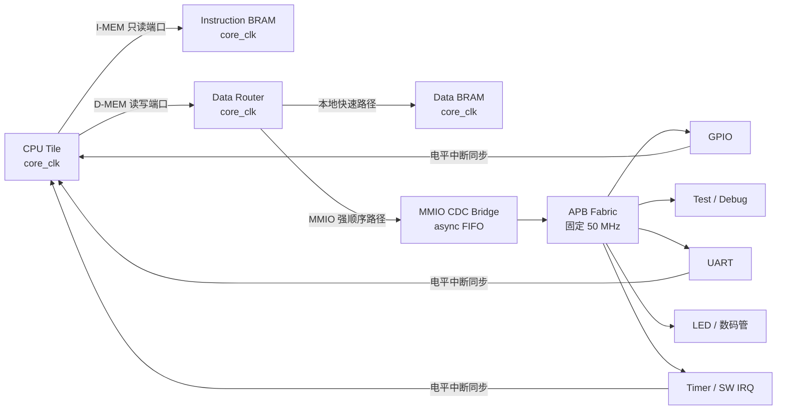

结论：原 SoC 不是“功能很差”，但对你现在的目标而言，架构方向确实不合适。建议保留 APB 外设、软件生成和验证资产，废弃“单时钟 + 全功能 HXI Crossbar 贯穿 CPU/BRAM/外设”的 SoC 骨架。

## 现有设计的问题

当前所有模块共享一个 `soc_clk`：CPU、BRAM、Crossbar、Timer、IRQ、UART、GPIO 都在同一时钟域，见 [soc_core.sv](D:/jichuang_soc/rtl/soc/soc_core.sv:4) 和 [fpga_top.sv](D:/jichuang_soc/fpga/boards/kintex7_competition/rtl/fpga_top.sv:38)。

主要问题有：

- CPU 的 I/D 两个端口都先进入 2×6 Crossbar，[soc_core.sv](D:/jichuang_soc/rtl/soc/soc_core.sv:74)。Crossbar 内还有多 outstanding 路由 FIFO、目标 FIFO和仲裁逻辑，[hxi_crossbar.sv](D:/jichuang_soc/rtl/bus/hxi/hxi_crossbar.sv:30)。这对单核 Harvard BRAM 系统明显过重。
- 指令端口并不是真正的“指令存储专用端口”，它也能被 Crossbar 路由到数据、Timer、IRQ、APB。
- Timer、IRQ 和 APB 外设全部跟着 CPU 提频，[soc_core.sv](D:/jichuang_soc/rtl/soc/soc_core.sv:94)。CPU 要跑 150–200 MHz 时，这些模块没有必要参与高频布局布线。
- CPU 已经产生 `dmem_req_uncached`，但 SoC 外部接口没有携带这个属性，最终只是作为 unused 消耗，[superscalar_cpu_core.sv](D:/jichuang_soc/rtl/cpu/superscalar/superscalar_cpu_core.sv:267)。新的接口必须明确表达 MMIO/uncached 属性和顺序要求。
- 当前 BRAM 资源推断是成功的：代码、数据各使用 16 个 RAMB36，[实现报告](D:/jichuang_soc/build/vivado/kintex7-rtthread-coremark-v2.1-rv32f-120mhz/project/reports/post_impl_utilization.rpt:30)。问题不在“有没有用上 BRAM”，而在 BRAM 前面的控制路径太复杂。
- 120 MHz 实现仍为 `WNS=-0.458 ns`，[时序报告](D:/jichuang_soc/build/vivado/kintex7-rtthread-coremark-v2.1-rv32f-120mhz/project/reports/post_impl_timing_summary.rpt:261)。最差路径有 15 级逻辑，并穿过 Crossbar 地址译码后到达数据 BRAM 控制端。175 MHz 构建则为 `WNS=-1.642 ns / TNS=-4512 ns`，[报告](D:/jichuang_soc/build/vivado/soc_dev_v1.10.1_175MHz/project/reports/post_impl_timing_summary.rpt:147)。

因此它适合“简单单时钟、功能先跑通”，不适合作为高频 CPU 的长期载体。

## 推荐的新架构

我把你说的“MMO”理解为 MMIO。



### 1. 高频计算域

`core_clk` 只驱动：

- CPU 核及内部 Cache、预测器、寄存器堆；
- Instruction BRAM；
- Data BRAM；
- 极小的 Data Router；
- MMIO CDC 的 CPU 侧。

CPU 对外只暴露两组事务端口：

```text
imem_req / imem_rsp
dmem_req / dmem_rsp
```

时钟、复位、中断和验证 trace 是必要 sideband，不算总线端口。CPU 不再知道 HXI、APB、GPIO 或具体板卡。

统一事务建议保留 `valid/ready` 形式：

```text
request : valid, ready, addr, write, wdata, wstrb, attr
response: valid, ready, rdata, error
```

其中：

- I-MEM 强制只读，只允许命中代码区；
- D-MEM 的 `attr` 至少包含 `cached/uncached`；
- 无事务 ID，保证请求和响应严格有序；
- 明确规定 stall 时 payload 必须稳定。

### 2. BRAM 快路径

Instruction BRAM 直接连接 I-MEM，不经过地址 Crossbar。

Data Router 只有三个目标：

1. Data BRAM；
2. MMIO CDC；
3. Decode-error responder。

本地地址区使用高地址位相等判断，不使用通用范围比较和六路 mux。

FPGA 后端建议使用 `xpm_memory_spram` 或固定 RAMB36E1 封装：

- CPU 可每周期提交一笔请求；
- 响应固定 1 或 2 周期；
- 推荐 BRAM 输出寄存器打开，以 2 周期延迟换更高 Fmax；
- 连续访问吞吐仍为每周期一笔；
- BRAM 本体和数据输出不做复位，另用 valid pipeline 屏蔽无效数据；
- 仿真使用行为模型，FPGA 使用 XPM backend，接口完全一致。

“快速”应定义为高吞吐、固定延迟和短关键路径，不应强求组合读或单周期返回。

### 3. 固定 50 MHz 外设域

时钟模块从同一个 MMCM 产生：

- `core_clk`：构建参数，例如 120/150/175/200 MHz；
- `periph_clk`：固定 50 MHz。

每个时钟域独立执行“异步拉低、同步释放”复位。不要再使用全局 `SOC_CLOCK_HZ`，而是分别使用：

```text
CORE_CLOCK_HZ
PERIPH_CLOCK_HZ = 50_000_000
```

UART、Timer 等只依赖 `PERIPH_CLOCK_HZ`。

即使两个时钟来自同一个 MMCM，也建议把 MMIO 边界按异步 CDC 设计。这样以后改变 CPU 频率或换板卡时不必修改 SoC。

### 4. MMIO 顺序模型

MMIO 性能不重要，正确性和复用更重要。推荐：

- CPU 侧发现 MMIO 请求后，先等待旧的 Data BRAM 请求全部响应；
- 每次只允许一笔 MMIO outstanding；
- MMIO 完成前阻止后续 D-MEM 请求；
- 请求和响应分别经过异步 FIFO；
- 外设侧转换成标准 APB3/APB4 事务。

这样天然满足设备访问强顺序，也不需要现有 Crossbar 那套 master/slave route FIFO。

中断在 50 MHz 域聚合成电平信号，再用两级同步器送入 CPU 域。脉冲型事件必须先转为 pending 电平，不能直接跨域。

## 推荐模块层次

```text
fpga_top
├─ board_clock_reset
│  ├─ core_clk / core_rst_n
│  └─ periph_clk_50m / periph_rst_n
├─ cpu_tile
│  ├─ cpu_core
│  └─ core_bus_adapter
├─ local_memory_subsystem
│  ├─ instruction_bram
│  ├─ data_router
│  ├─ data_bram
│  └─ decode_error_slave
├─ mmio_cdc_bridge
├─ peripheral_subsystem_50m
│  ├─ apb_interconnect
│  ├─ machine_timer
│  ├─ interrupt_controller
│  ├─ uart
│  ├─ gpio
│  ├─ led_sevenseg
│  └─ test_status
└─ board_io_wrapper
```

现有 APB Interconnect 和外设寄存器可以继续复用；例如当前 APB 已经正确完成 UART/GPIO/Test 的槽位选择，[apb_interconnect.sv](D:/jichuang_soc/rtl/bus/bridge/apb_interconnect.sv:28)。应当淘汰的是它上面的全局 Crossbar 和单时钟绑定。

## 地址空间建议

地址数值与架构分离，建议重新定义一个干净 ABI：

| 区域 | 建议基地址 | 属性 |
|---|---:|---|
| Instruction BRAM | `0x0000_0000` | executable、只读 |
| Data BRAM | `0x1000_0000` | cacheable、读写 |
| MMIO 总窗口 | `0x4000_0000` | uncached、strongly ordered |
| Timer | `0x4000_0000` | 4 KiB |
| IRQ Controller | `0x4000_1000` | 4 KiB |
| UART | `0x4000_2000` | 4 KiB |
| GPIO | `0x4000_3000` | 4 KiB |
| LED/数码管 | `0x4000_4000` | 4 KiB |
| Test/Debug | `0x4000_F000` | 仿真/调试 |

JSON 应继续作为地址唯一真源，自动生成 SV package、C header 和 linker script。

## 实施顺序

1. 先冻结 CPU 的 I-MEM/D-MEM 接口契约，给现有 CPU 加一层适配壳。
2. 删除 I-MEM 到 Crossbar 的路径，直接连接 Instruction BRAM。
3. 用三目标 Data Router 替代整个 HXI Crossbar。
4. 引入 `core_clk + 50MHz periph_clk` 和双域复位。
5. 实现 MMIO async bridge，把 Timer、IRQ 和全部外设迁入 APB 50 MHz 域。
6. 最后删除旧 `memory_subsystem`、HXI Crossbar 和直连高速 Timer/IRQ。
7. CI 强制检查：两块存储必须推断为 RAMB36、CDC 无 Critical、两个时钟域 WNS 均不小于 0。

这套结构里，CPU 核迭代只影响 `cpu_tile`；外设增删只影响 50 MHz APB 子系统；提高 CPU 频率也不会要求 UART、GPIO、LED 或数码管重新参与高频时序收敛。