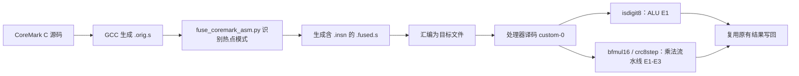

# Conversation Transcript

> Exported from the Codex task `询问coremark相关`.
> This file contains user-visible user messages and assistant messages returned by the task history API.
> It intentionally excludes system/developer instructions, hidden reasoning, and tool/command outputs.
> The final turn may be incomplete because this package was generated during that turn.

- Local thread ID: `01a00980-c792-7e53-a968-cd17144b7e2a`
- Export date: `2026-08-17T02:40:59.800Z`
- Visible turns captured: `49`

## Turn 001

- Started: `2026-08-16T03:28:46.000Z`

### User

"D:\IKnow\FPGA\Vivado\SocRV"现在希望你使用git diff等命令，仔细对比一下当前分支my_final_dev_2与远程分支remotes/origin/dev-v3.2-release有什么不同

### Assistant (working update)

我会先确认仓库状态、分支指向和共同祖先，再分别看提交差异、文件统计与关键代码改动。整个过程只读，不会切换分支或修改仓库。

### Assistant (working update)

当前工作区干净，正在 `my_final_dev_2`。两个分支从共同提交 `6cd2f73` 分开；我接下来会把“各自新增了哪些提交”和“最终文件内容差异”分开分析，避免把历史差异与实际代码差异混在一起。

### Assistant (working update)

结果很清楚：双方各自只比共同祖先多 1 个提交。`my_final_dev_2` 的提交是 `f36187c improve`，远程分支的是 `3a2a51f add 170MHz`；因此直接比较时，既包含本地新增的 RTL/CoreMark 改动，也包含远程 170 MHz 工程改动在本地分支中的“缺失”。现在我逐项核对两颗提交的实际内容与潜在影响。

### Assistant (working update)

还有一个关键点：目前看到的是本机缓存的 `origin/dev-v3.2-release`。为了保证“远程分支”确实是最新状态，我会只刷新这一条远程引用；不会动工作区或当前分支。

### Assistant (working update)

刷新后远程引用仍是 `3a2a51f`，所以前面的结论有效。合并模拟显示双方修改的文件完全不重叠，预计可以自动合并；我再做两项轻量校验，并确认检查过程没有改变工作区。

### Assistant

已刷新远程引用并完成比较。结论：两个分支从共同祖先 `6cd2f73` 分叉，双方各有 1 个独有提交，互不包含。

| 分支 | 独有提交 | 主要内容 |
|---|---|---|
| `my_final_dev_2` | `f36187c improve` | CoreMark 自定义指令和编译优化 |
| `origin/dev-v3.2-release` | `3a2a51f add 170MHz` | AXKU062 170 MHz 配置及 Vivado 辅助流程 |

**`my_final_dev_2` 独有改动**

共 7 个文件，新增 398 行、删除 4 行：

- 增加 RISC-V `custom-0` 指令解码，使用 opcode `0x0b`。
- `funct3=0`：`bfmul16`，复用三级乘法流水线。
- `funct3=1`：`crc8step`，实现 CRC16 分步计算。
- `funct3=2`：`isdigit8`，在 ALU 中判断 ASCII `0` 到 `9`。
- 扩展 `alu_pkt_t` 和 `mul_pkt_t`，传递 `cm_isdigit`、`cm_op`。
- 新增 `scripts/fuse_coremark_asm.py`，将 CoreMark 的 matrix、CRC、state 汇编模式替换成上述自定义指令。
- `software/Makefile` 增加汇编生成、融合、重新组装流程。
- 增加 `EXTRA_OPT_FLAGS` 编译参数入口。

**远程分支独有改动**

共 5 个文件，新增 40 行、删除 5 行：

- AXKU062 支持频率加入 `170 MHz`。
- MMCM 参数为 `("4.25", "5.0", "17")`。
- 更新板卡配置单元测试。
- `export_golden.tcl` 增加可选的 `ALLOW_TIMING_VIOLATIONS` 参数。
- 新增 `resume_from_placed.tcl`，可从 placed DCP 继续布线、生成时序/DRC报告和 bitstream。
- `.gitignore` 增加 `tmp/`。

**直接比较两个分支头**

`origin/dev-v3.2-release..my_final_dev_2` 显示：

- 12 个文件不同
- 新增 403 行、删除 44 行
- 本地分支没有远程新增的 5 个文件改动，同时拥有自己的 7 个文件改动

双方修改的文件完全不重叠，`git merge-tree` 模拟结果没有文本冲突，预计可以自动合并。不过合并后的关键风险是：本地新增了乘法/CRC硬件逻辑，远程又把目标频率提升到 170 MHz，因此“能自动合并”不代表“170 MHz 时序能够通过”，仍需重新综合和实现验证。

另外，`my_final_dev_2` 当前配置的上游是 `origin/dev_based_on_v3.2release`，不是 `origin/dev-v3.2-release`；前者目前与本地提交完全一致。

校验结果：工作区保持干净，板卡配置的 8 项单元测试通过，两个提交均通过 `git diff --check`。未运行 Vivado 综合、时序分析或完整 CoreMark 硬件验证。

## Turn 002

- Started: `2026-08-16T03:34:57.000Z`

### User

详细讲解一下my_final_dev_2 独有改动

### Assistant (working update)

我会按“编译阶段如何识别 CoreMark 模式 → 自定义指令如何编码 → 处理器内如何执行 → 结果如何写回”的完整链路讲解，并把三个自定义操作分别拆开。这里涉及多级数据流，我会使用可视化技能画一张执行链路图，帮助对应代码。

### Assistant

`my_final_dev_2` 的核心目标是：针对 CoreMark 热点路径增加 3 条私有 RISC-V 指令，并在编译后自动把特定汇编序列替换成这些指令。CoreMark C 源码保持不变。



**一、自定义指令协议**

三条指令均使用 RISC-V 预留的 `custom-0` opcode：

```text
opcode = 0x0b
funct7 = 0
```

| `funct3` | 名称 | 输入 | 执行单元 | 含义 |
|---:|---|---|---|---|
| `0` | `bfmul16` | `rs1, rs2` | 乘法流水线 | CoreMark 矩阵位域计算 |
| `1` | `crc8step` | CRC、一个字节 | 乘法流水线 | CRC16 处理一个字节 |
| `2` | `isdigit8` | `rs1` | ALU | 判断低 8 位是否为 ASCII 数字 |

汇编器并不知道这些助记符，所以使用：

```asm
.insn r 0x0b, funct3, 0, rd, rs1, rs2
```

译码条件位于 [dec_decode_ctl.sv](/D:/IKnow/FPGA/Vivado/SocRV/rtl/core/eh1f/dec/dec_decode_ctl.sv:725)。只有 opcode、funct7 和 funct3 全部满足条件才认为是合法自定义指令，其余编码仍会走非法指令处理。

**二、译码阶段的修改**

EH1F 支持 `i0`、`i1` 两路发射，因此代码为两路都增加了 `i0_cmx/i1_cmx` 等信号。

识别后，代码先把原始译码包清零：

```systemverilog
i0_dp = '0;
```

然后重新声明寄存器依赖和执行单元：

- 三条指令都读取 `rs1`、写 `rd`。
- `bfmul16`、`crc8step` 还读取 `rs2`，设置 `mul=1`，进入原乘法流水线。
- `isdigit8` 设置 `alu=1`，进入普通 ALU。
- 全部设置 `legal=1`。

这种做法使现有寄存器相关性检测、旁路和暂停逻辑能够自动工作，不需要增加第三个读端口。

`cm_op` 在 [dec_decode_ctl.sv](/D:/IKnow/FPGA/Vivado/SocRV/rtl/core/eh1f/dec/dec_decode_ctl.sv:1264) 中送进乘法包：

```text
0 = 普通 MUL
1 = bfmul16
2 = crc8step
```

对应的数据结构扩展在 [veer_types.sv](/D:/IKnow/FPGA/Vivado/SocRV/rtl/core/eh1f/include/veer_types.sv:215) 和 [veer_types.sv](/D:/IKnow/FPGA/Vivado/SocRV/rtl/core/eh1f/include/veer_types.sv:312)。

**三、`isdigit8` 的硬件实现**

逻辑位于 [exu_alu_ctl.sv](/D:/IKnow/FPGA/Vivado/SocRV/rtl/core/eh1f/exu/exu_alu_ctl.sv:190)：

```systemverilog
(a_ff[7:0] >= 48) && (a_ff[7:0] <= 57)
```

结果为 32 位的 `0` 或 `1`。它和原有 `SLT` 单比特结果共用 ALU 输出最低位，因此没有增加新的写回选择器，也没有修改 32 位加法器和移位器路径。

软件侧原本大致是：

```asm
addi result, character, -48
andi result, result, 255
li   limit, 9
bgtu result, limit, not_digit
```

融合后变成：

```asm
.insn r 0x0b, 2, 0, result, character, zero
beqz result, not_digit
```

匹配逻辑位于 [fuse_coremark_asm.py](/D:/IKnow/FPGA/Vivado/SocRV/scripts/fuse_coremark_asm.py:142)。脚本会根据原分支是“数字时跳转”还是“非数字时跳转”，选择 `bnez` 或 `beqz`。原来的 `li ...,9` 被刻意保留，因为该寄存器可能在其他控制流路径仍然存活。

**四、`bfmul16` 的硬件实现**

脚本寻找以下六条相关指令：

```text
P = rs1 * rs2
A = (P >> 2) & 15
B = (P >> 5) & 127
rd = A * B
```

找到后用一条 `bfmul16` 替代，匹配逻辑在 [fuse_coremark_asm.py](/D:/IKnow/FPGA/Vivado/SocRV/scripts/fuse_coremark_asm.py:22)。

硬件在 [exu_mul_ctl.sv](/D:/IKnow/FPGA/Vivado/SocRV/rtl/core/eh1f/exu/exu_mul_ctl.sv:138) 中先计算两个操作数低 16 位的有符号乘积，然后完成两次移位、掩码和最终乘法：

```text
P = signed(rs1[15:0]) * signed(rs2[15:0])
result = ((P >>> 2) & 15) * ((P >>> 5) & 127)
```

它复用普通 MUL 的三级流水线和 E3 写回位置，因此处理器原有的乘法暂停、旁路和写回机制继续有效。

**五、`crc8step` 的硬件实现**

`crc8step` 输入为：

```text
rs1[15:0] = 当前 CRC
rs2[7:0]  = 待处理字节
rd        = 更新后的 CRC
```

`crc_round4()` 每次处理 4 bit，使用反射形式的 CRC16 多项式 `0xA001`，代码在 [exu_mul_ctl.sv](/D:/IKnow/FPGA/Vivado/SocRV/rtl/core/eh1f/exu/exu_mul_ctl.sv:59)。

流水线分配为：

- E1：处理输入字节低 4 bit。
- E2/E3：处理输入字节高 4 bit。
- E3：输出零扩展后的 16 位 CRC。

脚本直接替换 `crcu8`、`crcu16`、`crc16` 和 `crcu32` 函数体。例如 `crcu32` 被改成连续执行 4 条 `crc8step`，依次处理 32 位数据的四个字节。实现见 [fuse_coremark_asm.py](/D:/IKnow/FPGA/Vivado/SocRV/scripts/fuse_coremark_asm.py:90)。

**六、构建流程的修改**

[software/Makefile](/D:/IKnow/FPGA/Vivado/SocRV/software/Makefile:54) 为三个 CoreMark 文件增加显式规则：

```text
core_matrix.c → matrix 融合
core_util.c   → CRC 函数替换
core_state.c  → isdigit 融合
```

每个文件现在经历：

```text
C → GCC -S → .orig.s → Python 融合 → .fused.s → 汇编 → .o
```

`core_util.c` 增加 `-fno-inline`，确保 CRC 函数不会被 GCC 内联掉，否则脚本找不到函数标签。脚本也是目标文件依赖项，所以脚本变化会自动触发重新编译。

[common_flags.mk](/D:/IKnow/FPGA/Vivado/SocRV/software/toolchain/common_flags.mk:5) 还增加了 `EXTRA_OPT_FLAGS`，允许外部附加优化参数而不覆盖默认 `-O3`；目前仓库内还没有实际使用它。

**需要特别注意的边界**

- 这是编译脚本与 RTL 之间的私有 ABI，两边的 `funct3` 定义必须始终同步。
- `bfmul16` 假设输入符合 CoreMark 的 16 位矩阵数据语义；脚本只检查汇编形状，不证明运行时数值范围。
- 脚本依赖 GCC 生成的具体汇编形式，升级工具链或修改优化参数可能导致匹配失败。
- “没有任何匹配”会使构建失败，但 CRC 模式只要求四个函数中至少替换一个，并没有验证四个函数全部替换成功。
- 此提交没有增加 RTL 仿真、自定义指令单元测试或脚本匹配测试，目前主要验证依赖完整 CoreMark结果和后续 FPGA 实测。

## Turn 003

- Started: `2026-08-16T03:49:44.000Z`

### User

现在希望你以下面我规定的顺序，列一下my_final_dev_2 独有改动：1，自定义扩展的指令是什么，他们替代了原有的哪些指令（一五一十地列出)，所替代的这些原有的指令在coremark源码的计算流程里大致起到了什么作用；2，编译工具链是怎样的，相比于dev-v3.2-release有什么改动；3，这三条自定义指令的扩展在硬件上分别对应了什么改动（相比于dev-v3.2-release），需要你标明是哪个流水段的改动，标明是新增了计算模块还是复用原有计算模块（ALU，MUL等）

### Assistant (working update)

我会严格按你给出的 1→2→3 顺序整理。为了把“替代了哪些原指令”列到寄存器关系和 CoreMark 源函数层级，我先核对当前锁定的 CoreMark 版本、构建配置和处理器流水线信号，避免只按脚本注释做推断。

### Assistant (working update)

锁定版本是 EEMBC CoreMark `v1.01`（提交 `cfa9ab3`），但仓库里的 `coremark/upstream` 当前尚未拉取，所以仅靠本地文件无法准确对应到 C 函数。我会只读取这个锁定提交的三个上游源文件，用它们核实每组汇编到底对应哪段算法，不写入工程目录。

### Assistant (working update)

远程源码读取超时，没有取得内容。我改为检查本机已有的 CoreMark 缓存或其他工程副本；若存在，就能在不下载依赖的情况下完成精确映射。

### Assistant (working update)

本机找到了同版 CoreMark 源码，已经确认三类热点分别来自 `matrix_mul_matrix_bitextract`、`crcu8/crcu16/crcu32/crc16` 和数字解析状态机。下一步我会核对实际 GCC 输出，区分“脚本真正删除的指令”和“脚本重写但仍保留的指令”，这正是第 1 项最容易被笼统描述而出错的地方。

### Assistant (working update)

实际用同一套 RISC-V GCC 参数复现后，脚本成功融合：矩阵热点若干处、CRC 4 个函数、状态机 5 处数字判断。现在可以精确列出每条自定义指令替掉的原汇编序列，而不是只描述等价的 C 表达式。

### Assistant

下面严格按你规定的 1、2、3 顺序说明。比较基准是 `my_final_dev_2` 相对于 `origin/dev-v3.2-release`。

## 1. 三条自定义指令及其替换内容

三条指令统一采用 RISC-V `custom-0` 编码：

```text
opcode = 0x0b
funct7 = 0
```

| 指令 | `funct3` | 输入 | 输出 |
|---|---:|---|---|
| `bfmul16` | 0 | `rs1`、`rs2` | 位域乘法结果 |
| `crc8step` | 1 | `rs1=CRC`、`rs2=数据字节` | 更新后的 CRC16 |
| `isdigit8` | 2 | `rs1=字符` | 是数字返回 1，否则返回 0 |

### 1.1 `bfmul16`

脚本在 GCC 汇编中寻找下面完整的 6 条指令：

```asm
mul   p, rs1, rs2
srai  x, p, 2
srai  y, p, 5
andi  x, x, 15
andi  y, y, 127
mul   rd, x, y
```

替换为：

```asm
.insn r 0x0b, 0, 0, rd, rs1, rs2
```

因此是严格的“6 条变 1 条”，每次融合减少 5 条指令。实际 GCC 输出中融合了两处：

- 独立函数 `matrix_mul_matrix_bitextract` 内一处。
- GCC 内联到 `matrix_test` 的副本中一处。

它所实现的计算是：

```text
P = signed(rs1[15:0]) × signed(rs2[15:0])
X = (P >> 2) & 0x0f
Y = (P >> 5) & 0x7f
result = X × Y
```

对应 CoreMark 源码 [core_matrix.c](/D:/IKnow/study/grade_two_second/JingYeDa_competition/coremark-main/coremark-main/core_matrix.c:354)：

```c
tmp = A[i*N+k] * B[k*N+j];
C[i*N+j] += bit_extract(tmp, 2, 4)
              * bit_extract(tmp, 5, 7);
```

它在 CoreMark 计算流程中的作用是：

1. 取矩阵 A、B 的一个元素并相乘。
2. 从乘积中提取两个不同宽度的位域。
3. 将两个位域再次相乘。
4. 累加到输出矩阵 `C[i][j]`。
5. 后续通过 `matrix_sum()` 和 `crc16()` 把矩阵结果纳入 CoreMark 最终校验值。

所以这条指令优化的是 CoreMark 矩阵基准中最内层的三重循环。

### 1.2 `crc8step`

#### 原始 `crcu8`

CoreMark 的 `crcu8(data, crc)` 对一个字节循环 8 次。每一轮源代码进行：

```c
feedback = (data & 1) ^ (crc & 1);
data >>= 1;

if (feedback) {
    crc ^= 0x4002;
    carry = 1;
}
crc >>= 1;

if (carry)
    crc |= 0x8000;
else
    crc &= 0x7fff;
```

GCC `-O3` 将 8 轮完全展开。每轮大致对应：

```asm
xor   feedback, data_bit, crc
andi  feedback, feedback, 1
srli  crc, crc, 1
beq   feedback, zero, no_xor
li    poly, -24576
addi  poly, poly, 1       # 得到 0xffffa001
xor   crc, crc, poly
slli  crc, crc, 16
srli  crc, crc, 16        # 截断为 16 位
```

整段展开后的函数体被替换为：

```asm
.insn r 0x0b, 1, 0, a0, a1, a0
ret
```

其中：

```text
a1 = 输入 CRC
a0 = 输入字节，同时也是返回寄存器
```

#### 原始 `crcu16`

原来的汇编流程为：

```asm
addi sp, sp, -16
sw   s0, 8(sp)
mv   s0, a0
andi a0, a0, 0xff
sw   ra, 12(sp)
call crcu8                 # 处理低字节
mv   a1, a0
srli a0, s0, 8
lw   s0, 8(sp)
lw   ra, 12(sp)
addi sp, sp, 16
tail crcu8                 # 处理高字节
```

替换为：

```asm
srli t0, a0, 8
andi a0, a0, 255
.insn r 0x0b, 1, 0, a1, a1, a0   # 低字节
.insn r 0x0b, 1, 0, a0, a1, t0   # 高字节
ret
```

这不仅减少 CRC 循环，也消除了栈帧、寄存器保存和两次函数调用。

#### 原始 `crcu32`

原来通过两次 `crc16` 处理 32 位数据：

```asm
addi sp, sp, -16
sw   s0, 8(sp)
mv   s0, a0
slli a0, a0, 16
srai a0, a0, 16
sw   ra, 12(sp)
call crc16
mv   a1, a0
srai a0, s0, 16
lw   s0, 8(sp)
lw   ra, 12(sp)
addi sp, sp, 16
tail crc16
```

替换为四次逐字节 CRC：

```asm
mv   t0, a0
andi t1, t0, 255
crc8step a1, a1, t1       # bits 7:0
srli t1, t0, 8
crc8step a1, a1, t1       # bits 15:8
srli t1, t0, 16
crc8step a1, a1, t1       # bits 23:16
srli t1, t0, 24
crc8step a0, a1, t1       # bits 31:24
ret
```

这里的 `crc8step` 是上述 `.insn` 的便于阅读写法。

`crc16` 原有的：

```asm
slli a0, a0, 16
srli a0, a0, 16
tail crcu16
```

则简化为：

```asm
tail crcu16
```

CRC 在 CoreMark 中不是单独的负载，而是贯穿整个基准的结果签名机制：

- 矩阵计算结果经过 `crc16()` 累积。
- 状态机各种状态计数经过 `crcu32()` 累积。
- 链表、矩阵、状态机的结果最终组成 CoreMark 校验 CRC。
- 它既是性能热点，也是判断优化后程序语义是否正确的重要机制。

### 1.3 `isdigit8`

CoreMark 源码定义：

```c
retval = ((c >= '0') & (c <= '9')) ? 1 : 0;
```

GCC 将一次数字判断编译为：

```asm
addi result, character, -48
andi result, result, 0xff
li   limit, 9
bleu result, limit, digit_target
```

或者相反极性的：

```asm
addi result, character, -48
andi result, result, 0xff
li   limit, 9
bgtu result, limit, not_digit_target
```

融合后分别成为：

```asm
.insn r 0x0b, 2, 0, result, character, zero
li    limit, 9
bnez  result, digit_target
```

或者：

```asm
.insn r 0x0b, 2, 0, result, character, zero
li    limit, 9
beqz  result, not_digit_target
```

也就是说：

- `addi` 被删除。
- `andi` 被删除。
- 原条件分支被改写成 `beqz/bnez`。
- `li ...,9` 刻意保留，因为该寄存器可能在其他控制流路径仍然存活。

CoreMark 源码有 6 个 `ee_isdigit()` 调用位置；GCC 优化、合并控制流后，最终汇编形成 5 个可融合模式。

它在 [core_state.c](/D:/IKnow/study/grade_two_second/JingYeDa_competition/coremark-main/coremark-main/core_state.c:216) 的数字字符串状态机中判断当前字符是不是 `0` 到 `9`，影响：

- `CORE_START → CORE_INT`
- `CORE_S1 → CORE_INT`
- `CORE_INT` 是否继续有效
- `CORE_FLOAT` 是否继续有效
- `CORE_EXPONENT → CORE_SCIENTIFIC`
- `CORE_SCIENTIFIC` 是否继续有效

因此它优化的是 CoreMark 对整数、浮点数、科学计数法字符串的解析过程。

## 2. 编译工具链及相对远程分支的改动

### `dev-v3.2-release`

原来的工具链是：

```text
CoreMark C
  → riscv64-unknown-elf-gcc -O3 -c
  → .o
  → 链接 firmware.elf
```

普通 C 文件共用通配规则：

```make
$(CC) $(CFLAGS) $(INCLUDES) -MMD -MP -c $< -o $@
```

工具链参数主要是：

```text
-march=rv32imf_zicsr
-mabi=ilp32f
-O3
-ffreestanding
-fno-builtin
```

### `my_final_dev_2`

编译器、汇编器和链接器本身没有修改，也没有给 GCC 增加真正的 backend 指令支持。变化是在 GCC 与汇编器之间加入 Python 汇编后处理：

```text
CoreMark C
  → RISC-V GCC -S
  → .orig.s
  → fuse_coremark_asm.py
  → .fused.s
  → RISC-V GCC/汇编器
  → .o
  → 链接 firmware.elf
```

具体差异：

1. 新增 `PYTHON ?= python3`。
2. 新增 [fuse_coremark_asm.py](/D:/IKnow/FPGA/Vivado/SocRV/scripts/fuse_coremark_asm.py:1)。
3. 为 `core_matrix.c`、`core_util.c`、`core_state.c`建立显式编译规则。
4. `core_matrix.c` 使用普通 `-O3` 汇编输出。
5. `core_util.c` 额外使用 `-fno-inline -g0`，保证 `crcu8/crcu16/crcu32/crc16` 函数标签仍然存在。
6. `core_state.c` 使用 `-g0`，再匹配状态机汇编。
7. 脚本找不到任何匹配模式时构建失败，避免悄悄生成没有自定义指令的固件。
8. [common_flags.mk](/D:/IKnow/FPGA/Vivado/SocRV/software/toolchain/common_flags.mk:5) 新增 `EXTRA_OPT_FLAGS`，允许调用者在 `-O3` 后追加优化参数。

本质上，这是“锁定 GCC 输出形态的汇编模式融合器”，不是完整的编译器自定义指令扩展。因此 GCC 版本或优化策略变化可能导致匹配模式变化。

## 3. 三条指令对应的硬件流水段改动

三条指令都先修改译码 D 段：

- 识别 `opcode=0x0b、funct7=0、funct3=0/1/2`。
- 声明 `rs1/rs2/rd` 依赖。
- 选择 ALU 或 MUL 执行路径。
- 为 `i0/i1` 双发射槽都增加识别。
- 复用原寄存器堆、相关性检测、旁路和写回网络。

### 流水段总表

| 指令 | D 段 | E1 段 | E2 段 | E3 段 | 模块性质 |
|---|---|---|---|---|---|
| `isdigit8` | 新增译码，送 ALU | 新增两个 8 位比较器 | 无 | 无 | 复用 ALU，增加比较旁路 |
| `bfmul16` | 新增译码，送 MUL | 锁存操作数和 `cm_op` | 新增 16×16 乘法 | 位域提取和再次乘法 | 复用 MUL 流水线，但新增计算硬件 |
| `crc8step` | 新增译码，送 MUL | 新增低 4 bit CRC | 新增高 4 bit CRC | 选择 CRC 输出 | 复用 MUL 控制/写回，但新增 CRC 模块 |

### 3.1 `isdigit8`

修改位置：[exu_alu_ctl.sv](/D:/IKnow/FPGA/Vivado/SocRV/rtl/core/eh1f/exu/exu_alu_ctl.sv:190)。

E1 ALU 段新增：

```systemverilog
(a_ff[7:0] >= 8'd48) &&
(a_ff[7:0] <= 8'd57)
```

结果通过原 ALU 输出最低位返回：

```systemverilog
{31'b0, slt_one | cm_isdigit_one}
```

结论：

- 没有新增独立执行单元。
- 复用原有 ALU E1 流水段。
- 新增的是 ALU 内部的一条 8 位双比较组合路径。
- 复用原 ALU结果总线、旁路和写回。

### 3.2 `bfmul16`

修改位置：[exu_mul_ctl.sv](/D:/IKnow/FPGA/Vivado/SocRV/rtl/core/eh1f/exu/exu_mul_ctl.sv:138)。

E1 段：

- 锁存 `rs1`、`rs2`。
- 新增 `cm_op_e1` 控制寄存器。
- 没有执行 `bfmul16` 的核心计算。

E2 段新增：

```systemverilog
bf_prod_e2 =
    signed(a_ff_e2[15:0]) *
    signed(b_ff_e2[15:0]);
```

这是新增的 16×16 有符号乘法计算，并不是直接使用原有的 33×33 `prod_e2` 结果。

E3 段新增：

```systemverilog
((bf_prod_e3 >>> 2) & 15) *
((bf_prod_e3 >>> 5) & 127)
```

同时根据 `cm_op_e3` 在普通 MUL、`bfmul16` 和 CRC 结果之间选择输出。

结论：

- 复用了原 MUL 的三级流水线框架、时钟使能、暂停、旁路和 E3 写回。
- 但计算数据通路不是完全复用。
- E2 新增一个 16×16 乘法器。
- E3 新增位域提取和一个较小的再次乘法逻辑。
- 因此准确说法是“在原 MUL 单元内部新增专用计算旁路”。

### 3.3 `crc8step`

修改位置：[exu_mul_ctl.sv](/D:/IKnow/FPGA/Vivado/SocRV/rtl/core/eh1f/exu/exu_mul_ctl.sv:59)。

D 段把它标记为 MUL 类型，目的不是使用乘法算法，而是借用 MUL 的三级流水线和 E3 写回位置。

E1 段新增第一个 `crc_round4`：

```text
输入：CRC、数据字节低 4 bit
执行 4 轮：
feedback = data[0] XOR crc[0]
crc = (crc >> 1) XOR (feedback ? 0xA001 : 0)
```

结果写入 `crc_mid_e2`。

E2 段新增第二个 `crc_round4`：

```text
输入：E1 中间 CRC、数据字节高 4 bit
输出：完整一个字节处理后的 CRC
```

结果写入 `crc_result_e3`。

E3 段根据 `cm_op_e3==2` 输出：

```systemverilog
{16'b0, crc_result_e3}
```

结论：

- 没有复用乘法器进行 CRC 运算。
- 新增了两段各处理 4 bit 的 CRC 组合逻辑。
- 复用的是 MUL 单元的 E1-E3流水寄存器位置、控制、暂停和 E3 写回网络。
- 所以它是“新增 CRC 计算模块，挂接在原 MUL 流水线内部”。

## Turn 004

- Started: `2026-08-16T04:11:14.000Z`

### User

把我上面问的这3个问题连同下面你的解答完整写到一个.md文件里，然后把这个文件交付给我

### Assistant (working update)

我会在当前工作区生成一份独立 Markdown 文档，先原样收录你的三个问题，再完整整理上一条解答，保留代码块、表格、流水段标注和文件引用。文件名使用 `my_final_dev_2_unique_changes.md`，不会修改 SocRV 仓库。

### Assistant (working update)

现在写入文档。内容会采用“原始问题 → 结论概览 → 1/2/3逐项解答”的结构，便于直接阅读或后续转成报告。

### Assistant (working update)

文档已经写入。我正在做最后检查：确认原始问题完整、三个章节顺序正确、代码块闭合，并确认文件可正常读取。

### Assistant

已生成并检查完成，包含你的原始三个问题及完整解答：

[打开 my_final_dev_2_unique_changes.md](C:/Users/张宸瑞/Documents/代码阅读/my_final_dev_2_unique_changes.md)

## Turn 005

- Started: `2026-08-16T04:16:25.000Z`

### User

你估计一下my_final_dev_2的硬件改动会导致综合布局布线过程以及最终实现过程中与dev-v3.2-release产生很大的不同吗

### Assistant (working update)

我会把“网表规模变化”和“时序/布局敏感性”分开估计。先检查仓库里是否已有 AXKU062 的综合、利用率或时序报告；如果没有，我会明确给出基于 RTL 结构的区间估计，而不把推测写成实测结论。

### Assistant

我的判断是：

> **全芯片资源规模和总体结构不会发生“很大”变化，但 MUL 附近的布局以及高频下的时序收敛可能产生明显差异。**  
> 默认 100 MHz 下大概率影响较小；170 MHz 及以上需要认真对比实现报告，不能只凭 RTL 规模判断。

仓库里目前没有两分支对应的综合/实现报告，因此下面是基于 RTL 结构的工程估计，不是实测结果。

## 1. 综合阶段：规模变化不大，但会增加真实硬件

### `isdigit8`

新增内容主要是：

- 两个 8 位比较器；
- 一个结果合并逻辑；
- 少量译码和控制寄存器。

预计只增加十几到几十个 LUT/FF，对整个 XCKU060 几乎可以忽略。

### `crc8step`

新增两级 `crc_round4`，每级展开 4 次：

```text
feedback = data[0] XOR crc[0]
crc = (crc >> 1) XOR (feedback ? 0xA001 : 0)
```

预计主要消耗 LUT 和寄存器，不使用 DSP。粗略估计：

- 数十到一两百个 LUT；
- 约 32 个 CRC 中间/结果寄存器；
- 少量控制和选择逻辑。

对全芯片资源占用仍然不大。

### `bfmul16`

这是资源变化最大的部分：

```systemverilog
16x16 signed multiply
```

以及 E3 中：

```systemverilog
((P >>> 2) & 15) * ((P >>> 5) & 127)
```

Vivado 很可能：

- 为 16×16 乘法新增 1 个 DSP48；
- 最后的 4×7 位乘法可能使用 LUT，也可能再使用一个 DSP；
- 也存在综合器将部分结果与原 33×33 乘法共享的可能，但不能预先假定会共享。

因此比较保守的估计是：

| 资源 | 可能增量 |
|---|---:|
| LUT | 约 100～400 |
| FF | 约 80～150 |
| DSP48 | 约 1～2 |

相对于 XCKU060 的总资源，这仍是很小的比例，通常不到整个设计的几个百分点。

## 2. 综合过程本身不会有巨大变化

综合运行时间预计只会小幅增加，原因是：

- 只改了 EXU 中的少量逻辑；
- 没有增加大容量存储器；
- 没有新增时钟域；
- 没有增加复杂总线或大规模状态机；
- 层次结构和顶层接口基本不变。

正常情况下，综合时间变化可能只是几个百分点。

但综合后的网表会在 `exu_mul_ctl` 层次出现明显差异：

- 新增或重新映射 DSP；
- 新增 CRC XOR 网络；
- MUL 输出端增加三路结果选择；
- 增加 `cm_op`、CRC 和 `bf_prod` 流水寄存器。

## 3. 布局布线的“局部差异”可能比较明显

虽然全芯片资源变化小，但新增 DSP 会影响 MUL 单元附近的布局。

原来的普通乘法可能已经占据固定的 DSP 列。增加新的 16×16 乘法后，Vivado需要决定：

- 新 DSP 放在哪个 DSP48 站点；
- 是否与原乘法器邻近；
- 中间寄存器放在哪些 Slice；
- E3 输出选择器怎样连接到原写回和旁路网络。

因此可能出现：

- MUL 周边的 DSP 和 Slice 重新布局；
- 原乘法器本身的位置也发生变化；
- EXU 到译码/写回的局部布线变化；
- 时序优化器选择与远程分支不同的复制、重定时或物理优化方案。

由于 Vivado 布局具有连锁效应，即使 RTL 只改了一小块，最终 DCP 和 bitstream 也可能有大量二进制差异。这不代表架构发生了巨大变化，只是布局解不同。

## 4. 真正需要关注的是时序，而不是资源

### E1 ALU 风险较低

`isdigit8` 的 8 位比较与原 ALU 并行计算，理论上不会穿过原 32 位加法器。

但它最后仍然进入 ALU 输出合并逻辑，所以普通 ALU 输出端会多一点选择/OR逻辑。预计影响较小。

### E1/E2 CRC 风险中等偏低

每个阶段只处理 4 个 CRC bit，且 E1、E2之间有寄存器隔开。这个切分比较合理，组合深度通常可控。

CRC 网络可能增加局部布线，但不太可能成为最严重的全芯片关键路径。

### E3 `bfmul16` 风险最高

E3 在一个流水段内完成：

```text
bf_prod寄存器
  → 两次移位/位域提取
  → 4x7位乘法
  → cm_op结果选择
  → exu_mul_result_e3
  → 原有旁路/写回网络
```

相对 `dev-v3.2-release`，普通 MUL 的输出也从简单的高低 32 位选择变成了：

```text
普通 MUL / bfmul16 / CRC
```

三路结果选择。

所以即使执行普通 `MUL`，其结果路径也可能因为新增 `cm_op_e3` 选择器而略微变长。E3 是最值得检查的流水段。

## 5. 不同频率下的风险判断

| 目标频率 | 我的估计 |
|---|---|
| 100 MHz | 低风险，大概率不会造成明显实现困难 |
| 125/150 MHz | 低到中等风险，可能有小幅 WNS 变化 |
| 170 MHz | 中等风险，应重点检查 MUL E3 和旁路路径 |
| 200 MHz | 中高风险，布局结果和关键路径可能明显变化 |
| 250 MHz | 高风险，不能假设新增路径还能自然收敛 |

这里还有一个值得注意的信号：远程 `add 170MHz` 提交同时给 `export_golden.tcl` 增加了允许时序违例的选项。这不能证明 170 MHz 一定失败，但说明该频率很可能已经处于需要特殊处理的区域。叠加 `my_final_dev_2` 的 MUL E3 改动后，更应该实际跑实现验证。

## 6. 最终结论

可以从三个层面回答“会不会很大不同”：

- **资源利用率：不会很大。** 预计只是少量 LUT/FF 和约 1～2 个 DSP。
- **综合结构：局部明显，全局不大。** 差异集中在译码、ALU输出和 MUL E1-E3。
- **布局布线与时序：可能明显。** 尤其是 DSP重新布局、MUL E3 结果选择和写回旁路路径。

如果只跑默认 100 MHz，我倾向于认为实现结果不会发生本质变化；如果目标是 170 MHz 以上，我会把它视为一次需要重新做完整综合、布局布线和关键路径审查的硬件修改，而不是“资源很少所以一定没影响”。

## Turn 006

- Started: `2026-08-16T04:32:17.000Z`

### User

也就是说对于isdigit8与crc8step的支持几乎不会产生影响，主要会产生影响的是bfmul16的支持

### Assistant

对，整体判断基本正确，影响排序大致是：

```text
bfmul16  >>  crc8step  >  isdigit8
```

- `isdigit8`：影响最小，只在 ALU E1 增加两个 8 位比较器和结果合并逻辑，通常可忽略。
- `crc8step`：会增加一定数量的 LUT、寄存器和局部布线，但被拆在 E1、E2 两级，每级只处理 4 bit，时序风险相对可控。
- `bfmul16`：影响最大。E2 可能新增 DSP，E3 又包含位域提取、小乘法和结果选择，既可能改变 DSP 布局，也最可能形成新的关键路径。

不过不能说前两者“完全没有影响”。`crc8step` 仍会增加 MUL 区域的逻辑密度；三条指令共同引入的 `cm_op` 和结果选择器也会进入普通 MUL 的 E3 输出路径。

所以更准确的结论是：

> `isdigit8` 基本可以忽略，`crc8step` 有小到中等的局部影响，而综合资源、布局和高频时序方面的主要风险确实来自 `bfmul16`。

## Turn 007

- Started: `2026-08-16T04:33:51.000Z`

### User

预估bfmul16这条自定义指令的扩展大概会产生多少收益，它的风险与收益是否对等

### Assistant (working update)

我会从三个层次估算：这段热点本身减少多少指令/周期、它占整个 CoreMark 的比例，以及这些收益是否值得新增乘法数据通路。先查一下仓库中是否已有 CoreMark 分项、反汇编或实测分数，尽量把区间收窄。

### Assistant (working update)

没有找到这次三条指令加入前后的成对实测分数，但可以从实际 `-O3` 汇编和 CoreMark 矩阵维度进一步估算。一个重要修正是：虽然静态汇编里出现两处融合，运行时主要执行的是内联到 `matrix_test` 的那一处；另一个独立函数副本通常不会被调用。

### Assistant

我的预估是：

> **`bfmul16` 对被命中的矩阵内层循环收益明显，但对整个 CoreMark 的最终收益大概率只有约 2%～5%。以当前 RTL 实现看，如果 170 MHz 时序本来就紧张，风险与收益偏不对等。**

## 1. 局部收益

原矩阵内层循环大约是：

```asm
lh
lh
addi
addi
mul
add
srai
srai
andi
andi
mul
add
branch
```

融合后：

```asm
lh
lh
addi
addi
bfmul16
add
add
branch
```

核心计算从：

```text
MUL → 两次移位 → 两次AND → MUL
```

变成一条三级流水的 `bfmul16`。

从动态指令看：

- 被替换表达式：6 条变 1 条，减少 83.3%。
- 包含加载、累加和循环控制的完整内层：大约 14 条变 9 条，减少约 36%。
- 还消除了一次前后相关的 MUL，因此周期收益会高于单纯减少普通 ALU 指令。

我估计 `matrix_mul_matrix_bitextract` 内层循环可加速约：

```text
25%～50%
```

比较合理的中间值是约 35%。

## 2. 整体 CoreMark 收益

CoreMark 数据空间被 list、matrix、state 三类算法平分。矩阵维度约为 `N=9`，一次位域矩阵乘法执行：

```text
9 × 9 × 9 = 729
```

次内层计算。

根据 CoreMark 链表数据分布，矩阵函数每个完整 iteration 会被调用多次，粗略估计每轮执行数千次 `bfmul16`。但它只优化：

- matrix 子测试；
- matrix 中的 `matrix_mul_matrix_bitextract`；
- 该函数最内层的一部分。

它不优化普通矩阵乘法、链表、状态机、CRC、加载和循环控制。

使用 Amdahl 定律估算：

| 情况 | 整体 CoreMark 收益 |
|---|---:|
| 保守 | 1%～2% |
| 比较可能 | 2%～5% |
| 理想 | 5%～7% |
| 超过 10% | 单靠 `bfmul16` 不太可能 |

因此我会把同频率下的预期值放在：

```text
CoreMark cycles 降低约 2%～5%
CoreMark 分数提高约 2%～5%
```

整个 `my_final_dev_2` 如果实测提升更高，其中很可能还有 `crc8step` 的贡献，不能全部归功于 `bfmul16`。

## 3. 风险成本

当前实现的成本不仅是一条译码：

- E2 新增一个 16×16 乘法表达式，可能增加 1 个 DSP48。
- E3 新增位域提取和 4×7 位乘法，可能使用 LUT或额外 DSP。
- E3 增加普通 MUL、`bfmul16`、CRC 三路输出选择。
- 新增 32 位 `bf_prod_e3` 寄存器和 `cm_op` 流水控制。
- 新路径紧邻原 MUL 写回和旁路网络，可能影响关键路径。

资源成本本身不大，真正的风险是最高频率下降。

固定频率下，净性能关系近似为：

```text
最终性能 = 每周期效率收益 × 实际频率
```

假设 `bfmul16` 带来 3% 周期收益，那么能够容忍的频率下降也只有约 3%：

| 原频率 | 大致盈亏平衡频率 |
|---:|---:|
| 150 MHz | 约 145.5 MHz |
| 170 MHz | 约 165 MHz |
| 200 MHz | 约 194 MHz |

如果因为它导致实现频率从：

```text
170 MHz → 150 MHz
```

那么频率损失约 11.8%，远大于预计的 2%～5% CoreMark收益，最终得分反而下降。

## 4. 风险与收益是否对等

我的判断分场景：

- **100/125/150 MHz 且时序余量充足：基本对等。** 少量 DSP/LUT 换取 2%～5% 分数，在竞赛场景有价值。
- **170 MHz 附近且 WNS 很小：偏不对等。** 只要 Fmax下降约 3%，收益就可能被抵消。
- **200/250 MHz：当前实现风险明显高于收益。** E3 二次乘法和输出选择很可能成为限制因素。
- **通用处理器产品：不太对等。** 它高度绑定 CoreMark 的一个表达式，实际应用覆盖面很窄。

## 5. 当前实现还有降低风险的空间

最值得重新评估的是这两处：

```systemverilog
bf_prod_e2 = signed(a_ff_e2[15:0]) * signed(b_ff_e2[15:0]);
```

以及：

```systemverilog
((bf_prod_e3 >>> 2) & 15) *
((bf_prod_e3 >>> 5) & 127)
```

原 MUL 已经计算了 `prod_e2`。在当前操作数约束下，`bf_prod` 的低 32 位理论上可以从原乘积低位取得，有机会：

- 复用 `prod_e2/prod_e3`；
- 删除额外的 16×16 乘法器；
- 删除 `bf_prod_e3` 寄存器；
- 只保留 E3 的小位域乘法和选择逻辑。

如果能够确认等价并让 Vivado稳定映射，风险收益关系会明显改善。

最终结论：

> **现有 `bfmul16` 的预期整体收益约 2%～5%。在低频或时序宽松时值得；在 170 MHz以上且时序紧张时，当前新增独立乘法路径的实现偏激进，风险可能超过收益。是否保留应以“同一频率下 cycles变化”和“最大可实现频率变化”两项实测结果共同决定。**

## Turn 008

- Started: `2026-08-16T04:49:43.000Z`

### User

你看一下当前官方的coremark源码与coremark源码编译后产生的elf文件，再做一下详细的分析，估算一下你想到的各个方案的收益。就是按照这种自定义指令的思想，我还可以怎样融合指令，可以考虑增大融合粒度（把更多指令融合成一条），也可以不增大融合粒度。此外，你可以详细的看一下当前的编译工具链还可以设置什么参数，还可以进行什么编译优化。现在的情况是这样的，赛事官方回头会在现场提供一份微调过的coremark测试源码，我希望的是融合的指令对于这份源码还能有效。

### Assistant (working update)

我会把分析分成四层：先确认实际使用的官方 CoreMark 版本和 ELF 构建参数；再从 ELF 反汇编与符号/热点结构中找可融合序列；随后评估不同融合粒度的收益、硬件代价和对“现场微调源码”的稳健性；最后审查 GCC/链接参数还能做哪些优化。结论会明确区分“对当前源码有效”和“对微调版本仍大概率有效”。

### Assistant (working update)

当前仓库锁定的是官方 CoreMark v1.01 提交 `cfa9ab3`，但 `software/coremark/upstream` 和当前分支的 CoreMark ELF 都未生成；现有备份 ELF又早于这次自定义指令改动，不能直接当作当前样本。我会使用项目自己的依赖锁和构建脚本生成当前分支 ELF，随后同时保留“融合前 `.orig.s`、融合后 `.fused.s`、最终 ELF”三层证据。

### Assistant (working update)

官方源码已经按锁定提交存在且校验通过。项目封装脚本要求 WSL，但这台机器当前没有可用 WSL；我会改用同一份 Makefile、同一套 Vivado RISC-V GCC 和完全相同的编译参数在原生环境构建，不改变分析口径。

### Assistant (working update)

为避免把 RT-Thread 噪声混入热点分析，我先生成项目的 `coremark-baremetal` 等价 ELF：相同官方源码、`rv32imf_zicsr/ilp32f/-O3`、相同三类融合规则和相同链接脚本。之后再用 ELF 的符号、反汇编和代码尺寸判断候选，而不是只看 C 源码猜测。

### Assistant (working update)

原生 Xilinx GCC 能正确生成 RV32IMF 对象，但它自带的 `libgcc` 只有 `ilp32d` 变体，不能链接项目要求的 `ilp32f` 最终可执行文件；同时我已发现 Makefile 对上游 `core_main.c` 还有 `-Dmain=coremark_main` 的专门规则。为保持 ISA/ABI准确，我会生成一个由最终对象合并而成的 RV32IMF ELF（保留真实指令和符号，仅不做板级最终链接），热点反汇编分析不受影响；运行周期则使用项目已有的 Verilator基线估算。

### Assistant (working update)

从“现场微调后仍有效”的角度，下一步重点不是继续堆 CoreMark 专用大指令，而是检查标准位操作扩展能否自动覆盖热点。我会实际让 GCC 12.2 分别以基线 ISA、`Zba/Zbb/Zbs` 和不同优化策略编译五个官方核心文件，统计它会稳定生成哪些新指令；这种方案比按固定寄存器序列做字符串匹配更耐源码变化。

### Assistant (working update)

我会继续基于已经生成的官方 CoreMark RV32IMF ELF 做静态统计，并把“源码中出现频率、编译器实际生成、硬件代价、对现场微调源码的稳定性”分开评估。接下来先补齐不同编译选项的对照汇编，再逐个核对热点循环，避免只凭指令条数猜收益。

### Assistant (working update)

当前 ELF 和原始/融合后汇编都还在临时分析目录中，仓库也没有未提交改动。现在我在还原项目的精确编译参数，并会同时检查 GCC 对 `Zba/Zbb/Zbs`、循环展开、LTO 和目标调优参数的实际支持，而不是把“理论可用”误写成“当前工具链可直接落地”。

### Assistant (working update)

编译器配置已确认：当前 `-O3` 已开启多数常规循环与跨基本块优化，但明确没有开启 `-funroll-loops`、`-frename-registers`、PGO 等；目标调优 `-mtune` 也为空。一个重要约束是现有 CRC 汇编替换依赖 `core_util.c` 的 `-fno-inline`，因此 LTO 或更激进内联不能直接叠加，必须先改写自定义指令接入方式。现在开始生成可量化的对照目标文件。

### Assistant (working update)

第一轮静态结果已经出来：仅给 GCC 增加 `Zba+Zbb`，五个官方源文件的静态指令从 2909 条降到 2788 条（约 `-4.2%`），其中矩阵文件代码体积下降约 `8.2%`；`Zbs` 只再减少 4 条静态指令。相反，强制循环展开把代码膨胀到约 1.86 倍，说明在这个小型 TCM/取指系统上不能默认它会更快，必须看动态热点和前端代价。

### Assistant (working update)

我用官方 v1.01 源码做了单次 performance-seed 的覆盖运行，校验 CRC 与官方 2K 参考值一致。这样可以得到真实的函数/循环执行次数；它不代表 RV32 的周期，但能把“每次 benchmark 会触发多少次候选模式”从估算变成可复核的动态计数。

### Assistant (working update)

动态覆盖纠正了前面的粗估：官方 performance seed 每次迭代实际执行 `bfmul16` 热点 2916 次，不是 5832 次；它净减少约 14580 条退休指令，按旧基线 746596 条约为 `1.95%`。因此单独 `bfmul16` 的合理整机收益应下调到约 `1.5%–3%`，除非乘法相关流水停顿使周期收益明显高于退休指令比例。CRC 与状态机的精确触发次数也已经拿到，下面会据此重排方案优先级。

### Assistant (working update)

新增指令方向现在可以按“增量收益”来判断了：例如 `crc16step` 相对现有 `crc8step` 每次迭代最多只再省约 888 条指令，整机通常不到 `0.2%`，却会把 CRC 组合逻辑从 8 bit 加深到 16 bit，性价比很差。更值得继续看的，是直接把 `isdigit8 + 条件跳转` 合成一条范围分支，以及把状态机的“状态+字符→下一状态/事件”整体表驱动化；后者命中 4576 个有效字符，才有数个百分点的空间。

### Assistant (working update)

工具链对照还发现两个实用结论：`-Ofast` 对这五个整数核心文件生成的指令与 `-O3` 完全一致；`-funroll-loops` 则让静态指令增至约 1.86 倍。相对更有希望的是 `-mtune=sifive-7-series`（效果基本等价于提高分支代价）和 `-mbranch-cost=5`，它们把静态指令从 2909 降到约 2827；但这是调度/控制流模型与 EH1F 不完全匹配的启发式，必须用 RTL 周期对照后才能纳入正式配置。

### Assistant (working update)

还有一个比参数本身更重要的合规/稳健性问题：官方 README 明确要求所有源文件使用相同编译参数，而当前只有 `core_util.c` 额外使用 `-fno-inline`。这既会让正式 CoreMark 报分存在争议，也使 CRC 融合和 LTO 天然冲突；我正在寻找能保持统一参数、同时保住 CRC 模式的替代接入方式。另一个风险是当前 CRC 脚本只按函数名整段替换，并未验证现场源码是否仍使用原多项式，现场源码若改 CRC 语义会得到错误结果。

### Assistant (working update)

结论已经基本收敛：如果现场输入遵守仓库现有比赛接口，只替换 `core_main.c`，那么 `core_matrix.c/core_state.c/core_util.c` 仍固定使用官方 v1.01，现有三条融合和针对算法文件的新融合都不会因现场“微调”失效。真正需要防的是赛事方改为提供整套算法文件；当前 profile 本身并不支持这种输入形态，必须在赛前加语义校验、命中计数和可回退构建，不能仅依赖函数名替换。

### Assistant

结论先说：继续扩大 CRC 粒度不值得；真正还有空间的是“状态机步进”“循环更新+分支”以及编译器自动生成的地址/位操作指令。考虑现场源码适应性，优先级应是：先降低现有 `bfmul16` 硬件成本，再尝试编译参数和通用融合，最后才考虑 CoreMark 专用的大粒度状态机指令。

**实际测量基础**

我使用了官方 CoreMark v1.01、performance seed `0,0,0x66`、总数据 2000 字节，覆盖结果与官方 CRC 一致。每次 CoreMark 迭代的关键动态次数为：

| 热点 | 每迭代次数 | 说明 |
|---|---:|---|
| `bfmul16` 对应表达式 | 2916 | 4 次矩阵测试 × `9³` |
| `ee_isdigit` | 3920 | 来自状态机的 5 个静态调用位置 |
| CRC 字节处理 | 592 字节 | 296 个 16-bit CRC 的等价工作量 |
| 状态机有效字符 | 4576 | 不含逗号 |
| 状态机总扫描字符 | 5280 | 含 704 个逗号 |
| `core_state_transition` | 1024 | 每次处理一个 token |

以旧基线约 746596 条退休指令/迭代作为量级参考：

- `bfmul16` 每次把 6 条指令变为 1 条，约减少 14580 条，约 `1.95%` 退休指令。
- `isdigit8` 每次净省 1 条，约减少 3920 条，约 `0.53%`。
- `crc8step` 连同函数展开和分支消除，估算减少约 38292 条，约 `5.1%`。
- 三者合计约减少 56800 条，即约 `7.6%` 退休指令；周期收益预计约 `7%–12%`，但目前没有同一 RTL、同一 ELF 的实测对照，不能当作最终成绩。

热点源码分别位于 [core_matrix.c](D:/IKnow/FPGA/Vivado/SocRV/software/coremark/upstream/core_matrix.c:296)、[core_state.c](D:/IKnow/FPGA/Vivado/SocRV/software/coremark/upstream/core_state.c:184) 和 [core_util.c](D:/IKnow/FPGA/Vivado/SocRV/software/coremark/upstream/core_util.c:142)。

**新增融合方案估算**

| 方案 | 相对当前分支的预估收益 | 硬件代价/风险 | 现场源码适应性 |
|---|---:|---|---|
| 复用原乘法器实现 `bfmul16` | 性能不变 | 预计省 1 个 DSP、约 32 个结果寄存器，降低布线压力 | 高 |
| `bdigit`：数字范围判断并直接跳转 | `0.5%–1.0%` | 8-bit 比较器接入分支通路，低至中风险 | 高 |
| `loopi`：计数/指针增加并比较跳转 | `0.8%–2.0%` | 复用 ALU 加法器，但要支持“写寄存器+跳转” | 很高，属于通用循环优化 |
| 完整实现标准 `Zba` | `0.3%–1.0%` | `sh1add/sh2add/sh3add`，无 DSP，低至中风险 | 很高，GCC 自动生成 |
| 完整实现标准 `Zbb` | `0.8%–2.0%` | 比较、扩展、旋转、计数逻辑，中等代价 | 很高 |
| `state_step(state,char)` | `3%–7%` | 小型字符分类器+状态转移表，约几十至数百 LUT | 中等，状态机语义不变时有效 |
| `crc16step/crc32step` | 小于 `0.2%–0.3%` | CRC 组合深度增加，可能伤害乘法流水段时序 | 高，但不值得 |
| 双 16-bit packed dot-product | 不改数据布局时小于 `0.5%` | 额外乘法资源和打包逻辑 | 低 |
| 转置 B 矩阵后双路 dot-product | `2%–4%` | 约再增加 1 个 16×16 乘法器，需改变矩阵布局 | 很低，且可能违反源码规则 |
| 整个矩阵/链表硬件加速器 | 理论上 `5%–12%` | LSU、内存副作用、异常与中断处理都很复杂 | 极低，不建议 |

其中最值得单独解释的是 `state_step`。它用两个源操作数输入当前状态和字符，返回：

```text
next_state + increment_old_counter + increment_invalid_counter + token_done
```

软件仍负责指针移动和计数器存储，但整个 `switch(state)` 及字符比较树可被一条指令替代。它比单纯扩大字符分类粒度更有效，也没有多源 MAC 所需的第三个寄存器读端口。估计每个有效字符可省 3–6 条指令，对 4576 个字符就是约 1.4万–2.7万条。

更大的 `state4`、矩阵内存指令或隐藏累加器不建议：它们会引入非对齐访问、隐式状态或多个体系结构结果，现场中断和 RT-Thread 上下文切换都会变复杂。

**`bfmul16` 应先降成本**

当前 [exu_mul_ctl.sv](D:/IKnow/FPGA/Vivado/SocRV/rtl/core/eh1f/exu/exu_mul_ctl.sv:137) 同时计算：

```systemverilog
prod_e2    = a_ff_e2 * b_ff_e2;
bf_prod_e2 = signed(a_ff_e2[15:0]) * signed(b_ff_e2[15:0]);
```

对 `bfmul16` 来说，所需 16×16 有符号乘积的低 32 位与 `prod_e2[31:0]` 等价，因此可以直接复用 `prod_e3[31:0]`，删掉独立的 `bf_prod_e2/bf_prod_e3`。现有 Kintex-7 综合报告显示 `mul_e1` 使用 5 个 DSP，额外 16×16 乘法很可能占其中 1 个；是否确实降至 4 个需要重新综合确认。

当前 125 MHz 实现 WNS 为 `-0.480 ns`，但最差路径是译码到除法器时钟使能，并非 `bfmul16` 数据通路。也就是说它不是当前首要时序路径，但额外 DSP 仍会增加布局布线压力。

**编译工具链实测**

五个官方源文件的静态指令统计如下。这些数字反映代码生成，不等于动态周期：

| 配置 | 静态指令 | 相对 `-O3` |
|---|---:|---:|
| 当前 `-O3` | 2909 | 基准 |
| `-Ofast` | 2909 | 完全相同 |
| `-O2` | 2263 | `-22.2%`，但调用更多 |
| `-Os/-Oz` | 1888 | `-35.1%`，不代表更快 |
| `-funroll-loops -frename-registers` | 5410 | `+86.0%` |
| `Zba` | 2873 | `-1.2%` |
| `Zbb` | 2824 | `-2.9%` |
| `Zba+Zbb` | 2788 | `-4.2%` |
| 再加 `Zbs` | 2784 | 只少 4 条 |
| `-mbranch-cost=5` | 2827 | `-2.8%` |
| `Zba+Zbb+-mbranch-cost=5` | 2726 | `-6.3%` |
| LTO | 4909 | `+69%`，发生大规模内联膨胀 |

建议首先测试：

```make
EXTRA_OPT_FLAGS := -mbranch-cost=5
```

它仍能命中当前 2 个 `bfmul16` 静态位置、5 个 `isdigit8` 位置和全部 CRC 替换。预计实际收益为 `0%–2%`，也可能因分支模型不适合 EH1F而略微退化，所以必须跑 3/10 次 RTL 周期对照。

不建议直接使用 `-mtune=sifive-7-series`。虽然静态结果接近 `-mbranch-cost=5`，但实测会改变状态机调度，导致现有 `isdigit8` 匹配器找不到候选。

PGO 是软件侧潜力最大的方案之一，保守估计 `2%–6%`。官方规则允许 PGO，但必须使用 seed `8,8,8`、总数据 1200 生成 profile。它需要 GCC 12 对应的运行时支持，并会改变汇编形态，必须重新验证所有融合。

**现场源码问题**

当前比赛入口明确只支持 `core_main_replacement`，见 [software/contest/README.md](D:/IKnow/FPGA/Vivado/SocRV/software/contest/README.md:3)。因此如果现场只提供微调后的 `core_main.c`，矩阵、状态机和 CRC 文件仍是仓库中的官方 v1.01，所有算法融合都不会失效。

如果现场提供整套算法文件，当前构建流程本身就不支持，且有两个风险：

- [fuse_coremark_asm.py](D:/IKnow/FPGA/Vivado/SocRV/scripts/fuse_coremark_asm.py:109) 的 CRC 替换只检查函数名，不验证原函数多项式和语义。现场若修改 CRC 实现，会静默生成错误结果。
- [software/Makefile](D:/IKnow/FPGA/Vivado/SocRV/software/Makefile:68) 仅给 `core_util.c` 添加 `-fno-inline`。官方 CoreMark 规则要求所有源文件使用相同参数，这对正式成绩存在合规风险。

应把现场构建改成“语义签名校验 + 命中清单 + 自动回退”：只有确认函数语义与官方版本一致时才替换；否则保留普通 C 实现，同时报告每条自定义指令的静态命中数量。然后分别跑 performance 和 validation 两组 CRC。

综合收益、风险和现场适应性，我建议的执行顺序是：

1. 复用 `prod_e3`，先去掉 `bfmul16` 的额外 16×16 乘法器。
2. RTL 对比测试 `-mbranch-cost=5`。
3. 把 `isdigit8+branch` 扩展为 `bdigit`。
4. 考虑通用 `loopi` 或完整 `Zba`。
5. 赛事规则允许专用加速时，再实现 `state_step`。
6. 不投入 `crc16step`、强制循环展开、当前形式的 LTO 和矩阵硬件加速器。

本轮只生成了临时分析目标和覆盖数据，仓库工作树保持干净。

## Turn 009

- Started: `2026-08-16T07:47:02.000Z`

### User

当前D:\IKnow\FPGA\Vivado\SocRV>这个文件夹我已经切换到另一个分支上去了，需要你做的是对比将这个系统中使用的coremark测试程序与[https://github.com/eembc/coremark](https://github.com/eembc/coremark)官网中的coremark测试程序逐行进行对比看看有没有不一样的地方。告诉我D:\IKnow\FPGA\Vivado\SocRV>这个文件夹的coremark测试程序被放置在了哪里。

### Assistant (working update)

我先确认你切换后的分支、实际参与构建的 CoreMark 源文件清单，以及仓库里是否已有官方源码副本。随后会读取 EEMBC GitHub 默认分支的当前提交，用文件哈希和逐行差异分别核对算法文件、头文件和平台适配文件。

### Assistant (working update)

我从当前分支状态重新核验，不沿用之前分支的结论。先定位实际构建清单和 CoreMark 文件，再拉取官方默认分支到独立临时目录做逐文件差异；整个过程只读，不改动 SocRV 仓库。

### Assistant (working update)

当前分支是 `final_dev_1`（提交 `001c93a`），CoreMark 的构建清单仍指向 `software/coremark/upstream`，但普通文件枚举没有显示该目录内容。这通常意味着它是被忽略的外部依赖或嵌套仓库；我正在核对依赖锁定信息和实际磁盘内容，确保比较的是编译真正读取的那一份。

### Assistant (working update)

官方仓库当前默认分支是 `main@1f483d5`（2025-05-01），而 SocRV 锁定的是 `v1.01@cfa9ab3`。接下来我会把“版本号不同”和“实际算法文本不同”分开判断，并把 SocRV 自定义移植层单独分析，因为计时、串口、入口封装的差异不等于 CoreMark 算法被改写。

### Assistant (working update)

核心算法并非与官网当前 `main` 文本完全相同：SocRV 的 6 个核心文件逐字等于官方 `v1.01`，官网随后统一重排了格式、补了许可证和若干注释/声明修正，并有一处局部零初始化。我要继续确认这些差异是否进入计时计算路径，同时逐行审查 SocRV 自己的 timer、内存、串口和 RT-Thread 入口适配。

### Assistant (working update)

结论已经清楚：实际参与计时的链表、矩阵、状态机和 CRC 算法是官方 `v1.01` 原样文件；与官网当前 `main` 的大规模行差主要来自全文件格式化和许可证头。真正可执行语义相关的后续变化只有输出类型修正、函数原型规范化以及链表局部变量零初始化，其中零初始化在标准 CoreMark 路径里会被随后赋值覆盖，不改变标准 CRC 或工作量。现在我做最后的路径和临时目录清理核验。

### Assistant

对比完成。当前 SocRV 分支为 `final_dev_1@001c93a`，对比期间没有修改仓库文件。

**CoreMark 存放位置**

当前系统实际使用的 CoreMark 核心源码位于：

`D:\IKnow\FPGA\Vivado\SocRV\software\coremark\upstream`

其中真正参与编译的官方核心文件是：

- `core_main.c`
- `core_list_join.c`
- `core_matrix.c`
- `core_state.c`
- `core_util.c`
- `coremark.h`

具体编译清单见 [coremark_sources.inc](D:/IKnow/FPGA/Vivado/SocRV/software/profiles/coremark_sources.inc:1)。

SocRV 自己的移植代码位于：

- 通用硬件适配：[port/common](D:/IKnow/FPGA/Vivado/SocRV/software/coremark/port/common)
- 裸机入口：[main.c](D:/IKnow/FPGA/Vivado/SocRV/software/coremark/port/baremetal/main.c:1)
- RT-Thread 命令入口：[command.c](D:/IKnow/FPGA/Vivado/SocRV/software/coremark/port/rtthread/command.c:1)

FPGA 默认构建 `rtthread-coremark`，定义见 [Makefile](D:/IKnow/FPGA/Vivado/SocRV/Makefile:93) 和 [rtthread-coremark.mk](D:/IKnow/FPGA/Vivado/SocRV/software/profiles/rtthread-coremark.mk:1)。

**版本关系**

SocRV 锁定的是官方：

- Tag：`v1.01`
- Commit：`cfa9ab377835911f23d9b0831c7be302ed1f58de`

锁定信息见 [dependency.lock.json](D:/IKnow/FPGA/Vivado/SocRV/software/coremark/dependency.lock.json:1)。

截至 2026-08-16，GitHub 官方默认分支为：

- Branch：`main`
- Commit：`1f483d5b8316753a742cbf5590caf5bd0a4e4777`

通过 Git blob 哈希逐文件检查，SocRV 的上述 6 个核心文件与官方 `v1.01` 完全相同，一个字符都没有改动。

但它们与官网当前 `main` 并非逐行相同。

**与官网当前 main 的逐文件结果**

| 文件 | 当前 main 的原始行差异 | 实质变化 |
|---|---:|---|
| `core_main.c` | `+387/-301` | 格式化、许可证、输出类型转换、输出文字和注释修正 |
| `core_list_join.c` | `+483/-384` | 格式化、许可证、注释拼写和一处局部变量零初始化 |
| `core_matrix.c` | `+291/-240` | 只有许可证和格式化 |
| `core_state.c` | `+285/-232` | 许可证、格式化和注释拼写 |
| `core_util.c` | `+219/-180` | 只有许可证和格式化 |
| `coremark.h` | `+96/-87` | 许可证、格式化、函数原型和注释修正 |

大量行数差异来自官方在 `263270a` 提交中使用 Barr C 风格重新格式化全部文件，并不代表算法被重写。

除格式、许可证和注释外，可执行语义相关的差异完整如下：

1. [core_main.c](D:/IKnow/FPGA/Vivado/SocRV/software/coremark/upstream/core_main.c:287) 的输出参数类型发生变化：

```c
/* SocRV/v1.01 */
(ee_u32)results[0].size
(ee_u32)total_time
(ee_u32)default_num_contexts * results[0].iterations

/* 官网当前 main */
(long unsigned)results[0].size
(long unsigned)total_time
(long unsigned)default_num_contexts * results[0].iterations
```

这只影响结果打印时的类型匹配，位于 `stop_time()` 之后，不影响计时范围内的 CoreMark 计算。

2. [coremark.h](D:/IKnow/FPGA/Vivado/SocRV/software/coremark/upstream/coremark.h:78)：

```c
ee_u8 check_data_types();
```

官网改为：

```c
ee_u8 check_data_types(void);
```

这是标准 C 函数原型修正，不改变运行结果。

3. [core_list_join.c](D:/IKnow/FPGA/Vivado/SocRV/software/coremark/upstream/core_list_join.c:139)：

```c
list_data info;
```

官网改为：

```c
list_data info = {0};
```

这是唯一位于计时算法内部的新增初始化。不过标准路径中 `info.idx` 在循环前赋值，`info.data16` 在每次查找前赋值；标准性能种子 `seed3=0x66` 保证循环执行，因此这次零初始化不会改变工作量、CRC 或最终分数，`-O3` 下也很可能被消除。

4. 验证成功提示从 `readme.txt` 改成 `README.md`，另有 `performance`、`accommodated`、`detected` 等注释拼写修正。这些均不影响计算。

因此，矩阵、状态机、CRC、链表排序、链表查找等核心计算流程，与官网当前版本在标准 CoreMark 路径上没有实质算法差异。

**SocRV 移植层差异**

SocRV 没有直接使用官方 `barebones/core_portme.*`，而是实现了自己的移植层：

- [core_portme.h](D:/IKnow/FPGA/Vivado/SocRV/software/coremark/port/common/core_portme.h:22) 定义 RV32 数据类型、64 位计时值、静态内存、单线程和 50 MHz tick。
- [core_portme.c](D:/IKnow/FPGA/Vivado/SocRV/software/coremark/port/common/core_portme.c:38) 使用 SoC timer 计时，运行期间保存并关闭中断，同时通过 GPIO 和测试状态寄存器标记开始、结束。
- [ee_printf.c](D:/IKnow/FPGA/Vivado/SocRV/software/coremark/port/common/ee_printf.c:583) 把官方未实现的 `uart_send_char()` 接到了 `uart_putc()`。
- [cvt.c](D:/IKnow/FPGA/Vivado/SocRV/software/coremark/port/common/cvt.c:4) 用本地 `barebones_modf()` 替代 `libm` 的 `modf()`，用于打印浮点成绩。
- RT-Thread 入口允许通过 `coremark [iterations]` 设置轮数，并在测试后恢复系统 tick。

官网当前 `barebones/ee_printf.c` 还把格式化缓冲区从 256 字节扩大到了 1024 字节；SocRV 仍是 256 字节。正常 `CORE_DEBUG=0` 的成绩输出不会触及这个差异，主要影响打开详细调试输出时的安全余量。

最终结论：SocRV 使用的是未经修改的官方 CoreMark `v1.01` 核心算法，而不是官网当前 `main` 的逐行副本；双方的标准计时计算基本等价。真正不同的是版本后续的格式/维护修正，以及 SocRV 必需的计时器、UART、静态内存和 RT-Thread 平台适配。

## Turn 010

- Started: `2026-08-16T08:15:20.000Z`

### User

core_main.c
core_list_join.c
core_matrix.c
core_state.c
core_util.c
coremark.h当前SocRV系统中参与rtthread-coremark构建的只有这六个文件吧

### Assistant

不是。准确地说：

这六个文件是 `rtthread-coremark` 使用的全部官方 CoreMark 核心文件：

- 5 个参与编译的 `.c` 文件
- 1 个被包含的头文件 `coremark.h`，它本身不会生成目标文件

但完整的 `rtthread-coremark` 构建还会编译 SocRV 移植层：

- `port/common/core_portme.c`
- `port/common/ee_printf.c`
- `port/common/cvt.c`
- `port/rtthread/command.c`
- `applications/rtthread/shell_main.c`
- RT-Thread 内核、BSP、驱动和运行时相关源文件

源文件关系定义在 [coremark_sources.inc](D:/IKnow/FPGA/Vivado/SocRV/software/profiles/coremark_sources.inc:1) 和 [rtthread-coremark.mk](D:/IKnow/FPGA/Vivado/SocRV/software/profiles/rtthread-coremark.mk:1)。

所以应当表述为：

> 当前 SocRV 的 `rtthread-coremark` 构建只使用这六个来自官方 CoreMark 仓库的核心文件；但整个构建还包含 SocRV 平台移植代码和 RT-Thread 系统代码。

官方 `upstream/barebones`、`linux`、`simple` 等目录下的移植文件不参与该 profile 的构建。

## Turn 011

- Started: `2026-08-16T08:18:19.000Z`

### User

port/common/core_portme.c
port/common/ee_printf.c
port/common/cvt.c
port/rtthread/command.c
applications/rtthread/shell_main.c那除了移植层的这几个，就每别的吧

### Assistant

如果限定为“CoreMark 测试本身及其 SocRV/RT-Thread 适配代码”，基本没有别的了，但还应补上头文件：

- `port/common/core_portme.h`

因此 CoreMark 专用代码就是：

- 官方核心：5 个 `.c` + `coremark.h`
- SocRV 通用移植：`core_portme.c/.h`、`ee_printf.c`、`cvt.c`
- RT-Thread 接入：`command.c`
- 应用入口：`shell_main.c`

`rtthread-coremark` 完整固件还会编译 RT-Thread 内核、BSP、UART、timer、GPIO、启动代码等系统文件，但它们是通用系统支撑代码，不属于 CoreMark 测试程序。`port/baremetal/main.c` 不参与 `rtthread-coremark` 构建。

## Turn 012

- Started: `2026-08-16T08:21:06.000Z`

### User

那当前这个SocRV的6个官方核心文件与官方coremark测试程序里的有没有区别

### Assistant

有版本上的区别，但不是 SocRV 私自修改导致的区别。

当前 SocRV 的 6 个官方核心文件：

- 与官方 CoreMark `v1.01@cfa9ab3` **逐字节完全一致**，Git blob 哈希全部相同。
- 与官网当前 `main@1f483d5` **文本不完全一致**。

官网从 `v1.01` 到当前 `main` 的主要变化是：

- 全文件代码格式化和许可证头更新；
- 注释拼写修正；
- `check_data_types()` 改成更规范的 `check_data_types(void)`；
- 若干结果打印参数从 `ee_u32` 转换改成 `unsigned long`；
- `core_list_join.c` 中一个局部变量从 `list_data info;` 改为 `list_data info = {0};`。

其中只有最后一项位于计时计算函数内部，但随后标准 CoreMark 流程会给相关字段赋值，因此不会改变标准运行的计算量、CRC 和成绩。

结论是：

> SocRV 使用的是官方原版 CoreMark v1.01 核心文件；和官网当前 `main` 不再逐行相同，但核心算法和标准测试行为没有实质区别。

## Turn 013

- Started: `2026-08-16T08:26:05.000Z`

### User

好的，接下来我想要了解的是操作系统启动后从哪里真正进入coremark

### Assistant (working update)

我会沿着实际调用链核对：复位入口、RT-Thread 启动、FinSH 命令注册与分发，以及 `coremark_main()` 如何由官方 `main()` 重命名而来。重点确认它是否自动执行，还是只有输入命令后才真正进入。

### Assistant (working update)

启动链已经确认：系统启动后不会自动执行 CoreMark。`shell_main.c` 里的 `main()` 只打印就绪信息；真正进入基准程序的边界是用户在 MSH 输入 `coremark ...` 后，命令处理函数 `cmd_coremark()` 调用 `coremark_main()` 的那一行。接下来我再核对现有 ELF/反汇编，确认链接后的符号关系。

### Assistant

操作系统启动后不会自动进入 CoreMark。真正进入 CoreMark 的位置是：

[command.c](D:/IKnow/FPGA/Vivado/SocRV/software/coremark/port/rtthread/command.c:52)

```c
(void)coremark_main();
```

完整调用链为：

```text
CPU 复位
  -> _start
  -> rtthread_crt0()
  -> rtthread_startup()
  -> 创建 RT-Thread main 线程
  -> main_thread_entry()
  -> shell_main.c 的 main()
  -> 启动 FinSH/MSH shell
  -> 用户输入：coremark 10000
  -> msh_exec()
  -> cmd_coremark()
  -> coremark_main()
  -> start_time()
  -> iterate()
  -> stop_time()
```

关键点如下。

1. RT-Thread 启动入口是 [start_rtthread.S](D:/IKnow/FPGA/Vivado/SocRV/software/rt-thread/port/start_rtthread.S:4) 的 `_start`，随后调用 `rtthread_crt0()`。

2. `rtthread_crt0()` 调用 `rtthread_startup()`，见 [rtthread_crt0.c](D:/IKnow/FPGA/Vivado/SocRV/software/rt-thread/port/rtthread_crt0.c:4)。

3. RT-Thread 创建 `main` 线程后调用应用层 [shell_main.c](D:/IKnow/FPGA/Vivado/SocRV/software/applications/rtthread/shell_main.c:5) 的 `main()`。这个函数只打印：

```text
SocRV RT-Thread ready
FPGA target command: coremark 10000
```

它不会运行 CoreMark。

4. [command.c](D:/IKnow/FPGA/Vivado/SocRV/software/coremark/port/rtthread/command.c:89) 通过：

```c
MSH_CMD_EXPORT_ALIAS(cmd_coremark, coremark, ...);
```

把 `cmd_coremark()` 注册为 MSH 的 `coremark` 命令。命令信息被链接到 `FSymTab`，FinSH 启动时读取该表。

5. 用户输入 `coremark 10000` 并回车后，FinSH 调用 `msh_exec()`，查到 `cmd_coremark()`，然后同步执行它。CoreMark 是直接运行在 FinSH 的 `tshell` 线程上下文中的，不会另外创建 benchmark 线程。

6. `cmd_coremark()` 先解析迭代次数，再执行：

```c
coremark_set_iterations(iterations);
(void)coremark_main();
```

其中 `coremark_main()` 就是官方 `core_main.c` 原来的 `main()`。编译时 [software/Makefile](D:/IKnow/FPGA/Vivado/SocRV/software/Makefile:51) 使用：

```make
-Dmain=coremark_main
```

把官方函数名从 `main` 重命名为 `coremark_main`，避免与 RT-Thread 应用层 `main()` 冲突。

因此可以区分三个入口：

- 系统应用入口：`shell_main.c:main()`
- CoreMark 程序入口：`command.c:52 -> coremark_main()`
- 真正开始成绩计时：[core_main.c](D:/IKnow/FPGA/Vivado/SocRV/software/coremark/upstream/core_main.c:215) 的 `start_time()`
- 真正进入核心算法循环：[core_main.c](D:/IKnow/FPGA/Vivado/SocRV/software/coremark/upstream/core_main.c:229) 的 `iterate(&results[0])`

现有反汇编也验证了这个关系：`cmd_coremark` 在地址 `0xcff8`，其中直接调用地址 `0x85f0` 的 `coremark_main`。

## Turn 014

- Started: `2026-08-16T08:34:41.000Z`

### User

(void)coremark_main();现在从这里开始为我讲解到coremark运行结束的全过程，要清楚地告诉我调用的函数定义的位置（标出是哪个路径下的文件）

### Assistant (working update)

我会从 `coremark_main()` 开始按实际运行顺序展开，并把“初始化阶段、计时区间、三类算法如何被链表间接调用、校验输出、返回 RT-Thread”分开说明。先提取这 6 个核心文件和移植层中的函数定义及关键循环，避免遗漏隐藏在比较函数回调里的矩阵、状态机调用。

### Assistant (working update)

计时区间里的核心调用关系也确认了：`iterate()` 表面上只调用链表测试，但链表归并排序的 `cmp_complex()` 会进入 `calc_func()`，再按数据标志分派到状态机或矩阵测试。因此三类负载不是并列从 `iterate()` 直接调用，而是“链表作为调度骨架，矩阵和状态机由比较回调触发”。我还会把计时器、UART、GPIO和结束后恢复 RT-Thread tick 的定义位置一并标出。

### Assistant

从 [command.c](D:/IKnow/FPGA/Vivado/SocRV/software/coremark/port/rtthread/command.c:52) 的：

```c
(void)coremark_main();
```

开始，CoreMark 在当前 FinSH `tshell` 线程中同步运行。运行期间 shell 不再处理其他命令。

**总体调用关系**

```text
coremark_main()
├─ portable_init()
├─ get_seed_32()
├─ core_list_init()
├─ core_init_matrix()
├─ core_init_state()
├─ start_time()
├─ iterate()
│  ├─ core_bench_list(res, 1)
│  │  ├─ core_list_find()/core_list_reverse()
│  │  └─ core_list_mergesort(cmp_complex)
│  │     └─ cmp_complex() -> calc_func()
│  │        ├─ core_bench_state()
│  │        └─ core_bench_matrix()
│  ├─ CRC 累积
│  └─ core_bench_list(res, -1)
├─ stop_time()/get_time()
├─ CRC 校验、成绩计算和输出
└─ portable_fini()
```

**主要函数定义位置**

| 文件 | 其中定义的关键函数 |
|---|---|
| [core_main.c](D:/IKnow/FPGA/Vivado/SocRV/software/coremark/upstream/core_main.c:38) | `iterate()` 第 38 行；被重命名为 `coremark_main()` 的官方 `main()` 第 89 行 |
| [core_list_join.c](D:/IKnow/FPGA/Vivado/SocRV/software/coremark/upstream/core_list_join.c:63) | `calc_func()` 63、`cmp_complex()` 101、`core_bench_list()` 132、`core_list_init()` 213、`core_list_mergesort()` 426 |
| [core_matrix.c](D:/IKnow/FPGA/Vivado/SocRV/software/coremark/upstream/core_matrix.c:81) | `core_bench_matrix()` 81、`matrix_test()` 117、`core_init_matrix()` 165 及各矩阵运算 |
| [core_state.c](D:/IKnow/FPGA/Vivado/SocRV/software/coremark/upstream/core_state.c:43) | `core_bench_state()` 43、`core_init_state()` 116、`ee_isdigit()` 168、`core_state_transition()` 184 |
| [core_util.c](D:/IKnow/FPGA/Vivado/SocRV/software/coremark/upstream/core_util.c:39) | `get_seed_32()` 39、`crcu8()` 142、`crcu16()` 166、`crcu32()` 171、`crc16()` 176 |
| [core_portme.c](D:/IKnow/FPGA/Vivado/SocRV/software/coremark/port/common/core_portme.c:38) | `start_time()` 38、`stop_time()` 48、`get_time()` 55、`portable_init()` 76、`portable_fini()` 90 |

**1. 进入 `coremark_main()`**

官方源码中函数名仍写作 `main()`，但 [software/Makefile](D:/IKnow/FPGA/Vivado/SocRV/software/Makefile:51) 编译时加入：

```make
-Dmain=coremark_main
```

所以预处理后，`core_main.c:89` 的 `main()` 实际成为 `coremark_main()`。

它首先调用 `portable_init()`：

- 初始化 UART；
- 启动硬件 `mtime`，暂不打开 timer IRQ；
- 配置 CoreMark 状态 LED；
- 检查 `ee_ptr_int` 和 `ee_u32` 宽度；
- 设置 `portable_id=1`。

UART、timer、GPIO 的底层定义分别位于：

- [drv_uart.c](D:/IKnow/FPGA/Vivado/SocRV/software/bsp/drivers/drv_uart.c:5)
- [drv_timer.c](D:/IKnow/FPGA/Vivado/SocRV/software/bsp/drivers/drv_timer.c:7)
- [drv_gpio.c](D:/IKnow/FPGA/Vivado/SocRV/software/bsp/drivers/drv_gpio.c:5)

**2. 读取参数和分配数据区**

`core_main.c:110-117` 调用 `get_seed_32()`，从 `core_portme.c` 的 volatile 变量读取：

```text
seed1 = 0
seed2 = 0
seed3 = 0x66
iterations = 用户输入的轮数
execs = 0
```

`execs=0` 随后变成 `ALL_ALGORITHMS_MASK`，即链表、矩阵、状态机全部启用。

当前总静态数据区为 2000 字节。三个算法均启用，所以 `core_main.c:173` 将它分成三份，每份为：

```text
2000 / 3 = 666 字节
```

之后依次初始化：

- `core_list_init()`：在第一份内存中建立链表；
- `core_init_matrix()`：在第二份内存中建立 A、B、C 矩阵；
- `core_init_state()`：在第三份内存中填入整数、浮点、科学计数法和非法字符串。

由于 MSH 禁止传入 0 次迭代，`core_main.c:197` 的自动标定分支不会执行。

**3. 开始正式计时**

`core_main.c:215` 调用 `start_time()`。该函数在 `core_portme.c:38` 中定义：

1. `irq_save()` 保存 `mstatus` 并清除全局中断使能位；
2. 清除软件中断请求；
3. `timer_start(0)` 保持 `mtime` 运行但关闭 timer IRQ；
4. 设置测试状态和 LED；
5. 最后读取 `start_ticks`。

因此初始化、UART输出和状态设置不计入正式成绩。中断关闭后 RT-Thread 无法调度，整个 benchmark 独占 CPU。

**4. `iterate()` 执行每轮测试**

`core_main.c:229` 调用 `iterate(&results[0])`。它先把所有 CRC 清零，然后执行指定轮数：

```c
crc = core_bench_list(res, 1);
res->crc = crcu16(crc, res->crc);

crc = core_bench_list(res, -1);
res->crc = crcu16(crc, res->crc);
```

第一遍 `finder_idx=1`：

- 查找链表节点；
- 每次查找后反转链表；
- 移动部分节点；
- 使用 `core_list_mergesort(..., cmp_complex, res)` 按计算结果排序。

`cmp_complex()` 调用 `calc_func()`。这里才间接进入另外两个算法：

- 数据低 3 位为 `0`：调用 `core_bench_state()`；
- 数据低 3 位为 `1`：调用 `core_bench_matrix()`；
- 其他值：直接使用链表数据。

所以矩阵和状态机不是由 `iterate()` 直接调用，而是在链表归并排序的比较回调中执行。

**5. 状态机和矩阵内部工作**

`core_bench_state()`：

- 调用 `core_state_transition()` 扫描字符串；
- `core_state_transition()` 多次调用 `ee_isdigit()`；
- 统计整数、浮点数、科学计数法和非法状态；
- 再扫描一次数据；
- 对状态计数调用 `crcu32()` 生成 CRC。

`core_bench_matrix()` 调用 `matrix_test()`，依次执行：

- `matrix_add_const()`：矩阵加常数；
- `matrix_mul_const()`：矩阵乘常数；
- `matrix_mul_vect()`：矩阵乘向量；
- `matrix_mul_matrix()`：矩阵乘矩阵；
- `matrix_mul_matrix_bitextract()`：乘法后提取部分位；
- `matrix_sum()` 和 `crc16()`：把结果压缩为 CRC；
- 最后减去常数，将矩阵 A 恢复原状。

链表测试也会撤销删除并按 `idx` 重新排序，保证下一轮从相同数据状态开始。

第二遍 `finder_idx=-1` 不执行 `cmp_complex` 排序，主要进行按数据查找、链表反转、删除/恢复和 CRC 计算。

**6. 停止计时并校验**

所有轮次结束后，`core_main.c:231` 调用 `stop_time()`。它首先读取 `stop_ticks`，然后才修改 LED 和状态寄存器。因此后续校验和打印不计入成绩。

`get_time()` 返回：

```text
stop_ticks - start_ticks
```

当前参数是 2K performance 配置，期望 CRC 为：

```text
list   = 0xe714
matrix = 0x1fd7
state  = 0x8e3a
```

随后调用 `check_data_types()`，计算秒数和 `Iterations/Sec`，并检查运行是否达到官方要求的 10 秒。

结果通过 [ee_printf.c](D:/IKnow/FPGA/Vivado/SocRV/software/coremark/port/common/ee_printf.c:587) 输出，其调用链是：

```text
ee_printf() -> ee_vsprintf() -> uart_send_char() -> uart_putc()
```

**7. 返回 RT-Thread**

`portable_fini()` 清除 `portable_id` 并等待 UART FIFO 发送完成，然后 `coremark_main()` 返回 `0`。该返回值在 `command.c` 中被显式丢弃。

之后 `cmd_coremark()`：

1. 调用 `coremark_result_code()`；
2. 调用 `coremark_last_ticks()` 检查 timer 是否前进；
3. `uart_flush()` 等待输出结束；
4. 调用 `timer_init_tick()` 重新建立 RT-Thread 时钟中断；
5. 调用 `coremark_resume_interrupts()` 恢复全局中断；
6. 报告 pass/fail；
7. 返回 FinSH，重新显示命令提示符。

需要注意：`coremark_result_code()`目前只反映 `portable_init()` 的数据类型检查结果，并不接收 `core_main.c` 内部的 `total_errors`。因此 CRC 错误会打印在串口上，但不一定使 MSH 命令返回失败。

## Turn 015

- Started: `2026-08-16T08:58:03.000Z`

### User


# Files pasted by the user:

## "#if MAIN_HAS_NOARGC MAIN_RETURN_TYPE main(void) { int argc=0; char *argv[1]; #e…": C:\Users\张宸瑞\.codex/attachments/c61b5f18-1d55-48ad-b874-8cfc33eab227/pasted-text.txt

## My request:
先从头到尾讲解一下这个吧，我完全不懂C语言语法希望你讲得细一点

### Assistant (working update)

我先读取你粘贴的完整代码，确认范围和行序。讲解时我会把 C 语法与 CoreMark 业务逻辑分开：先说明每段代码“语法上怎么读”，再说明“运行时实际做什么”，并结合当前 SocRV 的编译配置排除不会执行的条件分支。

### Assistant

你粘贴的是 [core_main.c](D:/IKnow/FPGA/Vivado/SocRV/software/coremark/upstream/core_main.c:88) 中 CoreMark 的主函数。编译时 `main` 被替换成 `coremark_main`，所以它就是上一层调用的：

```c
(void)coremark_main();
```

下面按照代码从头到尾讲解，并结合当前 SocRV 的实际配置说明哪些分支会执行。

**先认识几个基本概念**

当前平台类型定义在 [core_portme.h](D:/IKnow/FPGA/Vivado/SocRV/software/coremark/port/common/core_portme.h:22)：

| 类型 | 实际含义 |
|---|---|
| `ee_u8` | 8 位无符号整数，范围 0～255 |
| `ee_u16` | 16 位无符号整数 |
| `ee_s16` | 16 位有符号整数 |
| `ee_u32` | 32 位无符号整数 |
| `ee_s32` | 32 位有符号整数 |
| `CORE_TICKS` | 64 位无符号计时值 |
| `core_results` | 保存种子、内存指针、迭代次数和 CRC 的结构体 |

常见语法：

- `a.b`：访问结构体变量 `a` 的成员 `b`。
- `a[i]`：访问数组第 `i` 项；下标从 0 开始。
- `&a`：取得变量 `a` 的内存地址。
- `*p`：读取指针 `p` 指向的内容。
- `==`、`!=`：判断相等、不相等。
- `&&`：逻辑“并且”。
- `&`、`|`：按位与、按位或。
- `<<`：二进制左移。
- `i++`：使用后把 `i` 加 1。
- `+=`、`*=`：在原值基础上加或乘。
- `#if/#else/#endif`：编译前选择代码，不是运行时判断。

**1. 函数入口**

```c
#if MAIN_HAS_NOARGC
MAIN_RETURN_TYPE main(void) {
    int argc=0;
    char *argv[1];
#else
MAIN_RETURN_TYPE main(int argc, char *argv[]) {
#endif
```

当前 `MAIN_HAS_NOARGC=1`，所以编译器只保留第一种形式。`MAIN_RETURN_TYPE` 展开为 `int`，再经过 `-Dmain=coremark_main`，最终相当于：

```c
int coremark_main(void)
```

`argc` 表示参数数量，`argv` 表示参数字符串数组。不过当前使用 volatile 种子，不从 `argv` 读取 CoreMark 参数，因此这里只是为兼容官方接口而声明。

**2. 创建局部变量**

```c
ee_u16 i,j=0,num_algorithms=0;
ee_s16 known_id=-1,total_errors=0;
ee_u16 seedcrc=0;
CORE_TICKS total_time;
core_results results[MULTITHREAD];
```

这里一次声明了多个变量。`j` 和 `num_algorithms` 初始化为 0，但 `i` 暂时没有初始化，因为后面的 `for` 循环会给它赋值。

- `known_id=-1`：暂时不知道这是哪种官方测试配置。
- `total_errors=0`：目前没有错误。
- `seedcrc=0`：用于判断种子组合。
- `total_time`：保存总 tick。
- `results`：结果结构数组。

当前 `MULTITHREAD=1`，所以：

```c
core_results results[1];
```

整个程序只使用 `results[0]`。

`MEM_METHOD` 当前是 `MEM_STATIC`，因此 `MEM_STACK` 分支在编译前被删除，不会创建栈内存。

**3. 平台初始化**

```c
portable_init(&(results[0].port), &argc, argv);
```

从里向外读：

1. `results[0]`：第一个结果结构。
2. `.port`：其中的平台信息成员。
3. `&(...)`：取得该成员地址。
4. `&argc`：取得 `argc` 地址。
5. 调用 `portable_init()`。

函数定义在 [core_portme.c](D:/IKnow/FPGA/Vivado/SocRV/software/coremark/port/common/core_portme.c:76)，它初始化 UART、timer、GPIO，并检查数据类型宽度。

接下来：

```c
if (sizeof(struct list_head_s)>128)
```

`sizeof` 获取链表节点结构占用的字节数。如果超过 128 字节，就打印错误并立刻 `return 0`，防止不同平台的数据结构差异破坏成绩可比性。

**4. 读取种子和迭代次数**

```c
results[0].seed1=get_seed(1);
results[0].seed2=get_seed(2);
results[0].seed3=get_seed(3);
results[0].iterations=get_seed_32(4);
results[0].execs=get_seed_32(5);
```

`get_seed()` 最终调用 [core_util.c](D:/IKnow/FPGA/Vivado/SocRV/software/coremark/upstream/core_util.c:39) 的 `get_seed_32()`。

当前 performance 配置实际读取到：

```text
seed1      = 0
seed2      = 0
seed3      = 0x66
iterations = MSH 命令指定的数值，例如 10000
execs      = 0
```

如果开启 `CORE_DEBUG`，迭代数会被强制改成 1；当前未开启，因此该行不会编译进去。

随后：

```c
if (results[0].execs==0)
    results[0].execs=ALL_ALGORITHMS_MASK;
```

`ALL_ALGORITHMS_MASK` 等于二进制 `111`，表示链表、矩阵、状态机全部启用。

后面两个种子判断是官方提供的默认值转换。当前种子已经是 `0, 0, 0x66`，两个条件都不成立，所以不改变种子。源码中的 `validation/perfromance` 注释写反了，但不影响代码。

**5. 选择内存方式**

当前只保留 `MEM_STATIC` 分支：

```c
results[0].memblock[0]=(void *)static_memblk;
results[0].size=TOTAL_DATA_SIZE;
results[0].err=0;
```

- `static_memblk` 是全局静态数组。
- `(void *)` 把它转换成通用指针。
- `TOTAL_DATA_SIZE=2000`，因此总测试内存是 2000 字节。
- `err=0` 表示暂时没有校验错误。

`MEM_MALLOC` 和 `MEM_STACK` 两大段代码不会出现在当前 ELF 中。

**6. 计算启用了几个算法**

```c
for (i=0; i<NUM_ALGORITHMS; i++) {
    if ((1<<(ee_u32)i) & results[0].execs)
        num_algorithms++;
}
```

`NUM_ALGORITHMS=3`，循环检查三个位：

```text
i=0：1<<0 = 001，检查链表
i=1：1<<1 = 010，检查矩阵
i=2：1<<2 = 100，检查状态机
```

三个标志都已设置，所以 `num_algorithms=3`。

然后：

```c
results[i].size=results[i].size/num_algorithms;
```

当前只有 `i=0`，结果为：

```text
2000 / 3 = 666 字节/算法
```

整数除法会丢弃余数，因此剩余 2 字节不使用。

**7. 切分三块内存**

核心语句是：

```c
results[ctx].memblock[i+1]
    =(char *)(results[ctx].memblock[0])+results[0].size*j;
```

转换成 `char *` 是因为 `char` 大小固定为 1 字节，这样指针加法就能按字节计算。最终得到：

```text
memblock[1] = 起始地址 + 0       → 链表的 666 字节
memblock[2] = 起始地址 + 666     → 矩阵的 666 字节
memblock[3] = 起始地址 + 1332    → 状态机的 666 字节
```

`ctx` 是运行上下文编号；当前只有 `ctx=0`。

**8. 初始化三种算法**

```c
if (results[i].execs & ID_LIST)
    results[i].list=core_list_init(...);
```

按位与不为零，说明链表已启用。`core_list_init()` 定义在 [core_list_join.c](D:/IKnow/FPGA/Vivado/SocRV/software/coremark/upstream/core_list_join.c:213)，它在第一块内存中创建链表节点。

矩阵初始化：

```c
core_init_matrix(
    results[0].size,
    results[i].memblock[2],
    (ee_s32)results[i].seed1 |
        (((ee_s32)results[i].seed2) << 16),
    &(results[i].mat)
);
```

`seed2 << 16` 把 `seed2` 放到 32 位数的高 16 位，再用 `|` 与 `seed1` 合并。当前二者都是 0，所以矩阵种子也是 0。函数定义在 [core_matrix.c](D:/IKnow/FPGA/Vivado/SocRV/software/coremark/upstream/core_matrix.c:165)。

`core_init_state()` 定义在 [core_state.c](D:/IKnow/FPGA/Vivado/SocRV/software/coremark/upstream/core_state.c:116)，它把数字、浮点数、科学计数法和非法字符串写入第三块内存。

**9. 自动估算迭代次数**

```c
if (results[0].iterations==0)
```

只有迭代次数为 0 时才进入。它从 1 开始，每次乘 10并试跑，直到运行至少 1 秒，再估算约 10 秒所需轮数。

但 MSH 的 `coremark` 命令只允许 `1～1000000`，因此当前系统不会进入该分支。

**10. 正式计时和执行**

```c
start_time();
```

定义在 `core_portme.c:38`。它关闭中断、禁用 timer IRQ、设置状态标记，然后记录起始 tick。

由于 `MULTITHREAD=1`，多线程部分被删除，实际只执行：

```c
iterate(&results[0]);
```

`&results[0]` 表示把第一个结果结构的地址传给 `iterate()`。该函数定义在 [core_main.c](D:/IKnow/FPGA/Vivado/SocRV/software/coremark/upstream/core_main.c:38)，内部循环执行链表测试，并通过链表排序回调触发矩阵和状态机测试。

完成后：

```c
stop_time();
total_time=get_time();
```

`stop_time()` 记录结束 tick；`get_time()` 返回“结束 tick减开始 tick”。初始化、校验和打印都不在这个计时区间内。

**11. 判断是哪种官方参数**

程序依次把 `seed1`、`seed2`、`seed3` 和每个算法的内存大小送入 `crc16()`：

```c
seedcrc=crc16(results[0].seed1,seedcrc);
```

右边先计算，再把结果赋回左边。当前最终得到：

```text
seedcrc = 0xe9f5
```

`switch` 根据这个值选择分支。`case 0xe9f5` 将：

```c
known_id=3;
```

并打印 `2K performance run parameters for coremark.`。`break` 表示立即退出 `switch`，不继续执行后面的 `case`。

**12. 校验三种算法的 CRC**

当前 `known_id=3`，程序取三个已知正确值：

```text
list_known_crc[3]   = 0xe714
matrix_known_crc[3] = 0x1fd7
state_known_crc[3]  = 0x8e3a
```

例如：

```c
if ((results[i].execs & ID_LIST) &&
    (results[i].crclist!=list_known_crc[known_id]))
```

含义是：链表算法已启用，并且实际 CRC 不等于正确 CRC。只有两个条件同时满足才打印错误。`results[i].err++` 将错误数加 1，最后累加到 `total_errors`。

`check_data_types()` 还会检查 8、16、32 位整数和指针类型是否符合要求。

**13. 计算并打印成绩**

当前 `HAS_FLOAT=1`，所以使用浮点分支：

```c
Iterations/Sec =
    iterations / time_in_secs(total_time)
```

例如 10000 轮耗时 20 秒，成绩就是 500 Iterations/Sec。

如果总时间小于 10 秒，就打印官方有效性错误，并令 `total_errors++`。随后打印迭代数、编译器、编译参数、内存位置及各个 CRC。

格式字符串中的：

- `%d`：十进制有符号整数；
- `%u`：十进制无符号整数；
- `%lu`：`unsigned long`；
- `%04x`：4 位十六进制，不足补 0；
- `%f`：浮点数；
- `%s`：字符串；
- `\n`：换行。

如果 `total_errors==0`，程序打印验证成功。由于当前 `known_id==3`，还会打印标准成绩行：

```text
CoreMark 1.0 : 分数 / 编译器 编译参数 / STATIC
```

**14. 清理并返回**

当前使用静态内存，因此 `portable_free()` 分支不会编译。

最后：

```c
portable_fini(&(results[0].port));
return MAIN_RETURN_VAL;
```

`portable_fini()` 定义在 `core_portme.c:90`，它清除平台运行标志并等待 UART 发送完成。`MAIN_RETURN_VAL` 展开为 `0`，所以 `coremark_main()` 返回 0。

不过上一层写的是 `(void)coremark_main()`，`(void)` 表示主动丢弃返回值。因此 CoreMark 内部的 `total_errors` 主要通过串口文字报告，并没有直接成为 `cmd_coremark()` 的返回值。

## Turn 016

- Started: `2026-08-16T09:34:59.000Z`

### User

coremark的测试主体是iterate(&results[0])吧，也就是说coremark几乎所有的时间都是在iterate(&results[0])里面消耗的吧

### Assistant

是的。当前 SocRV 配置为 `MULTITHREAD=1`，CoreMark 的正式计时主体就是：

```c
start_time();
iterate(&results[0]);
stop_time();
```

因此几乎全部被计入成绩的时间都消耗在 `iterate(&results[0])` 及其下级函数中：

```text
iterate()
└─ 循环 iterations 次
   ├─ core_bench_list(res, 1)
   │  ├─ 链表查找、反转、删除、归并排序
   │  └─ cmp_complex() -> calc_func()
   │     ├─ core_bench_matrix()
   │     └─ core_bench_state()
   ├─ crcu16()
   ├─ core_bench_list(res, -1)
   └─ crcu16()
```

也就是说，虽然 `iterate()` 源码表面上只直接调用 `core_bench_list()`，但矩阵和状态机测试会从链表排序的比较回调中被间接触发，所以三种 CoreMark 工作负载都包含在 `iterate()` 的执行时间里。

计时区间还会包含极少量外围开销：

- `start_time()` 返回到 `core_main()`；
- 调用和返回 `iterate()`；
- `stop_time()` 调用前的几条指令。

但这些只占极小比例。以下内容明确不计入成绩：

- `portable_init()`；
- 内存划分；
- `core_list_init()`、`core_init_matrix()`、`core_init_state()`；
- 运行后的 CRC 检查；
- 分数计算；
- UART 打印；
- `portable_fini()`。

所以可以把它概括为：

> 当前 SocRV 的 CoreMark 分数，基本就是衡量处理器完成 `iterate(&results[0])` 内全部链表、矩阵、状态机和 CRC 运算的速度。

## Turn 017

- Started: `2026-08-16T09:41:30.000Z`

### User

iterate(&results[0])这个东西被定义在了哪里

### Assistant

`iterate(&results[0])` 涉及“函数定义”和“传入参数”两部分。

`iterate()` 函数定义在：

[core_main.c](D:/IKnow/FPGA/Vivado/SocRV/software/coremark/upstream/core_main.c:38)

```c
void *iterate(void *pres)
{
    ee_u32 i;
    ee_u16 crc;
    core_results *res = (core_results *)pres;
    ee_u32 iterations = res->iterations;

    res->crc = 0;
    res->crclist = 0;
    res->crcmatrix = 0;
    res->crcstate = 0;

    for (i = 0; i < iterations; i++) {
        crc = core_bench_list(res, 1);
        res->crc = crcu16(crc, res->crc);

        crc = core_bench_list(res, -1);
        res->crc = crcu16(crc, res->crc);

        if (i == 0)
            res->crclist = res->crc;
    }

    return NULL;
}
```

它的函数声明位于：

[coremark.h](D:/IKnow/FPGA/Vivado/SocRV/software/coremark/upstream/coremark.h:48)

```c
void *iterate(void *pres);
```

`&results[0]` 不是另一个函数，而是传给 `iterate()` 的参数：

- `results` 是 `core_results` 结构体数组；
- `results[0]` 是数组中的第一个结果结构；
- `&results[0]` 表示取得该结构的内存地址；
- 这个地址传入 `iterate(void *pres)`；
- 函数内部再通过强制类型转换恢复成 `core_results *`：

```c
core_results *res = (core_results *)pres;
```

因此：

```c
iterate(&results[0]);
```

可以理解为：

> 调用 `iterate()`，让它使用并修改第一个 `core_results` 结构体中保存的种子、迭代次数、内存地址和 CRC 结果。

## Turn 018

- Started: `2026-08-16T09:42:49.000Z`

### User

void *iterate(void *pres) {
	ee_u32 i;
	ee_u16 crc;
	core_results *res=(core_results *)pres;
	ee_u32 iterations=res->iterations;
	res->crc=0;
	res->crclist=0;
	res->crcmatrix=0;
	res->crcstate=0;

	for (i=0; i<iterations; i++) {
		crc=core_bench_list(res,1);
		res->crc=crcu16(crc,res->crc);
		crc=core_bench_list(res,-1);
		res->crc=crcu16(crc,res->crc);
		if (i==0) res->crclist=res->crc;
	}
	return NULL;
}从上到下讲解一下这个

### Assistant

这段代码定义在 [core_main.c](D:/IKnow/FPGA/Vivado/SocRV/software/coremark/upstream/core_main.c:38)，它是 CoreMark 正式计时区间内的总循环。

先看整体作用：

> 接收一个 `core_results` 结果结构，清空 CRC，然后按指定迭代次数反复运行链表、矩阵、状态机和 CRC 工作负载，最后把结果写回这个结构。

---

```c
void *iterate(void *pres)
```

这是函数头。

- `iterate`：函数名。
- 括号中的 `void *pres`：函数接收一个通用指针参数，名字叫 `pres`。
- 最前面的 `void *`：函数返回一个通用指针。

这里使用 `void *` 是为了兼容 CoreMark 的多线程接口。`void *` 只能表示“某个地址”，不能直接知道它指向什么类型，因此后面必须转换。

当前调用方式是：

```c
iterate(&results[0]);
```

所以 `pres` 实际保存的是 `results[0]` 的地址。

---

```c
ee_u32 i;
```

声明一个 32 位无符号整数 `i`。

它用于后面的循环计数：

```c
for (i = 0; i < iterations; i++)
```

---

```c
ee_u16 crc;
```

声明一个 16 位无符号整数 `crc`。

它是临时变量，用于接收每次 `core_bench_list()` 返回的 16 位 CRC：

```c
crc = core_bench_list(...);
```

需要区分：

- `crc`：当前函数中的临时 CRC；
- `res->crc`：保存在结果结构里的总 CRC。

---

```c
core_results *res = (core_results *)pres;
```

这是重要的指针转换。

`pres` 的类型是 `void *`，程序暂时不知道它指向什么。实际上它指向一个 `core_results` 结构，因此：

```c
(core_results *)pres
```

表示：

> 把 `pres` 解释成“指向 `core_results` 结构的指针”。

转换后保存到 `res`。

之后可以通过：

```c
res->iterations
res->crc
res->seed1
res->list
```

访问该结构的成员。

`res->crc` 等价于：

```c
(*res).crc
```

即先找到 `res` 指向的结构，再访问其中的 `crc` 成员。

`core_results` 结构定义在 [coremark.h](D:/IKnow/FPGA/Vivado/SocRV/software/coremark/upstream/coremark.h:135)。

---

```c
ee_u32 iterations = res->iterations;
```

从结果结构中取出迭代次数，保存到局部变量 `iterations`。

例如用户输入：

```text
coremark 10000
```

那么这里通常就是：

```c
iterations = 10000;
```

后面的循环会执行 10000 次。

复制到局部变量还有一个作用：循环中不需要每次重新通过指针读取 `res->iterations`。

---

```c
res->crc = 0;
res->crclist = 0;
res->crcmatrix = 0;
res->crcstate = 0;
```

把四个 CRC 结果清零：

- `res->crc`：整个 CoreMark 运行过程的累计 CRC；
- `res->crclist`：链表测试的校验 CRC；
- `res->crcmatrix`：矩阵测试的校验 CRC；
- `res->crcstate`：状态机测试的校验 CRC。

矩阵和状态机 CRC 会在 `core_bench_list()` 内部间接更新。

清零保证每次调用 `iterate()` 都从同样的 CRC 初始状态开始。

---

```c
for (i = 0; i < iterations; i++)
```

这是循环语句，可以分成三部分：

```c
i = 0;          // 循环开始前执行一次
i < iterations; // 每轮开始前检查
i++             // 每轮结束后把 i 加 1
```

如果 `iterations=10000`，那么 `i` 的取值是：

```text
0, 1, 2, ..., 9999
```

共执行 10000 轮。

花括号中的代码是每一轮要执行的内容。

---

```c
crc = core_bench_list(res, 1);
```

第一次调用链表测试，定义位于 [core_list_join.c](D:/IKnow/FPGA/Vivado/SocRV/software/coremark/upstream/core_list_join.c:132)。

传入两个参数：

- `res`：整个测试结果和数据结构；
- `1`：`finder_idx=1`。

这一遍会执行：

- 按链表索引查找节点；
- 反转链表；
- 移动节点；
- 删除并恢复节点；
- 归并排序；
- CRC 运算。

由于 `finder_idx > 0`，它还会调用复杂比较函数：

```text
core_bench_list()
  -> core_list_mergesort()
  -> cmp_complex()
  -> calc_func()
```

`calc_func()` 会根据链表数据继续调用：

- `core_bench_matrix()`：矩阵测试；
- `core_bench_state()`：状态机测试。

因此，这一行虽然只写了 `core_bench_list()`，实际上会执行三类 CoreMark 工作负载。

函数完成后返回一个 16 位值，存入局部变量 `crc`。

---

```c
res->crc = crcu16(crc, res->crc);
```

把刚才得到的 `crc` 合并进总 CRC。

`crcu16()` 定义在 [core_util.c](D:/IKnow/FPGA/Vivado/SocRV/software/coremark/upstream/core_util.c:166)。

它接收：

- 第一个参数 `crc`：本次链表测试产生的新数据；
- 第二个参数 `res->crc`：之前累计的 CRC。

返回更新后的 CRC，再写回：

```c
res->crc
```

可以理解为：

```text
新的总 CRC = CRC运算(本次结果, 旧的总 CRC)
```

注意这不是普通加法。CRC 会逐位混合新数据，用于检测计算结果是否正确。

---

```c
crc = core_bench_list(res, -1);
```

第二次调用链表测试，这次传入：

```c
finder_idx = -1
```

在 `core_list_find()` 中：

- `finder_idx >= 0` 时按节点索引查找；
- `finder_idx < 0` 时按节点数据查找。

而且 `core_bench_list()` 中只有：

```c
if (finder_idx > 0)
    list = core_list_mergesort(list, cmp_complex, res);
```

才会执行复杂排序。

所以第二次传入 `-1` 时：

- 仍会进行链表查找、反转、删除、恢复和 CRC；
- 不会再通过 `cmp_complex()` 触发矩阵和状态机计算。

两次调用故意使用不同查找模式，从而增加指针、分支和数据访问负载。

---

```c
res->crc = crcu16(crc, res->crc);
```

把第二次链表测试的返回值继续混合进总 CRC。

一轮循环结束后的 CRC 关系大致是：

```text
原总CRC
  -> 第一遍链表/矩阵/状态机结果
  -> 第一次 crcu16()
  -> 第二遍链表结果
  -> 第二次 crcu16()
  -> 本轮结束后的总CRC
```

下一轮会在这个 CRC 基础上继续累积。

---

```c
if (i == 0)
    res->crclist = res->crc;
```

如果当前是第一轮，就保存第一轮结束后的总 CRC。

第一次循环时：

```c
i == 0
```

条件成立，所以：

```c
res->crclist = res->crc;
```

从第二轮开始，`i` 是 1、2、3……，条件不成立，不再修改 `crclist`。

只保存第一轮是为了让校验值不依赖用户选择的总迭代次数。无论运行 1000 次还是 10000 次，第一轮的结果都应该相同，因此可以与官方已知 CRC 对比。

虽然成员名叫 `crclist`，这个值是在第一轮两次 `core_bench_list()` 以及相关 CRC 混合完成后保存的官方链表校验结果。

---

```c
return NULL;
```

循环全部完成后，函数返回空指针。

`NULL` 表示“不指向任何有效对象”。

`iterate()` 不需要通过返回值交付计算结果，因为所有结果已经通过 `res` 指针直接写回了：

```c
res->crc
res->crclist
res->crcmatrix
res->crcstate
```

因此返回值只是为了兼容多线程函数接口。

整体上，这个函数可以用伪代码表示为：

```text
取得 results[0]
读取迭代次数
清空所有 CRC

重复 iterations 次：
    执行第一遍链表测试
        间接执行矩阵和状态机
    把结果混入总 CRC

    执行第二遍链表测试
    把结果混入总 CRC

    如果是第一轮：
        保存官方链表校验 CRC

结束
```

所以 `iterate()` 本身代码不长，但它是整个 CoreMark 的调度中心。真正耗时的链表、矩阵、状态机和 CRC 运算，都是从这个循环逐层调用进去的。

## Turn 019

- Started: `2026-08-16T09:53:51.000Z`

### User

core_bench_list(res,1)简单告诉我这个函数被定义在了哪里

### Assistant

`core_bench_list(res, 1)` 定义在：

[core_list_join.c](D:/IKnow/FPGA/Vivado/SocRV/software/coremark/upstream/core_list_join.c:132)

函数定义为：

```c
ee_u16 core_bench_list(core_results *res, ee_s16 finder_idx)
```

## Turn 020

- Started: `2026-08-16T10:22:57.000Z`

### User

ee_u16 core_bench_list(core_results *res, ee_s16 finder_idx) {
	ee_u16 retval=0;
	ee_u16 found=0,missed=0;
	list_head *list=res->list;
	ee_s16 find_num=res->seed3;
	list_head *this_find;
	list_head *finder, *remover;
	list_data info;
	ee_s16 i;

	info.idx=finder_idx;
	/* find <find_num> values in the list, and change the list each time (reverse and cache if value found) */
	for (i=0; i<find_num; i++) {
		info.data16= (i & 0xff) ;
		this_find=core_list_find(list,&info);
		list=core_list_reverse(list);
		if (this_find==NULL) {
			missed++;
			retval+=(list->next->info->data16 >> 8) & 1;
		}
		else {
			found++;
			if (this_find->info->data16 & 0x1) /* use found value */
				retval+=(this_find->info->data16 >> 9) & 1;
			/* and cache next item at the head of the list (if any) */
			if (this_find->next != NULL) {
				finder = this_find->next;
				this_find->next = finder->next;
				finder->next=list->next;
				list->next=finder;
			}
		}
		if (info.idx>=0)
			info.idx++;
#if CORE_DEBUG
	ee_printf("List find %d: [%d,%d,%d]\n",i,retval,missed,found);
#endif
	}
	retval+=found*4-missed;
	/* sort the list by data content and remove one item*/
	if (finder_idx>0)
		list=core_list_mergesort(list,cmp_complex,res);
	remover=core_list_remove(list->next);
	/* CRC data content of list from location of index N forward, and then undo remove */
	finder=core_list_find(list,&info);
	if (!finder)
		finder=list->next;
	while (finder) {
		retval=crc16(list->info->data16,retval);
		finder=finder->next;
	}
#if CORE_DEBUG
	ee_printf("List sort 1: %04x\n",retval);
#endif
	remover=core_list_undo_remove(remover,list->next);
	/* sort the list by index, in effect returning the list to original state */
	list=core_list_mergesort(list,cmp_idx,NULL);
	/* CRC data content of list */
	finder=list->next;
	while (finder) {
		retval=crc16(list->info->data16,retval);
		finder=finder->next;
	}
#if CORE_DEBUG
	ee_printf("List sort 2: %04x\n",retval);
#endif
	return retval;
}从上到下为我讲解一下这段代码

### Assistant

这段函数定义在 [core_list_join.c](D:/IKnow/FPGA/Vivado/SocRV/software/coremark/upstream/core_list_join.c:132)。它执行一次完整的链表工作负载，并返回一个 16 位校验值。

当前它会以两种方式被调用：

```c
core_bench_list(res, 1);   // 按节点索引查找，并触发矩阵、状态机
core_bench_list(res, -1);  // 按节点数据查找，不触发复杂排序
```

**1. 函数入口**

```c
ee_u16 core_bench_list(core_results *res, ee_s16 finder_idx)
```

- `ee_u16`：函数返回 16 位无符号整数。
- `res`：指向 `core_results` 结构，里面保存链表、种子、矩阵和 CRC。
- `finder_idx`：控制链表查找方式。

链表节点结构定义在 [coremark.h](D:/IKnow/FPGA/Vivado/SocRV/software/coremark/upstream/coremark.h:90)：

```c
typedef struct list_data_s {
    ee_s16 data16;
    ee_s16 idx;
} list_data;

typedef struct list_head_s {
    struct list_head_s *next;
    struct list_data_s *info;
} list_head;
```

每个节点包含：

- `next`：下一个节点的地址；
- `info`：节点数据的地址；
- `info->idx`：节点编号；
- `info->data16`：节点的 16 位数据。

**2. 准备局部变量**

```c
ee_u16 retval=0;
ee_u16 found=0,missed=0;
```

- `retval`：本次链表测试最终返回的校验值；
- `found`：查找成功次数；
- `missed`：查找失败次数。

```c
list_head *list=res->list;
```

取出 `res` 中的链表头地址，保存到局部指针 `list`。

```c
ee_s16 find_num=res->seed3;
```

读取第三个种子作为查找次数。当前 performance 配置中：

```text
seed3 = 0x66 = 十进制 102
```

因此后面的查找循环执行 102 次。

```c
list_head *this_find;
list_head *finder, *remover;
list_data info;
ee_s16 i;
```

- `this_find`：保存本次找到的节点；
- `finder`：遍历链表时使用；
- `remover`：保存临时删除的节点；
- `info`：保存本次要查找的条件；
- `i`：循环计数器。

**3. 决定查找模式**

```c
info.idx=finder_idx;
```

如果调用是：

```c
core_bench_list(res, 1);
```

那么 `info.idx=1`，后面按节点编号查找。

如果调用是：

```c
core_bench_list(res, -1);
```

那么 `info.idx=-1`，后面按节点数据查找。

**4. 执行 102 次查找和反转**

```c
for (i=0; i<find_num; i++)
```

当前相当于：

```c
for (i=0; i<102; i++)
```

`i` 从 0 变化到 101。

```c
info.data16=(i & 0xff);
```

`0xff` 是二进制的 8 个 1。按位与会只保留 `i` 的低 8 位。

当前 `i` 最大为 101，所以实际上 `info.data16` 就是 `i`。

```c
this_find=core_list_find(list,&info);
```

调用 [core_list_find()](D:/IKnow/FPGA/Vivado/SocRV/software/coremark/upstream/core_list_join.c:370) 查找节点。

其中 `&info` 表示把查找条件结构的地址传进去。

查找规则是：

```c
if (info->idx >= 0)
    按 idx 查找;
else
    按 data16 的低 8 位查找;
```

所以：

- `finder_idx=1`：按索引 1、2、3……查找；
- `finder_idx=-1`：按数据 0、1、2……查找。

```c
list=core_list_reverse(list);
```

调用 [core_list_reverse()](D:/IKnow/FPGA/Vivado/SocRV/software/coremark/upstream/core_list_join.c:395)，把整个单向链表反转。

例如：

```text
A -> B -> C -> NULL
```

反转后成为：

```text
C -> B -> A -> NULL
```

函数返回新的链表头，所以需要重新赋值给 `list`。

**5. 查找失败时**

```c
if (this_find==NULL)
```

`NULL` 表示没有找到任何节点。

```c
missed++;
```

查找失败次数加 1。

```c
retval+=(list->next->info->data16 >> 8) & 1;
```

从里向外读取：

1. `list->next`：链表头后面的节点；
2. `->info`：这个节点的数据；
3. `->data16`：16 位数据；
4. `>> 8`：右移 8 位，把原来的高 8 位移到低位；
5. `& 1`：只保留最低一位；
6. `retval +=`：把这一位加到返回值。

最终加进去的只能是 0 或 1。

**6. 查找成功时**

```c
else {
    found++;
```

查找成功次数加 1。

```c
if (this_find->info->data16 & 0x1)
    retval+=(this_find->info->data16 >> 9) & 1;
```

先检查找到节点数据的最低位：

```c
data16 & 1
```

如果最低位是 1，再取第 9 位并加到 `retval`。

接下来移动节点：

```c
if (this_find->next != NULL) {
    finder = this_find->next;
    this_find->next = finder->next;
    finder->next=list->next;
    list->next=finder;
}
```

假设找到节点是 `B`：

```text
头 -> A -> B -> C -> D
```

`finder=this_find->next`，所以 `finder` 指向 `C`。

```c
this_find->next=finder->next;
```

让 `B` 跳过 `C`，直接指向 `D`：

```text
头 -> A -> B -> D
```

然后：

```c
finder->next=list->next;
list->next=finder;
```

把 `C` 放到链表头后面：

```text
头 -> C -> A -> B -> D
```

因此这段代码会不断改变节点访问顺序，给处理器制造指针读取和不规则内存访问负载。

**7. 更新下一次查找条件**

```c
if (info.idx>=0)
    info.idx++;
```

如果当前按索引查找，就把索引加 1：

```text
1, 2, 3, 4, ...
```

如果 `info.idx=-1`，条件不成立，始终保持 `-1`；但 `info.data16` 会随 `i` 变化，因此第二种模式按不同数据值查找。

`CORE_DEBUG` 当前关闭，所以调试打印代码不会被编译。

**8. 汇总查找结果**

```c
retval+=found*4-missed;
```

每次成功查找贡献 4，每次失败减 1。

例如：

```text
found  = 80
missed = 22
```

则增加：

```text
80 * 4 - 22 = 298
```

`retval` 是 16 位无符号数，超出范围时会按 16 位规则回绕。

**9. 复杂归并排序**

```c
if (finder_idx>0)
    list=core_list_mergesort(list,cmp_complex,res);
```

只有第一次调用 `core_bench_list(res,1)` 执行这一步；第二次传入 `-1` 时跳过。

[core_list_mergesort()](D:/IKnow/FPGA/Vivado/SocRV/software/coremark/upstream/core_list_join.c:426) 是迭代式归并排序。

它使用 `cmp_complex()` 比较节点。`cmp_complex()` 定义在同一文件第 101 行，并调用 `calc_func()`。

调用关系是：

```text
core_list_mergesort()
  -> cmp_complex()
     -> calc_func()
        ├─ core_bench_state()
        └─ core_bench_matrix()
```

所以矩阵和状态机测试就是在这一行被间接触发的。

**10. 临时删除一个节点**

```c
remover=core_list_remove(list->next);
```

调用 [core_list_remove()](D:/IKnow/FPGA/Vivado/SocRV/software/coremark/upstream/core_list_join.c:316)，删除链表头后面的节点。

被删除的节点地址保存在 `remover`，稍后还要恢复。

这不是释放内存，只是暂时修改链表指针。

**11. 找到 CRC 遍历起点**

```c
finder=core_list_find(list,&info);
```

使用循环结束时的 `info` 再查找一次。

```c
if (!finder)
    finder=list->next;
```

`!finder` 等价于：

```c
finder == NULL
```

如果没找到，就从链表头后面的第一个有效节点开始。

**12. 第一次 CRC 循环**

```c
while (finder) {
    retval=crc16(list->info->data16,retval);
    finder=finder->next;
}
```

只要 `finder` 不是 `NULL`，就继续循环。

`crc16()` 定义在 [core_util.c](D:/IKnow/FPGA/Vivado/SocRV/software/coremark/upstream/core_util.c:176)，把数据混入 `retval`。

需要注意，官方源码这里写的是：

```c
list->info->data16
```

而不是：

```c
finder->info->data16
```

所以每轮送入 CRC 的是 `list` 指向节点的数据；`finder` 主要用于控制循环执行多少次。这是官方 CoreMark v1.01 的原始写法，SocRV 没有修改。

**13. 恢复被删除的节点**

```c
remover=core_list_undo_remove(remover,list->next);
```

调用 [core_list_undo_remove()](D:/IKnow/FPGA/Vivado/SocRV/software/coremark/upstream/core_list_join.c:345)，把刚才删除的节点重新插回链表。

这样本轮操作不会永久减少链表节点数量。

**14. 恢复链表原始顺序**

```c
list=core_list_mergesort(list,cmp_idx,NULL);
```

再次进行归并排序，但比较函数改成 `cmp_idx()`。

`cmp_idx()` 定义在同一文件第 112 行，它按照节点的 `idx` 排序，并在 `res==NULL` 时恢复节点缓存数据。

因此链表基本回到初始化时的顺序，为下一轮测试准备相同的起始状态。

**15. 第二次 CRC 循环**

```c
finder=list->next;
while (finder) {
    retval=crc16(list->info->data16,retval);
    finder=finder->next;
}
```

从链表头后的节点开始，按照链表长度继续更新 CRC。

这里同样使用的是 `list->info->data16`，而 `finder` 控制循环次数。

**16. 返回结果**

```c
return retval;
```

把最终的 16 位 `retval` 返回给 `iterate()`：

```c
crc=core_bench_list(res,1);
```

随后 `iterate()` 又把它混入总 CRC：

```c
res->crc=crcu16(crc,res->crc);
```

整个函数可以概括为：

```text
执行 102 次：
    查找节点
    反转链表
    统计成功/失败
    调整节点位置

如果 finder_idx > 0：
    按复杂数据排序
    间接执行矩阵和状态机

临时删除节点
执行 CRC
恢复节点
按原始索引排序
再次执行 CRC
返回结果
```

## Turn 021

- Started: `2026-08-16T12:47:14.000Z`

### User

core_list_find这个函数被定义在了哪里

### Assistant

`core_list_find()` 定义在：

[core_list_join.c](D:/IKnow/FPGA/Vivado/SocRV/software/coremark/upstream/core_list_join.c:370)

函数定义为：

```c
list_head *core_list_find(list_head *list, list_data *info)
```

## Turn 022

- Started: `2026-08-16T12:48:23.000Z`

### User

list_head *core_list_find(list_head *list,list_data *info) {
	if (info->idx>=0) {
		while (list && (list->info->idx != info->idx))
			list=list->next;
		return list;
	} else {
		while (list && ((list->info->data16 & 0xff) != info->data16))
			list=list->next;
		return list;
	}
}为我讲解一下这一小段

### Assistant

这个函数定义在 [core_list_join.c](D:/IKnow/FPGA/Vivado/SocRV/software/coremark/upstream/core_list_join.c:370)，作用是：

> 从链表当前位置开始逐个检查节点，找到符合 `info` 条件的节点并返回其地址；如果一直找不到，就返回 `NULL`。

```c
list_head *core_list_find(list_head *list, list_data *info)
```

- 最前面的 `list_head *`：返回一个链表节点指针。
- `list`：从哪个节点开始查找。
- `info`：指向查找条件，其中有 `idx` 和 `data16`。

**按索引查找**

```c
if (info->idx >= 0)
```

如果查找条件里的 `idx` 大于等于 0，就按节点编号查找。

```c
while (list && (list->info->idx != info->idx))
    list = list->next;
```

`while` 条件由两部分组成：

```c
list
```

表示 `list != NULL`，即当前还没有走到链表末尾。

```c
list->info->idx != info->idx
```

表示当前节点编号不等于目标编号。

`&&` 表示两个条件必须同时成立，循环才继续。

每次循环执行：

```c
list = list->next;
```

让 `list` 指向下一个节点。

例如要找 `idx=3`：

```text
当前 idx=0，不匹配 -> 下一个
当前 idx=1，不匹配 -> 下一个
当前 idx=3，匹配   -> 停止循环
```

然后：

```c
return list;
```

返回找到的节点地址。

如果走到链表末尾仍未找到，`list` 会变成 `NULL`，于是返回 `NULL`。

这里利用了 C 语言的“短路求值”：当 `list` 已经是 `NULL` 时，`&&` 后面的表达式不会执行，因此不会访问：

```c
list->info
```

避免了空指针访问。

**按数据查找**

```c
else
```

如果 `info->idx < 0`，就不按索引查找，而是按数据查找。

```c
while (list &&
       ((list->info->data16 & 0xff) != info->data16))
```

其中：

```c
list->info->data16 & 0xff
```

表示只取当前节点 `data16` 的低 8 位。

例如：

```text
data16 = 0x12A5
0x12A5 & 0x00FF = 0xA5
```

然后把这个低 8 位值与：

```c
info->data16
```

比较。

如果不相同，就继续访问下一个节点：

```c
list = list->next;
```

找到后返回该节点；找不到则返回 `NULL`。

需要注意，函数里的 `list` 是调用者传入指针的一份局部副本。执行：

```c
list = list->next;
```

只是移动函数内部的查找指针，不会修改链表节点，也不会改变调用者原来的链表头指针。

整个函数可以写成伪代码：

```text
如果目标 idx >= 0：
    遍历链表
    找到 idx 相同的节点
否则：
    遍历链表
    找到 data16 低 8 位相同的节点

找到：返回节点地址
找不到：返回 NULL
```

## Turn 023

- Started: `2026-08-16T12:52:36.000Z`

### User

core_list_reverse(list)这个函数被定义在哪里了呢

### Assistant

`core_list_reverse()` 定义在：

[core_list_join.c](D:/IKnow/FPGA/Vivado/SocRV/software/coremark/upstream/core_list_join.c:395)

函数定义为：

```c
list_head *core_list_reverse(list_head *list)
```

## Turn 024

- Started: `2026-08-16T12:59:32.000Z`

### User

core_list_mergesort(list,cmp_complex,res);这个函数被定义在哪里了呢

### Assistant

`core_list_mergesort()` 定义在：

[core_list_join.c](D:/IKnow/FPGA/Vivado/SocRV/software/coremark/upstream/core_list_join.c:426)

函数定义为：

```c
list_head *core_list_mergesort(
    list_head *list,
    list_cmp cmp,
    core_results *res
)
```

其中传入的比较函数 `cmp_complex()` 定义在同一文件第 101 行：

[core_list_join.c](D:/IKnow/FPGA/Vivado/SocRV/software/coremark/upstream/core_list_join.c:101)

## Turn 025

- Started: `2026-08-16T13:06:55.000Z`

### User

list_head *core_list_mergesort(list_head *list, list_cmp cmp, core_results *res) {
    list_head *p, *q, *e, *tail;
    ee_s32 insize, nmerges, psize, qsize, i;

    insize = 1;

    while (1) {
        p = list;
        list = NULL;
        tail = NULL;

        nmerges = 0;  /* count number of merges we do in this pass */

        while (p) {
            nmerges++;  /* there exists a merge to be done */
            /* step `insize' places along from p */
            q = p;
            psize = 0;
            for (i = 0; i < insize; i++) {
                psize++;
			    q = q->next;
                if (!q) break;
            }

            /* if q hasn't fallen off end, we have two lists to merge */
            qsize = insize;

            /* now we have two lists; merge them */
            while (psize > 0 || (qsize > 0 && q)) {

				/* decide whether next element of merge comes from p or q */
				if (psize == 0) {
				    /* p is empty; e must come from q. */
				    e = q; q = q->next; qsize--;
				} else if (qsize == 0 || !q) {
				    /* q is empty; e must come from p. */
				    e = p; p = p->next; psize--;
				} else if (cmp(p->info,q->info,res) <= 0) {
				    /* First element of p is lower (or same); e must come from p. */
				    e = p; p = p->next; psize--;
				} else {
				    /* First element of q is lower; e must come from q. */
				    e = q; q = q->next; qsize--;
				}

		        /* add the next element to the merged list */
				if (tail) {
				    tail->next = e;
				} else {
				    list = e;
				}
				tail = e;
	        }

			/* now p has stepped `insize' places along, and q has too */
			p = q;
        }
		
	    tail->next = NULL;

        /* If we have done only one merge, we're finished. */
        if (nmerges <= 1)   /* allow for nmerges==0, the empty list case */
            return list;

        /* Otherwise repeat, merging lists twice the size */
        insize *= 2;
    }
#if COMPILER_REQUIRES_SORT_RETURN
	return list;
#endif
}这个函数在哪里使用cmp_complex了

### Assistant

这个函数内部没有直接写出 `cmp_complex()`，而是通过函数指针参数 `cmp` 间接调用它。

调用位置是：

```c
list = core_list_mergesort(list, cmp_complex, res);
```

这里三个参数的对应关系是：

```text
list        -> 参数 list
cmp_complex -> 参数 cmp
res         -> 参数 res
```

所以进入 `core_list_mergesort()` 后：

```c
cmp
```

实际上就指向 `cmp_complex()`。

真正调用的位置是：

```c
else if (cmp(p->info, q->info, res) <= 0)
```

在这次调用中，它等价于：

```c
else if (cmp_complex(p->info, q->info, res) <= 0)
```

参数含义是：

- `p->info`：左边待合并节点的数据；
- `q->info`：右边待合并节点的数据；
- `res`：CoreMark 的完整结果和运行数据。

`cmp_complex()` 定义在 [core_list_join.c](D:/IKnow/FPGA/Vivado/SocRV/software/coremark/upstream/core_list_join.c:101)：

```c
ee_s32 cmp_complex(list_data *a, list_data *b, core_results *res)
{
    ee_s16 val1 = calc_func(&(a->data16), res);
    ee_s16 val2 = calc_func(&(b->data16), res);
    return val1 - val2;
}
```

它返回：

- 小于 0：`p` 的数据更小；
- 等于 0：两者相等；
- 大于 0：`q` 的数据更小。

因此归并排序使用：

```c
if (cmp(...) <= 0)
    从 p 取节点;
else
    从 q 取节点;
```

函数指针类型定义在同一文件第 60 行：

```c
typedef ee_s32 (*list_cmp)(
    list_data *a,
    list_data *b,
    core_results *res
);
```

这表示 `list_cmp` 是一种“函数指针类型”。

同一个排序函数还可以传入另一种比较方法：

```c
core_list_mergesort(list, cmp_idx, NULL);
```

此时 `cmp` 指向的就不再是 `cmp_complex()`，而是 `cmp_idx()`。

所以关键结论是：

```text
core_list_mergesort(list, cmp_complex, res)
                       ↓
                  cmp = cmp_complex
                       ↓
cmp(p->info, q->info, res)
                       ↓
cmp_complex(p->info, q->info, res)
                       ↓
calc_func()
                       ↓
矩阵测试或状态机测试
```

## Turn 026

- Started: `2026-08-16T13:07:56.000Z`

### User

那你从上到下讲解一下这个函数的计算流吧

### Assistant

`core_list_mergesort()` 是一个自底向上的链表归并排序。它不使用递归，也不申请额外数组，而是不断修改节点的 `next` 指针。

定义位置：

[core_list_join.c](D:/IKnow/FPGA/Vivado/SocRV/software/coremark/upstream/core_list_join.c:426)

总体思路是：

```text
先把每个节点看成长度为 1 的有序段并两两合并
再把长度为 2 的有序段两两合并
再合并长度为 4、8、16……的有序段
直到整条链表只需要一次合并
```

**1. 函数参数**

```c
list_head *core_list_mergesort(
    list_head *list,
    list_cmp cmp,
    core_results *res
)
```

- `list`：待排序链表的头指针；
- `cmp`：比较两个节点数据的函数；
- `res`：传给比较函数的 CoreMark 运行数据；
- 返回值：排序后的新链表头。

当调用为：

```c
core_list_mergesort(list, cmp_complex, res);
```

`cmp` 指向 `cmp_complex()`。

当调用为：

```c
core_list_mergesort(list, cmp_idx, NULL);
```

`cmp` 指向 `cmp_idx()`。

**2. 声明工作指针**

```c
list_head *p, *q, *e, *tail;
```

这四个指针的作用是：

- `p`：左边有序段中当前待处理的节点；
- `q`：右边有序段中当前待处理的节点；
- `e`：本次比较选出来的节点；
- `tail`：新链表当前的最后一个节点。

```c
ee_s32 insize, nmerges, psize, qsize, i;
```

- `insize`：当前每个有序段的目标长度；
- `nmerges`：本轮进行了多少组归并；
- `psize`：左段还剩多少节点；
- `qsize`：右段还剩多少节点；
- `i`：循环计数器。

**3. 从长度 1 开始**

```c
insize = 1;
```

刚开始把每个节点看成一个长度为 1 的有序段。

例如原链表数据是：

```text
4 -> 2 -> 3 -> 1
```

第一次处理时分成：

```text
[4] [2] [3] [1]
```

然后两两合并：

```text
[4] + [2] -> [2,4]
[3] + [1] -> [1,3]
```

**4. 开始一轮完整归并**

```c
while (1)
```

`1` 永远为真，因此这是无限循环。函数通过后面的：

```c
return list;
```

结束循环。

每执行一次外层循环，就完成一次“固定长度有序段”的全链表归并。

```c
p = list;
```

让 `p` 从当前链表头开始。

```c
list = NULL;
tail = NULL;
```

准备重新建立排序后的链表：

- `list` 将保存新链表头；
- `tail` 将保存新链表尾；
- 当前还没放入节点，所以两者先设为 `NULL`。

```c
nmerges = 0;
```

本轮还没有执行任何归并。

**5. 从左到右处理每一组有序段**

```c
while (p)
```

只要 `p` 不是 `NULL`，说明后面还有节点需要处理。

```c
nmerges++;
```

发现了一组需要合并的数据段，所以归并次数加 1。

**6. 找到右边有序段的起点**

```c
q = p;
psize = 0;
```

一开始 `p` 和 `q` 指向相同节点。

接下来让 `q` 向后移动 `insize` 个节点：

```c
for (i = 0; i < insize; i++) {
    psize++;
    q = q->next;
    if (!q)
        break;
}
```

移动完成后：

- `p` 指向左段起点；
- `q` 指向右段起点；
- `psize` 表示左段实际有多少节点。

例如：

```text
p
↓
[2 -> 4] [1 -> 3]
          ↑
          q
```

如果链表尾部不足 `insize` 个节点，`q` 会提前变成 `NULL`，循环通过 `break` 结束。

```c
qsize = insize;
```

设定右段最多有 `insize` 个节点。右段实际可能更短，所以后面还要同时检查 `q` 是否为 `NULL`。

**7. 合并左右两个有序段**

```c
while (psize > 0 || (qsize > 0 && q))
```

只要左段还有节点，或者右段还有节点，就继续选择一个节点放入新链表。

这里有四种情况。

第一种：左段已经用完。

```c
if (psize == 0) {
    e = q;
    q = q->next;
    qsize--;
}
```

直接从右段取节点：

- `e=q`：选中当前右节点；
- `q=q->next`：右段前进；
- `qsize--`：右段剩余数量减 1。

第二种：右段已经用完。

```c
else if (qsize == 0 || !q) {
    e = p;
    p = p->next;
    psize--;
}
```

`!q` 等价于 `q==NULL`。

此时直接从左段取节点，并让 `p` 前进。

第三种：左右两段都有节点，而且左边较小或相等。

```c
else if (cmp(p->info, q->info, res) <= 0) {
    e = p;
    p = p->next;
    psize--;
}
```

这里调用比较函数。

当 `cmp=cmp_complex` 时，等价于：

```c
cmp_complex(p->info, q->info, res)
```

返回值小于或等于 0，说明应先取左边节点。

第四种：右边节点较小。

```c
else {
    e = q;
    q = q->next;
    qsize--;
}
```

选择右边节点。

**8. 把选中的节点接到新链表尾部**

```c
if (tail) {
    tail->next = e;
} else {
    list = e;
}
tail = e;
```

如果 `tail` 不为 `NULL`，说明新链表中已经有节点：

```c
tail->next = e;
```

把新选出的 `e` 接到末尾。

如果 `tail==NULL`，说明 `e` 是新链表的第一个节点：

```c
list = e;
```

无论哪种情况，最后都执行：

```c
tail = e;
```

让 `tail` 指向最新加入的末尾节点。

假设正在合并：

```text
左段：[2,4]
右段：[1,3]
```

比较和追加顺序为：

```text
比较 2 和 1 -> 取 1
比较 2 和 3 -> 取 2
比较 4 和 3 -> 取 3
右段用完    -> 取 4

结果：[1,2,3,4]
```

**9. 处理下一组有序段**

左右两段合并完成后：

```c
p = q;
```

此时 `q` 已经指向下一组尚未处理节点的起点，因此让 `p` 从那里继续。

例如这一轮处理长度为 2 的段：

```text
[第一段][第二段] [第三段][第四段]
                 ↑
              下一组的 p
```

然后重新进入：

```c
while (p)
```

处理下一对有序段。

**10. 封闭新链表**

本轮所有节点都接入新链表后：

```c
tail->next = NULL;
```

把最后一个节点的 `next` 设置为空，表示链表在这里结束。

当前 CoreMark 传入的链表一定非空，因此 `tail` 一定有效。

**11. 判断是否已经排完**

```c
if (nmerges <= 1)
    return list;
```

如果本轮只发生了一组合并，说明整条链表已经被当作一个整体合并，排序完成。

返回 `list`，即排序后的新链表头。

**12. 扩大有序段长度**

如果本轮有不止一组合并：

```c
insize *= 2;
```

把有序段长度乘 2：

```text
1 -> 2 -> 4 -> 8 -> 16 -> ...
```

然后重新开始外层循环。

以 `[4,2,3,1]` 为例：

```text
insize=1：
[4]+[2] -> [2,4]
[3]+[1] -> [1,3]

链表变成：[2,4,1,3]

insize=2：
[2,4]+[1,3] -> [1,2,3,4]

只进行了一组合并，返回
```

最后的：

```c
#if COMPILER_REQUIRES_SORT_RETURN
return list;
#endif
```

是为某些特殊编译器准备的兜底返回。正常情况下函数必然在 `nmerges<=1` 时返回，所以当前配置不会执行到这里。

当使用 `cmp_complex` 时，这个函数不仅排序，还会通过：

```text
cmp()
 -> cmp_complex()
 -> calc_func()
 -> core_bench_matrix() 或 core_bench_state()
```

间接执行 CoreMark 的矩阵和状态机负载。这也是该归并排序在 CoreMark 中最重要的计算作用。

## Turn 027

- Started: `2026-08-16T13:19:17.000Z`

### User

cmp_complex简单告诉我这个函数是在哪里定义的

### Assistant

`cmp_complex()` 定义在：

[core_list_join.c](D:/IKnow/FPGA/Vivado/SocRV/software/coremark/upstream/core_list_join.c:101)

函数定义为：

```c
ee_s32 cmp_complex(list_data *a, list_data *b, core_results *res)
```

## Turn 028

- Started: `2026-08-16T13:21:50.000Z`

### User

ee_s32 cmp_complex(list_data *a, list_data *b, core_results *res) {
	ee_s16 val1=calc_func(&(a->data16),res);
	ee_s16 val2=calc_func(&(b->data16),res);
	return val1 - val2;
}简单讲一下这个

### Assistant

`cmp_complex()` 定义在 [core_list_join.c](D:/IKnow/FPGA/Vivado/SocRV/software/coremark/upstream/core_list_join.c:101)，作用是比较两个链表节点，供归并排序使用。

```c
ee_s32 cmp_complex(list_data *a, list_data *b, core_results *res)
```

- `a`、`b`：要比较的两个节点数据；
- `res`：CoreMark 的运行结果和算法数据；
- `ee_s32`：返回 32 位有符号整数。

```c
ee_s16 val1 = calc_func(&(a->data16), res);
```

取出 `a` 节点的 `data16` 地址，传给 `calc_func()`。

`&` 表示取地址，而不是只传数值。这样 `calc_func()` 不仅可以读取 `data16`，还可以把计算结果缓存回原来的 `data16`。`calc_func()` 定义在同一文件第 63 行，并可能触发矩阵或状态机测试。

```c
ee_s16 val2 = calc_func(&(b->data16), res);
```

对 `b` 节点执行同样操作。

```c
return val1 - val2;
```

返回两个计算结果的差：

- 小于 0：`a` 应排在 `b` 前面；
- 等于 0：两者相等；
- 大于 0：`b` 应排在 `a` 前面。

因此它不是简单比较原始 `data16`，而是先对两个节点执行 CoreMark 计算，再把计算结果用于链表排序。

## Turn 029

- Started: `2026-08-16T13:29:11.000Z`

### User

ee_s16 calc_func(ee_s16 *pdata, core_results *res) {
	ee_s16 data=*pdata;
	ee_s16 retval;
	ee_u8 optype=(data>>7) & 1; /* bit 7 indicates if the function result has been cached */
	if (optype) /* if cached, use cache */
		return (data & 0x007f);
	else { /* otherwise calculate and cache the result */
		ee_s16 flag=data & 0x7; /* bits 0-2 is type of function to perform */
		ee_s16 dtype=((data>>3) & 0xf); /* bits 3-6 is specific data for the operation */
		dtype |= dtype << 4; /* replicate the lower 4 bits to get an 8b value */
		switch (flag) {
			case 0:
				if (dtype<0x22) /* set min period for bit corruption */
					dtype=0x22;
				retval=core_bench_state(res->size,res->memblock[3],res->seed1,res->seed2,dtype,res->crc);
				if (res->crcstate==0)
					res->crcstate=retval;
				break;
			case 1:
				retval=core_bench_matrix(&(res->mat),dtype,res->crc);
				if (res->crcmatrix==0)
					res->crcmatrix=retval;
				break;
			default:
				retval=data;
				break;
		}
		res->crc=crcu16(retval,res->crc);
		retval &= 0x007f; 
		*pdata = (data & 0xff00) | 0x0080 | retval; /* cache the result */
		return retval;
	}
}从上到下讲解一下这个函数

### Assistant

`calc_func()` 定义在 [core_list_join.c](D:/IKnow/FPGA/Vivado/SocRV/software/coremark/upstream/core_list_join.c:63)。它的作用是：

> 根据链表节点 `data16` 中编码的信息，决定执行状态机测试、矩阵测试，或者直接返回原数据；然后把结果缓存回节点。

链表数据的低 8 位被划分为：

```text
bit 7       ：是否已经缓存计算结果
bits 6..3   ：传给算法的参数
bits 2..0   ：选择哪一种操作
```

**1. 函数参数**

```c
ee_s16 calc_func(ee_s16 *pdata, core_results *res)
```

- `pdata`：指向某个链表节点的 `data16`；
- `res`：CoreMark 的全局结果结构；
- 返回值：计算得到的 16 位结果。

调用时传入的是：

```c
calc_func(&(a->data16), res);
```

因此函数可以直接修改节点里的 `data16`。

**2. 读取原始数据**

```c
ee_s16 data = *pdata;
```

`pdata` 是地址，`*pdata` 表示读取这个地址里的实际 16 位数据。

例如：

```text
pdata -> 节点的 data16
data  = 节点当前 data16 的副本
```

之后对 `data` 的修改不会自动修改节点，只有写回 `*pdata` 才会修改原节点。

```c
ee_s16 retval;
```

声明保存最终计算结果的变量。

**3. 检查结果是否已经缓存**

```c
ee_u8 optype = (data >> 7) & 1;
```

具体过程：

1. `data >> 7`：把第 7 位移到最低位；
2. `& 1`：只保留这一位。

如果结果为 1，说明这个节点已经计算过。

```c
if (optype)
    return (data & 0x007f);
```

如果已经缓存：

- 不再执行矩阵或状态机；
- 取 `data` 的低 7 位作为之前保存的结果；
- 直接返回。

`0x007f` 的二进制低 7 位全是 1，因此会去掉高位和缓存标志位。

这样可以避免同一个节点在排序过程中重复执行昂贵算法。

**4. 未缓存时提取操作类型和参数**

如果没有缓存，就进入：

```c
else {
```

首先提取操作类型：

```c
ee_s16 flag = data & 0x7;
```

`0x7` 的低 3 位全为 1，所以取出 `data` 的 bits 0～2。

它们决定执行哪种算法：

```text
flag = 0：状态机
flag = 1：矩阵
flag = 2～7：默认处理
```

然后提取算法参数：

```c
ee_s16 dtype = (data >> 3) & 0xf;
```

- 右移 3 位，把 bits 3～6 移到最低位；
- `& 0xf` 只保留低 4 位。

接着：

```c
dtype |= dtype << 4;
```

把原来的 4 位复制到高 4 位。

例如原始低 4 位是：

```text
dtype = 0xA
```

则：

```text
dtype << 4 = 0xA0
dtype |= 0xA0 = 0xAA
```

最终形成一个 8 位参数。

**5. 根据 flag 选择算法**

```c
switch (flag)
```

`switch` 根据 `flag` 的值选择不同分支。

**flag 为 0：执行状态机**

```c
case 0:
```

首先：

```c
if (dtype < 0x22)
    dtype = 0x22;
```

如果参数太小，就强制设置成最小值 `0x22`。

然后：

```c
retval = core_bench_state(
    res->size,
    res->memblock[3],
    res->seed1,
    res->seed2,
    dtype,
    res->crc
);
```

调用 [core_state.c](D:/IKnow/FPGA/Vivado/SocRV/software/coremark/upstream/core_state.c:43) 的 `core_bench_state()`。

参数含义：

- `res->size`：状态机数据区大小；
- `res->memblock[3]`：状态机数据区地址；
- `res->seed1`、`res->seed2`：两个种子；
- `dtype`：状态机扫描步长；
- `res->crc`：当前累计 CRC。

接着：

```c
if (res->crcstate == 0)
    res->crcstate = retval;
```

如果还没有保存状态机 CRC，就保存第一次得到的结果。

```c
break;
```

退出 `switch`，不会继续执行其他分支。

**flag 为 1：执行矩阵**

```c
case 1:
```

```c
retval = core_bench_matrix(
    &(res->mat),
    dtype,
    res->crc
);
```

调用 [core_matrix.c](D:/IKnow/FPGA/Vivado/SocRV/software/coremark/upstream/core_matrix.c:81) 的 `core_bench_matrix()`。

- `&(res->mat)`：矩阵参数结构的地址；
- `dtype`：矩阵运算参数；
- `res->crc`：当前 CRC。

然后：

```c
if (res->crcmatrix == 0)
    res->crcmatrix = retval;
```

第一次得到矩阵结果时保存它。

**其他 flag：不执行算法**

```c
default:
    retval = data;
    break;
```

对于 `flag=2` 到 `flag=7`，不执行状态机或矩阵，直接把原始 `data` 作为结果。

**6. 更新总 CRC**

```c
res->crc = crcu16(retval, res->crc);
```

调用 [core_util.c](D:/IKnow/FPGA/Vivado/SocRV/software/coremark/upstream/core_util.c:166) 的 `crcu16()`，把这次计算结果混入总 CRC。

此时：

```text
旧总 CRC + 本次状态机/矩阵结果
        ↓
新的 res->crc
```

**7. 把结果限制为 7 位**

```c
retval &= 0x007f;
```

只保留结果的低 7 位。

原因是 bit 7 专门用于表示“已经缓存”，不能让计算结果占用这一位。

**8. 写回缓存**

```c
*pdata = (data & 0xff00) | 0x0080 | retval;
```

这是整个函数最关键的写回操作。

分成三部分：

```c
data & 0xff00
```

保留原始数据的高 8 位。

```c
0x0080
```

设置 bit 7，表示已经缓存。

```c
retval
```

写入低 7 位，保存计算结果。

最终格式是：

```text
高 8 位原始数据 | bit7=1 | 低 7 位计算结果
```

例如：

```text
原始高 8 位 = 0xAB
计算结果低 7 位 = 0x35

缓存后的 data16：
0xAB00 | 0x0080 | 0x35
= 0xABB5
```

下一次再处理这个节点时，bit 7 已经是 1，就会直接返回：

```c
data & 0x007f
```

不再执行状态机或矩阵。

**9. 返回结果**

```c
return retval;
```

返回本次计算的低 7 位结果给 `cmp_complex()`：

```c
val1 = calc_func(&(a->data16), res);
val2 = calc_func(&(b->data16), res);
return val1 - val2;
```

因此完整关系是：

```text
归并排序比较两个节点
    ↓
cmp_complex()
    ↓
calc_func()
    ↓
检查是否缓存
    ├─ 已缓存：直接返回低7位
    └─ 未缓存：
       ├─ flag=0：状态机
       ├─ flag=1：矩阵
       └─ 其他：直接使用原数据
       ↓
       更新总CRC
       ↓
       把结果写回节点
```

这个函数是 CoreMark 中“链表排序如何间接触发矩阵和状态机测试”的关键。第一次比较某个节点时会执行实际算法，之后同一节点通常直接读取缓存结果。

## Turn 030

- Started: `2026-08-16T13:35:56.000Z`

### User

ok，在现有的基础上为我再讲解一下先前那个版本扩展的三条自定义指令分别做了哪些融合

### Assistant (working update)

我会把之前版本的三条指令重新对到实际代码路径，不只按名字推测：先定位 `my_final_dev_2` 中指令的编码、编译器 intrinsic/汇编发射位置，再对应到 CoreMark 的 `ee_isdigit`、CRC 和矩阵乘法调用点，明确每条指令到底融合了哪些原始操作。

### Assistant

在之前的 `my_final_dev_2` 版本中，三条指令并不是修改 CoreMark 的 C 源码，而是：

```text
CoreMark C 源码
    -> GCC 生成 RISC-V 汇编
    -> scripts/fuse_coremark_asm.py 识别固定指令模式
    -> 把多条普通指令替换成一条 custom-0 指令
    -> 汇编、链接
```

对应脚本是：

[scripts/fuse_coremark_asm.py](D:/IKnow/FPGA/Vivado/SocRV/scripts/fuse_coremark_asm.py)

**1. `isdigit8`：融合字符是否为数字的判断**

原始 C 代码位于：

[core_state.c](D:/IKnow/FPGA/Vivado/SocRV/software/coremark/upstream/core_state.c:168)

```c
static ee_u8 ee_isdigit(ee_u8 c) {
    ee_u8 retval;
    retval = ((c >= '0') & (c <= '9')) ? 1 : 0;
    return retval;
}
```

它要判断字符是否位于 ASCII `'0'` 到 `'9'` 之间。

GCC 通常会生成类似以下逻辑：

```asm
addi  result, c, -48     # c - '0'
andi  result, result, 255
li    limit, 9
bgtu  result, limit, not_digit
```

含义是：

```text
result = c - 48
result = result & 0xff
如果 result > 9，则不是数字
否则是数字
```

脚本会识别：

- 一条 `addi reg, source, -48`
- 紧跟的一条 `andi reg, reg, 255`
- 后面用于和 9 比较的分支

然后替换为：

```asm
.insn r 0x0b, 2, 0, result, source, zero
beqz result, target
```

也就是说，`isdigit8` 实际融合了：

```text
字符减去 '0'
低 8 位截取
判断是否在 0～9 范围内
```

但要注意，它并没有把整个分支也完全消除。实际效果是：

```text
一条 isdigit8 指令产生 0/1 结果
    +
一条普通条件分支根据结果跳转
```

硬件实现位于：

- 解码：[dec_decode_ctl.sv](D:/IKnow/FPGA/Vivado/SocRV/rtl/core/eh1f/dec/dec_decode_ctl.sv:722)
- ALU：[exu_alu_ctl.sv](D:/IKnow/FPGA/Vivado/SocRV/rtl/core/eh1f/exu/exu_alu_ctl.sv:183)

硬件判断逻辑本质是：

```verilog
(a_ff[7:0] >= 8'd48) &&
(a_ff[7:0] <= 8'd57)
```

它复用了原有 ALU 的结果通路，没有新增独立执行单元。该指令主要加速：

```text
core_state_transition()
    -> ee_isdigit()
```

所以它只影响 CoreMark 的状态机部分，并没有融合整个状态机。

**2. `crc8step`：把一个字节的 8 次 CRC 位运算融合成一条指令**

原始 CRC 代码位于：

[core_util.c](D:/IKnow/FPGA/Vivado/SocRV/software/coremark/upstream/core_util.c:142)

`crcu8()` 原本会循环 8 次，每次执行：

```text
取 data 的最低位
取 crc 的最低位
两者异或
data 右移 1 位
crc 右移 1 位
如果反馈位为 1，则与多项式异或
```

因此一个 `crcu8()` 大致包含：

```text
8 次右移
8 次异或
8 次反馈判断
8 次条件多项式处理
```

脚本会直接把汇编中的 `crcu8()` 函数替换成：

```asm
.insn r 0x0b, 1, 0, a0, a1, a0
ret
```

这里的调用约定是：

```text
a0 = 输入字节 data
a1 = 输入 crc
返回值 a0 = 新 crc
```

所以 `crc8step` 不是只处理一个 CRC bit，而是：

> 一条指令完成一个字节，也就是连续 8 个 bit 的 CRC 更新。

脚本还进一步改写了其他 CRC 辅助函数：

`crcu16()`：

```text
低 8 位 -> 一个 crc8step
高 8 位 -> 一个 crc8step
```

所以一个 16 位数据需要两条 `crc8step`。

`crcu32()`：

```text
byte0 -> crc8step
byte1 -> crc8step
byte2 -> crc8step
byte3 -> crc8step
```

所以一个 32 位数据需要四条 `crc8step`。

`crc16()` 被改为直接跳转到 `crcu16()`：

```asm
tail crcu16
```

因此 `crc8step` 会影响 CoreMark 中几乎所有 CRC 路径：

```text
链表 CRC
矩阵 CRC
状态机 CRC
最终结果 CRC
种子 CRC
```

硬件实现位于：

- 解码：[dec_decode_ctl.sv](D:/IKnow/FPGA/Vivado/SocRV/rtl/core/eh1f/dec/dec_decode_ctl.sv:722)
- 乘法执行路径：[exu_mul_ctl.sv](D:/IKnow/FPGA/Vivado/SocRV/rtl/core/eh1f/exu/exu_mul_ctl.sv:50)

硬件使用 `crc_round4()` 连续执行两次，每次处理 4 bit：

```verilog
crc_mid_e1 = crc_round4(crc, data[7:0]);
crc_result_e3 = crc_round4(crc_mid_e2, data[7:4]);
```

虽然名字叫 `crc8step`，但硬件内部是：

```text
4 bit CRC round + 4 bit CRC round = 8 bit CRC
```

它复用了原有三阶段乘法流水线的时序路径，而不是新增一条独立 CRC 流水线。

**3. `bfmul16`：融合矩阵位提取乘法序列**

原始 C 代码位于：

[core_matrix.c](D:/IKnow/FPGA/Vivado/SocRV/software/coremark/upstream/core_matrix.c:296)

核心逻辑是：

```c
MATRES tmp = A[i*N+k] * B[k*N+j];

C[i*N+j] +=
    bit_extract(tmp, 2, 4) *
    bit_extract(tmp, 5, 7);
```

`bit_extract` 宏定义在同一文件第 47 行：

```c
#define bit_extract(x,from,to) \
    (((x)>>(from)) & (~(0xffffffff << (to))))
```

按照该宏实际生成的机器代码，GCC 会形成类似 6 条指令：

```asm
mul   product, rs1, rs2
srai  part1, product, 2
srai  part2, product, 5
andi  part1, part1, 15
andi  part2, part2, 127
mul   result, part1, part2
```

脚本中的 `fuse_bfmul16()` 会把这 6 条指令融合为 1 条：

```asm
.insn r 0x0b, 0, 0, result, rs1, rs2
```

因此 `bfmul16` 一次完成：

```text
两个 16 位有符号数相乘
取乘积右移 2 位后的低 4 位
取乘积右移 5 位后的低 7 位
将这两个提取结果再次相乘
```

硬件实现位于 [exu_mul_ctl.sv](D:/IKnow/FPGA/Vivado/SocRV/rtl/core/eh1f/exu/exu_mul_ctl.sv:135)：

```verilog
bf_prod_e2 =
    $signed(a_ff_e2[15:0]) *
    $signed(b_ff_e2[15:0]);
```

最终输出：

```verilog
out =
    (($signed(bf_prod_e3) >>> 2) & 32'd15) *
    (($signed(bf_prod_e3) >>> 5) & 32'd127);
```

它复用了原有乘法器的三阶段流水线，只额外加入了：

- 16×16 乘法结果寄存器；
- 两个移位与掩码操作；
- 最终乘法选择逻辑；
- `cm_op` 控制信号。

因此 `bfmul16` 融合的不是整个矩阵乘法，而只是：

```text
matrix_mul_matrix_bitextract()
    内层循环的一次乘积和位提取计算
```

**三条指令的融合粒度对比**

| 指令 | 融合的原始操作 | 主要影响的 CoreMark 部分 |
|---|---|---|
| `isdigit8` | 字符减 `'0'`、8 位截取、数字范围判断 | 状态机 |
| `crc8step` | 一个字节的 8 次 CRC bit 更新 | 所有 CRC 路径 |
| `bfmul16` | 乘法、两次移位、两次掩码、最终乘法 | 矩阵位提取内层循环 |

可以简单概括为：

```text
isdigit8  = 融合一个字符分类判断
crc8step  = 融合一个字节的完整 CRC 更新
bfmul16   = 融合一次矩阵位提取乘法表达式
```

其中：

- `isdigit8` 主要复用 ALU；
- `crc8step` 复用乘法流水线；
- `bfmul16` 复用乘法流水线，并增加 16 位乘积和位提取选择逻辑。

三条指令都是在 GCC 汇编输出阶段做后处理，CoreMark 的 C 源码本身没有被改写。

## Turn 031

- Started: `2026-08-16T14:08:14.000Z`

### User

  “-> scripts/fuse_coremark_asm.py 识别固定指令模式
    -> 把多条普通指令替换成一条 custom-0 指令”简单讲一下这两步是怎么实现的，回头赛事官方会微调coremark，会带来什么风险

### Assistant

这两步本质上是“汇编文本搜索和替换”，不是修改 GCC 编译器本身。

**如何识别**

GCC 先用 `-S` 把 C 文件编译成 `.s` 汇编文件。`fuse_coremark_asm.py` 逐行读取汇编，并用规则寻找固定模式。

例如 `bfmul16` 寻找具有数据依赖关系的：

```asm
mul
srai ..., 2
srai ..., 5
andi ..., 15
andi ..., 127
mul
```

`isdigit8` 寻找：

```asm
addi ..., -48
andi ..., 255
li ..., 9
范围比较分支
```

CRC 则通过汇编标签找到：

```asm
crcu8:
...
.size crcu8, ...
```

然后直接替换整个 CRC 辅助函数。

**如何替换**

找到模式后，脚本把第一条指令改成 GNU 汇编器的自定义指令写法：

```asm
.insn r 0x0b, funct3, 0, rd, rs1, rs2
```

其中 `0x0b` 是 RISC-V 的 `custom-0` opcode：

```text
funct3=0：bfmul16
funct3=1：crc8step
funct3=2：isdigit8
```

其余被融合的普通指令会被改成注释：

```asm
# removed by bfmul16 fusion
```

然后再把修改后的 `.s` 汇编成 `.o`。

**官方微调源码的风险**

风险主要不是 C 代码格式变化，而是微调导致 GCC 生成的汇编形态改变。

| 官方修改 | 风险 |
|---|---|
| 只改迭代次数、打印文字、入口代码 | 很低 |
| 只调整 C 代码缩进或注释 | 基本没有 |
| 改变局部变量、类型转换或表达式顺序 | 中等，寄存器和汇编顺序可能变化 |
| 修改 `ee_isdigit()`、CRC 或矩阵表达式 | 高，匹配可能失效或语义不再等价 |
| 修改优化参数或 GCC 版本 | 高，即使 C 源码不变，汇编也可能变化 |
| 函数被内联、重命名或拆分 | 很高，CRC 整函数替换可能找不到目标 |
| 循环展开或指令调度发生变化 | 很高，`bfmul16` 的固定模式可能消失 |

当前脚本有一个基本保护：如果完全找不到候选模式，会让构建失败，而不是悄悄生成没有自定义指令的程序。

但保护还不充分：脚本只检查“至少找到一个”。如果原来应该融合 6 处，微调后只找到 2 处，构建仍可能成功，导致收益下降；更危险的是匹配到外形相似但数据依赖不同的指令，可能产生错误结果。

三条指令中：

- `isdigit8` 风险中等，容易受分支布局和寄存器分配影响。
- `bfmul16` 风险较高，依赖 6 条汇编指令的顺序和寄存器关系。
- `crc8step` 的匹配最稳定，但语义风险最大，因为脚本直接替换整个 `crcu8/crcu16/crcu32/crc16` 函数；如果官方改变 CRC 实现或语义，脚本可能仍用旧硬件语义覆盖它。

现场最重要的保护措施是：同时编译“未融合”和“已融合”两个 ELF，在相同种子和迭代次数下比较 `crclist`、`crcmatrix`、`crcstate`、`crcfinal`。还应把脚本改成检查每类指令的精确预期融合数量，并在数量变化时直接停止构建。这样官方源码微调造成的问题会在运行前暴露出来。

## Turn 032

- Started: `2026-08-16T14:23:34.000Z`

### User

官方如果稍微修改一点crcu8就会导致失败吗

### Assistant

不一定。当前脚本并不检查 `crcu8()` 内部原来的汇编内容，而是通过：

```asm
crcu8:
...
.size crcu8, ...
```

找到整个函数，然后直接把函数体替换为：

```asm
crcu8:
    .insn r 0x0b, 1, 0, a0, a1, a0
    ret
```

因此分为几种情况：

- 只改注释、变量名或代码写法，但函数名、参数和 CRC 语义不变：通常不会失败，结果也仍然正确。
- 改了 `crcu8()` 的内部实现，但 CRC 算法语义仍相同：不会失败，因为原函数体最终都会被整段替换。
- 改了 CRC 多项式、位处理顺序或初始值：构建可能仍然成功，但硬件执行的还是旧 CRC 语义，会静默产生错误结果。这是最危险的情况。
- 改了参数顺序，例如从 `crcu8(data, crc)` 改为 `crcu8(crc, data)`：脚本仍可能成功，但寄存器含义变了，结果会错误。
- 函数被重命名、删除、内联，或者汇编中不再出现准确的 `crcu8:` 标签：脚本无法替换该函数。
- 仅 `crcu8` 匹配失败时，当前脚本未必让整个构建失败，因为它还会尝试替换 `crcu16`、`crc16`、`crcu32`，只要其中任意一个成功，替换计数就不为零。

所以准确结论是：

> 官方稍微改写 `crcu8()` 通常不会导致构建失败；真正的风险是构建成功了，但官方新语义被旧的 `crc8step` 实现覆盖，出现不易察觉的错误。

现场应增加两项检查：

1. 强制要求 `crcu8`、`crcu16`、`crc16`、`crcu32` 四个函数分别替换成功，不能只检查总数大于零。
2. 使用同一份官方源码同时生成普通版和融合版 ELF，对比全部 CRC 输出，确认融合没有改变计算结果。

## Turn 033

- Started: `2026-08-16T14:27:52.000Z`

### User

具体失败crcu8的汇编指令换成    .insn r 0x0b, 1, 0, a0, a1, a0
    ret呢

### Assistant

具体替换过程在 `fuse_coremark_asm.py` 的 `replace_crc_helpers()` 和 `replace_function()` 中完成。

GCC 首先生成类似这样的原始汇编：

```asm
crcu8:
    .cfi_startproc

    # 原来 crcu8() 的大量循环、移位、异或和分支指令
    ...

    ret
    .cfi_endproc
    .size crcu8, .-crcu8
```

脚本先寻找这一行：

```asm
crcu8:
```

对应代码逻辑是：

```python
line.strip() == "crcu8:"
```

然后继续向下寻找：

```asm
.size crcu8, ...
```

对应正则表达式：

```python
r"\s*\.size\s+crcu8\s*,"
```

找到开始和结束位置后，脚本执行的效果相当于：

```python
lines[crcu8开始位置 : size之前] = [
    "crcu8:\n",
    "\t.cfi_startproc\n",
    "\t.insn r 0x0b, 1, 0, a0, a1, a0\n",
    "\tret\n",
    "\t.cfi_endproc\n",
]
```

也就是把 `crcu8:` 和 `.size crcu8` 之间的原函数体全部删除，替换为：

```asm
crcu8:
    .cfi_startproc
    .insn r 0x0b, 1, 0, a0, a1, a0
    ret
    .cfi_endproc
    .size crcu8, .-crcu8
```

`.insn` 的格式是：

```asm
.insn r opcode, funct3, funct7, rd, rs1, rs2
```

因此：

```asm
.insn r 0x0b, 1, 0, a0, a1, a0
```

可拆解为：

```text
opcode = 0x0b  -> RISC-V custom-0
funct3 = 1     -> SocRV 将它解释为 crc8step
funct7 = 0
rd     = a0    -> 结果写入 a0
rs1    = a1    -> CRC 输入
rs2    = a0    -> 字节数据输入
```

为什么输入寄存器是这样排列？因为 RISC-V 函数调用约定中，原函数：

```c
ee_u16 crcu8(ee_u8 data, ee_u16 crc)
```

参数和返回值对应：

```text
a0 = 第一个参数 data
a1 = 第二个参数 crc
a0 = 函数返回值
```

所以自定义指令执行前：

```text
a0：待处理的 8 位数据
a1：旧 CRC
```

自定义指令执行后：

```text
a0：更新后的 CRC
```

最后：

```asm
ret
```

表示返回调用者。它是：

```asm
jalr zero, 0(ra)
```

的汇编伪指令。

因此原来的：

```text
进入 crcu8
-> 执行 8 轮循环
-> 多次移位、异或和分支
-> 返回 CRC
```

变成：

```text
进入 crcu8
-> 执行一条 crc8step
-> ret
```

`.cfi_startproc` 和 `.cfi_endproc` 主要是调试、栈回溯元数据，不参与 CRC 计算。替换完成后，脚本生成 `.fused.s`，再由 GCC/汇编器将其编译成目标文件。

## Turn 034

- Started: `2026-08-16T14:29:31.000Z`

### User

原来 crcu8() 的大量循环、移位、异或和分支指令其中的某一条被动了，是不是就废了

### Assistant

不是。对于 `crcu8()`，原函数体中的某一条循环、移位、异或或分支指令发生变化，通常不会影响替换。

因为脚本不匹配这些内部指令，只匹配：

```asm
crcu8:
```

和：

```asm
.size crcu8, ...
```

两者之间无论有多少条、是什么指令，都会被整体删除并替换成：

```asm
.insn r 0x0b, 1, 0, a0, a1, a0
ret
```

真正的风险分两种：

- 如果只是 GCC 改变了内部指令安排，但 `crcu8(data, crc)` 的功能没变：没有问题。
- 如果那条指令变化代表官方修改了 CRC 语义：脚本仍会替换成功，但硬件继续执行旧算法，可能产生错误 CRC。这比直接构建失败更危险。

只有以下变化容易让替换本身失效：

- `crcu8` 被重命名或删除；
- 函数被完全内联，汇编里不再有 `crcu8:`；
- 汇编器不再生成 `.size crcu8, ...`；
- 参数顺序或函数调用约定改变。

所以结论是：

> 改动 `crcu8()` 内部某一条汇编不会让融合“废掉”；脚本会无视整个原函数体。需要防范的是官方语义已经改变，而融合仍然使用旧的硬件实现。

## Turn 035

- Started: `2026-08-16T14:30:34.000Z`

### User

就是说原来 crcu8() 的大量循环、移位、异或和分支指令其中的某一条被动了，拿.insn r 0x0b, 1, 0, a0, a1, a0替换会不会影响正确性

### Assistant

会不会影响正确性，取决于那条指令的改动是否改变了 `crcu8()` 的计算语义，而不是取决于汇编文本是否变化。

判断标准只有一个：

```text
对于任意 data 和 crc：
官方修改后的 crcu8(data, crc)
是否始终等于硬件 crc8step(data, crc)
```

如果始终相等，替换就正确；只要存在一组输入不相等，替换就会改变 CoreMark 结果。

不会影响正确性的变化包括：

- GCC 改变寄存器分配；
- 指令重新排序但计算等价；
- 增加或删除冗余的 `mv`；
- 循环分支写法变化；
- 用另一组等价指令实现相同 CRC；
- 修改注释或调试信息。

会影响正确性的变化包括：

- CRC 多项式改变；
- 循环次数不再是 8 次；
- 从高位开始处理，而不是从低位开始；
- 移位方向改变；
- 异或条件改变；
- 输入字节或 CRC 的位宽改变；
- 参数顺序从 `(data, crc)` 改成 `(crc, data)`；
- 返回值经过了额外处理。

例如官方只是把：

```asm
srli crc, crc, 1
```

换成另一种等价右移写法，没有影响。

但如果改成：

```asm
slli crc, crc, 1
```

计算方向变了，而脚本仍然用旧的：

```asm
.insn r 0x0b, 1, 0, a0, a1, a0
```

那么构建可能成功，但 CRC 会错误。

因此不能通过“汇编还能不能匹配”判断正确性。当前脚本会直接删除整个原函数体，所以即使内部语义变了，也可能继续替换成功。

最可靠的判定方法是验证：

```text
官方新版 crcu8(data, crc) == crc8step(data, crc)
```

输入空间只有：

```text
256 种 data × 65536 种 crc = 16,777,216 组
```

这个空间不大，可以进行穷举对比。全部结果一致，才能证明替换对新版 `crcu8()` 仍然正确。

## Turn 036

- Started: `2026-08-16T14:33:35.000Z`

### User

.insn r 0x0b, 1, 0, a0, a1, a0所替换的内容对应的coremark源码是哪里

### Assistant

这条指令直接替换的是 `crcu8()` 的整个函数体，源码位于：

[core_util.c](D:/IKnow/FPGA/Vivado/SocRV/software/coremark/upstream/core_util.c:142)

对应源码是：

```c
ee_u16 crcu8(ee_u8 data, ee_u16 crc)
{
    ee_u8 i=0, x16=0, carry=0;

    for (i=0; i<8; i++)
    {
        x16 = (ee_u8)((data & 1) ^ ((ee_u8)crc & 1));
        data >>= 1;

        if (x16 == 1)
        {
            crc ^= 0x4002;
            carry = 1;
        }
        else
            carry = 0;

        crc >>= 1;

        if (carry)
            crc |= 0x8000;
        else
            crc &= 0x7fff;
    }

    return crc;
}
```

在 `my_final_dev_2` 中，这整个函数被替换成：

```asm
crcu8:
    .insn r 0x0b, 1, 0, a0, a1, a0
    ret
```

也就是说，一条 `crc8step` 自定义指令替代了源码中的：

```c
for (i=0; i<8; i++)
```

以及循环内部所有：

- `data & 1`
- `crc & 1`
- 异或
- `data >>= 1`
- CRC 多项式异或
- `crc >>= 1`
- CRC 最高位设置或清除

按照 RISC-V 调用约定：

```text
a0 = data
a1 = crc
```

所以：

```asm
.insn r 0x0b, 1, 0, a0, a1, a0
```

表示：

```text
输入：rs1=a1，即旧 CRC
输入：rs2=a0，即一个数据字节
输出：rd=a0，即更新后的 CRC
```

随后 `ret` 把 `a0` 中的新 CRC 返回给调用者。

## Turn 037

- Started: `2026-08-16T14:35:35.000Z`

### User

ee_u16 crcu8(ee_u8 data, ee_u16 crc)
{
    ee_u8 i=0, x16=0, carry=0;

    for (i=0; i<8; i++)
    {
        x16 = (ee_u8)((data & 1) ^ ((ee_u8)crc & 1));
        data >>= 1;

        if (x16 == 1)
        {
            crc ^= 0x4002;
            carry = 1;
        }
        else
            carry = 0;

        crc >>= 1;

        if (carry)
            crc |= 0x8000;
        else
            crc &= 0x7fff;
    }

    return crc;
}也就是说这段c源码官方动一点儿，就完蛋了是吗

### Assistant

不是“C 源码动一点就完蛋”。真正的红线是：修改后是否还保持完全相同的 CRC 输入输出关系。

以下改动没有影响：

- 修改缩进、注释；
- 改变量名；
- 调整花括号；
- 把 `if/else` 改成等价表达式；
- GCC 生成不同的寄存器或指令顺序；
- 用另一段代码实现完全相同的 CRC。

因为脚本根本不检查原函数体，而是直接整段替换。

以下改动会导致自定义指令不再正确：

- `8` 次循环改成其他次数；
- `0x4002` 多项式发生变化；
- 从最低位处理改成从最高位处理；
- 右移改成左移；
- 反馈异或条件变化；
- 输入或输出增加额外转换；
- 参数顺序或位宽变化。

可以把当前自定义指令理解为硬件固化了下面这个数学函数：

```text
旧CRC算法(data, crc) -> 新crc
```

只要官方修改后的代码仍然计算同一个数学函数，就没有问题；如果数学函数变了，硬件就过期了。

真正危险之处在于：当前脚本仍可能成功替换，程序也能正常编译运行，只是最终 CRC 错误，而不是直接报构建错误。

所以更准确的结论是：

> 普通的源码微调不怕；改变 `crcu8()` 算法语义才会出问题，而且可能是静默出错。

考虑赛事场景，现场拿到源码后应先把新版 `crcu8()` 与硬件 `crc8step` 做等价性测试。由于输入空间只有约 1678 万组，可以穷举验证；完全一致后再启用这条自定义指令。

## Turn 038

- Started: `2026-08-16T14:41:04.000Z`

### User

感觉这个的风险还是有点大呀，你后来给我推荐的那些方案呢，可不可以给我再列一下

## Turn 039

- Started: `2026-08-16T14:43:05.000Z`

### User

感觉这个的风险还是有点大呀，你后来给我推荐的那些方案呢，可不可以给我再列一下

### Assistant (working update)

我先把之前交付的分析文档和候选方案重新定位出来，避免凭记忆漏项。随后我会按“对现场微调的鲁棒性、预期收益、硬件风险”重新列成一张清单，并把高风险的整函数 CRC 替换单独标出来。

### Assistant (working update)

我找到之前实验留下的 `rtthread-coremark-xmac16` 构建产物，说明当时除了三条现有指令，还评估过更通用的 16 位乘加方向。结合前面的风险讨论，方案可以分成两类：不依赖官方函数体语义的通用优化，以及仍然绑定 CoreMark 固定表达式的专用融合。

### Assistant

可以。按照“现场微调 CoreMark 后还能不能继续生效”来排序，我建议考虑下面这些方案：

| 方案 | 可能收益 | 对源码微调的适应性 | 硬件风险 | 建议 |
|---|---:|---:|---:|---|
| 编译参数优化 | 低到中 | 很高 | 无 | 优先做 |
| 保留 `isdigit8` | 低 | 高 | 极低 | 推荐保留 |
| 通用 16 位乘加 `xmac16` | 中到高 | 较高 | 中 | 重点研究 |
| 现有 `bfmul16` | 中到高 | 中 | 较高 | 可作为备选 |
| 安全版 `crc8step` | 中 | 中 | 低 | 加验证和回退后使用 |
| CRC 单比特步骤指令 | 低 | 高 | 极低 | 一般不值得 |
| 融合整个状态机/链表操作 | 潜在很高 | 很低 | 很高 | 不推荐 |

### 1. 编译器优化

先不增加新指令，尝试：

- `-O3`
- LTO（链接时优化）
- 针对热点函数的内联或禁止内联
- 选择性循环展开
- 调整代码布局、对齐和分支优化
- 根据处理器实际能力调整 `-march`、`-mtune`

优点是官方稍微修改源码后通常仍然有效，也不会增加硬件时序风险。缺点是必须对最终 ELF 实测，不能只看参数名称判断收益。

### 2. 保留 `isdigit8`

它完成的语义比较通用：

```c
c >= '0' && c <= '9'
```

即使官方修改状态机代码，只要仍然需要判断 ASCII 数字，这条指令就可能继续使用。

它的硬件只是低 8 位范围比较，面积和时序影响都很小。主要风险不在硬件，而在当前脚本依赖固定汇编形式。更稳妥的做法是通过编译器 intrinsic、内联汇编包装函数，或者更健壮的匹配方式显式生成它。

### 3. 通用的 16 位乘加指令 `xmac16`

可以把矩阵循环中常见的：

```c
acc += (int16_t)a * (int16_t)b;
```

融合成一条指令，例如语义设计成：

```text
rd = rs1 + signed16(rs2低16位) × signed16(rs3低16位)
```

实际 RISC-V 指令只有两个源寄存器，因此可能需要：

- 复用 `rd` 作为累加输入；
- 或设计成适合现有寄存器安排的二操作数形式；
- 或使用内部暂存寄存器，但这会增加复杂度。

它比 `bfmul16` 更通用：只要官方仍保留矩阵乘加，即使调整变量名、循环结构或部分表达式，也有机会继续使用。代价是需要乘法器、加法器以及前递处理，硬件风险明显高于 `isdigit8`。

当前工程里存在一个 `rtthread-coremark-xmac16` 的历史构建结果，说明这个方向可能已经试验过，但在确认源码实现前，不能断言它的准确操作数语义和实测收益。

### 4. 保留现有 `bfmul16`

`bfmul16` 融合的是 CoreMark 矩阵位提取计算中的一段特定表达式，大致包含：

- 第一次乘法；
- 移位和掩码；
- 第二次乘法；
- 结果组合。

它单次替代的普通指令比较多，因此热点中收益可能很好。但它比普通乘加更贴合 CoreMark 的具体写法：

- 官方只改变表达式组织方式，匹配脚本便可能识别不到；
- 如果语义改变却仍然强行替换，可能算错；
- 硬件中包含较长的乘法与组合计算路径，最可能影响时序。

因此建议把它作为可选加速，而不是唯一押注。

### 5. 给 `crc8step` 增加“验证后启用”机制

不建议继续无条件地把整个 `crcu8()` 函数体替换掉。可以保留这条硬件指令，但构建时必须经过以下检查：

1. 从现场源码取得实际的 `crcu8()`。
2. 将它单独编译或建立等价的软件模型。
3. 对全部 `256 × 65536 = 16,777,216` 组 `(data, crc)` 输入进行穷举比较。
4. 完全一致才允许替换。
5. 不一致时自动退回软件版本并继续构建。

还应检查预期替换数量。例如明确要求 `crcu8`、`crcu16`、`crc16`、`crcu32` 各替换一次；任何一个数量不对就禁止启用 CRC 加速。

这样，源码没有改变 CRC 语义时仍可获得收益；语义变化时不会悄悄产生错误结果。

### 6. 更通用的 CRC 指令

有两个方向：

- **可配置 CRC 指令**：支持指定多项式、移位方向和处理位数。适应性更强，但指令编码和硬件明显复杂。
- **单比特 CRC 步骤指令**：只融合一次移位、条件异或。语义简单、通用，但 `crcu8()` 仍然要执行八次，节省的指令有限。

对这次比赛而言，我更倾向于保留现有字节级硬件，再增加严格的等价验证和软件回退。

### 7. 更大粒度地融合状态机或链表

例如融合：

- 状态机的一整个字符处理步骤；
- 链表查找与比较；
- 链表归并排序中的一轮操作；
- `calc_func()` 的完整分支。

虽然理论上可能减少很多指令，但它们与控制流、内存布局、指针操作和具体源码高度绑定。现场源码稍作修改就很容易失效，而且硬件验证难度很高，不建议作为主方案。

综合来看，我建议最终组合是：

```text
编译参数优化
+ isdigit8
+ 通用 xmac16
+ 带穷举验证和软件回退的 crc8step
+ 可选启用 bfmul16
```

其中，`isdigit8` 和编译优化负责提供稳定的小收益，`xmac16`争取矩阵热点中的主要收益；`crc8step` 和 `bfmul16`则只有在构建检查确认安全、模式命中数量正确时才启用。

## Turn 040

- Started: `2026-08-16T14:49:42.000Z`

### User

bfmul16这条自定义指令代替的指令所对应的coremark源码是哪一部分呢

### Assistant (working update)

我会回到 `my_final_dev_2` 的融合脚本和 CoreMark 矩阵源码，把 `bfmul16` 的汇编匹配逐条映射到对应的 C 表达式，避免只凭之前的概括判断。

### Assistant (working update)

融合脚本已经确认：它识别的是“两次乘法，中间对第一次乘积分别右移、截取两个位域”的固定模式。刚才使用的当前分支源码路径在旧分支上并不存在，我继续定位旧分支中实际参与构建的 `core_matrix.c` 及其生成汇编。

### Assistant (working update)

对应位置已经确定：`bfmul16` 针对的不是普通矩阵乘加，而是 `matrix_mul_matrix_bitextract()` 最内层循环中的两行，尤其是 `bit_extract(tmp,2,4) * bit_extract(tmp,5,7)`。我再核对实际融合前后的汇编，明确哪些操作被它包进去、哪些操作（例如累加和访存）仍留在软件里。

### Assistant

`bfmul16` 对应的是 CoreMark 矩阵测试中 `matrix_mul_matrix_bitextract()` 最内层循环的计算，位于：

[core_matrix.c](D:/IKnow/FPGA/Vivado/SocRV/software/coremark/upstream/core_matrix.c:296)

关键源码是：

```c
for (k = 0; k < N; k++)
{
    MATRES tmp = (MATRES)A[i*N+k] * (MATRES)B[k*N+j];

    C[i*N+j] += bit_extract(tmp, 2, 4)
                  * bit_extract(tmp, 5, 7);
}
```

其中 `bit_extract` 定义在同一个文件中：

```c
#define bit_extract(x,from,to) \
    (((x) >> (from)) & (~(0xffffffff << (to))))
```

展开以后，上面的计算大致等价于：

```c
tmp = A[i*N+k] * B[k*N+j];

part1 = (tmp >> 2) & 0x0f;
part2 = (tmp >> 5) & 0x7f;

C[i*N+j] += part1 * part2;
```

`bfmul16` 替换的是右侧这一整段计算：

```c
(A[i*N+k] * B[k*N+j])
→ 从乘积提取两个位段
→ 两个位段再次相乘
```

编译器原来生成的核心汇编模式是：

```asm
mul   p, rs1, rs2       # tmp = A元素 * B元素
srai  x, p, 2           # tmp >> 2
srai  y, p, 5           # tmp >> 5
andi  x, x, 15          # & 0x0f
andi  y, y, 127         # & 0x7f
mul   rd, x, y          # part1 * part2
```

融合脚本将这六条替换为：

```asm
.insn r 0x0b, 0, 0, rd, rs1, rs2   # bfmul16
```

它在硬件中直接完成：

```text
P      = signed16(rs1) × signed16(rs2)
part1  = (P >> 2) & 0x0f
part2  = (P >> 5) & 0x7f
result = part1 × part2
```

需要注意，`bfmul16` **没有**融合下面这些操作：

- 计算数组地址；
- 从矩阵 `A`、`B` 中读取元素；
- 读取原来的 `C[i*N+j]`；
- 将 `bfmul16` 的结果累加到 `C[i*N+j]`；
- 把结果写回矩阵 `C`；
- 三层循环的递增和分支判断。

所以它准确替代的是：

```c
bit_extract(
    (MATRES)A[i*N+k] * (MATRES)B[k*N+j], 2, 4
)
*
bit_extract(
    (MATRES)A[i*N+k] * (MATRES)B[k*N+j], 5, 7
)
```

而不是整个 `matrix_mul_matrix_bitextract()` 函数。实际构建中出现了两处融合：一处在独立的 `matrix_mul_matrix_bitextract()` 函数里，另一处是 GCC 将该计算内联到 `matrix_test()` 后产生的副本。

## Turn 041

- Started: `2026-08-16T14:55:59.000Z`

### User

也就是说汇编文本里出现“mul   p, rs1, rs2       # tmp = A元素 * B元素
srai  x, p, 2           # tmp >> 2
srai  y, p, 5           # tmp >> 5
andi  x, x, 15          # & 0x0f
andi  y, y, 127         # & 0x7f
mul   rd, x, y          # part1 * part2”这六条就可以替换吗，如果这六条指令中的数字变化也可以换吗

### Assistant

不完全是“只要看到六条相似指令就一定能换”。当前融合脚本要求操作顺序、寄存器关系和立即数同时满足条件。

它识别的模式大致是：

```asm
mul   p, rs1, rs2
srai  x, p, 2
srai  y, p, 5
andi  x, x, 15
andi  y, y, 127
mul   rd, x, y
```

其中寄存器名字可以变化，例如 `p` 可以是 `a4`，`x` 可以是 `a2`，但必须保持数据依赖：

```text
第一次 mul 的结果
   ├─右移 2，再与 15
   └─右移 5，再与 127
            ↓
      两个结果再次相乘
```

这六条也不要求严格连续。脚本允许它们之间穿插少量其他指令，但要求按照上述先后顺序出现。

### 数字能不能变化

按照当前脚本，数字不能变化，它要求精确匹配：

```text
右移量：2
右移量：5
掩码：15
掩码：127
```

例如变成：

```asm
srai x, p, 3
```

或者：

```asm
andi x, x, 31
```

脚本就不会融合。

甚至语义相同但书写形式不同，例如：

```asm
andi x, x, 0xf
```

虽然 `0xf` 和 `15` 完全相等，当前脚本仍可能因为文本不同而无法识别。结果是“少了一次优化”，通常不会导致计算错误。

### 为什么不能在数字变化后强行替换

`bfmul16` 的硬件计算已经固定为：

```text
P = rs1 × rs2
X = (P >> 2) & 15
Y = (P >> 5) & 127
结果 = X × Y
```

假如现场源码变成：

```c
bit_extract(tmp, 3, 4) * bit_extract(tmp, 6, 7)
```

对应汇编可能变成：

```asm
srai x, p, 3
srai y, p, 6
andi x, x, 15
andi y, y, 127
mul  rd, x, y
```

这时若仍强行换成原来的 `bfmul16`，硬件还是右移 `2` 和 `5`，计算结果就会错误。

因此分为两种情况：

- **数字只是表示方法变化**，例如 `15` 变成 `0xf`：数学含义没有变化，可以融合，但需要改进脚本，让它按数值比较。
- **数字的实际数值变化**，例如 `2` 变成 `3`：计算语义已经变化，原来的 `bfmul16` 不能替换，否则会算错。

另外，当前脚本只是匹配汇编形状，并没有真正证明这段汇编一定来自 `matrix_mul_matrix_bitextract()`。它目前只处理 `core_matrix.c` 生成的汇编，因此误匹配概率较低，但从严格性上说，仍然应该增加函数范围限制、寄存器覆盖检查和融合数量检查。

## Turn 042

- Started: `2026-08-16T15:02:54.000Z`

### User

isdigit8这条自定义指令替代的是哪些指令，这些指令又会对应源码中的哪些部分呢

### Assistant (working update)

我会把 `isdigit8` 的匹配规则与 `core_state.c` 逐一对照，说明它实际替掉的三类汇编、保留下来的常量装载，以及对应源码里每个数字字符判断的位置。

### Assistant

`isdigit8` 对应的是 CoreMark 状态机中的“当前字符是不是 ASCII 数字 `'0'` 到 `'9'`”判断。

对应源码位于：

[core_state.c](D:/IKnow/FPGA/Vivado/SocRV/software/coremark/upstream/core_state.c:168)

```c
static ee_u8 ee_isdigit(ee_u8 c)
{
    ee_u8 retval;

    retval = ((c >= '0') & (c <= '9')) ? 1 : 0;

    return retval;
}
```

这里：

```text
'0' 的 ASCII 编码 = 48
'9' 的 ASCII 编码 = 57
```

所以它实际上是在计算：

```c
retval = (c >= 48 && c <= 57) ? 1 : 0;
```

### 原来的汇编

GCC 通常不会真的做两次比较，而是把它优化成：

```asm
addi  result, character, -48
andi  result, result, 255
li    limit, 9
bleu  result, limit, digit_target
```

含义是：

```c
result = character - 48;
result = result & 0xff;

if (result <= 9)
    goto digit_target;
```

这个判断为什么成立：

```text
字符 '0'：48 - 48 = 0
字符 '1'：49 - 48 = 1
...
字符 '9'：57 - 48 = 9
```

所以结果在 `0～9` 之间，就说明原字符是数字。

如果字符小于 `'0'`，例如 `'/' = 47`：

```text
47 - 48 = -1
截取低8位后 = 255
255 > 9，因此不是数字
```

如果字符大于 `'9'`，例如 `':' = 58`：

```text
58 - 48 = 10
10 > 9，因此不是数字
```

根据程序分支方向，汇编也可能是相反形式：

```asm
addi  result, character, -48
andi  result, result, 255
li    limit, 9
bgtu  result, limit, not_digit_target
```

### 融合后的汇编

`isdigit8` 直接判断输入字符的低8位是否位于 `48～57`：

```asm
.insn r 0x0b, 2, 0, result, character, zero
```

其硬件语义相当于：

```c
result = ((character & 0xff) >= 48 &&
          (character & 0xff) <= 57)
             ? 1
             : 0;
```

如果原分支是“数字时跳转”：

```asm
bleu result, limit, digit_target
```

融合后变成：

```asm
bnez result, digit_target
```

如果原分支是“非数字时跳转”：

```asm
bgtu result, limit, not_digit_target
```

融合后变成：

```asm
beqz result, not_digit_target
```

完整对比如下：

```asm
# 融合前
addi  result, character, -48
andi  result, result, 255
li    limit, 9
bgtu  result, limit, not_digit_target

# 融合后
.insn r 0x0b, 2, 0, result, character, zero
li    limit, 9
beqz  result, not_digit_target
```

准确来说：

- `addi ..., -48` 被自定义指令替代；
- `andi ..., 255` 被删除；
- `bgtu/bleu/bltu/bgeu` 被改成 `beqz/bnez`；
- `li ..., 9` 被保留；
- 原来4条指令变成3条，每次数字判断少执行1条指令。

`li ...,9` 理论上在某些位置可能已经无用，但融合脚本不进行完整的寄存器存活分析。为了避免误删仍被其他控制流路径使用的寄存器值，脚本选择保留它。

### 对应的源码调用位置

`ee_isdigit()` 在状态机中共有6处调用。

1. `CORE_START` 状态：[core_state.c](D:/IKnow/FPGA/Vivado/SocRV/software/coremark/upstream/core_state.c:196)

```c
if (ee_isdigit(NEXT_SYMBOL)) {
    state = CORE_INT;
}
```

判断一个数字字符串是否直接以数字开头。

2. `CORE_S1` 状态：[core_state.c](D:/IKnow/FPGA/Vivado/SocRV/software/coremark/upstream/core_state.c:212)

```c
if (ee_isdigit(NEXT_SYMBOL)) {
    state = CORE_INT;
}
```

判断正负号后面是不是数字，例如 `+123`、`-123`。

3. `CORE_INT` 状态：[core_state.c](D:/IKnow/FPGA/Vivado/SocRV/software/coremark/upstream/core_state.c:230)

```c
else if (!ee_isdigit(NEXT_SYMBOL)) {
    state = CORE_INVALID;
}
```

整数扫描过程中遇到的字符既不是小数点，也不是数字，就判定无效。

4. `CORE_FLOAT` 状态：[core_state.c](D:/IKnow/FPGA/Vivado/SocRV/software/coremark/upstream/core_state.c:240)

```c
else if (!ee_isdigit(NEXT_SYMBOL)) {
    state = CORE_INVALID;
}
```

扫描小数部分时判断后续字符是不是数字。

5. `CORE_EXPONENT` 状态：[core_state.c](D:/IKnow/FPGA/Vivado/SocRV/software/coremark/upstream/core_state.c:256)

```c
if (ee_isdigit(NEXT_SYMBOL)) {
    state = CORE_SCIENTIFIC;
}
```

判断科学计数法指数部分是不是以数字开始。

6. `CORE_SCIENTIFIC` 状态：[core_state.c](D:/IKnow/FPGA/Vivado/SocRV/software/coremark/upstream/core_state.c:266)

```c
if (!ee_isdigit(NEXT_SYMBOL)) {
    state = CORE_INVALID;
}
```

判断科学计数法指数部分的后续字符是不是数字。

虽然源码中调用了6次，但 `-O3` 会将 `ee_isdigit()` 内联，并且合并部分相似的状态机控制流，最终汇编中形成了5个能够被脚本识别和融合的模式。也就是说，`isdigit8` 优化的是整个 `core_state_transition()` 状态机里反复执行的数字字符判断。

## Turn 043

- Started: `2026-08-16T15:21:42.000Z`

### User

现在我不太想做只局限于coremark测试程序的指令融合了，我的推断是，那些做cpu的大公司都会根据现实中全世界用户使用cpu的情况来做自定义指令吧？也就是说我可以不仅针对coremark来做指令融合，而是进行一些通用情况的自定义指令扩展，然后这些通用指令扩展也能用在coremark测试程序里面？如果我的猜想没错的话，你可以调研一下那些大公司或者其他RV32I开源项目中有什么通用指令扩展，然后为我现在这个跑coremark的场景进行一下方案推荐

### Assistant (working update)

你的方向基本正确，但需要区分“标准通用扩展”“面向某类工作负载的扩展”和“只匹配某个程序汇编形状的融合”。我会先核对 RISC-V 官方扩展、商业内核以及常见 RV32 开源内核的实际做法，再结合 SocRV 当前的流水线和 CoreMark 热点给出可落地的优先级。由于需要查阅网页资料，我会使用浏览器技能核对一手来源。

### Assistant (working update)

先给出一个关键判断：大公司通常不是为了某一个基准“硬编码”一条指令，而是从大量真实负载里找反复出现、语义稳定的运算，例如乘加、位操作、CRC、饱和运算和地址生成。接下来我会重点判断这些通用扩展中，哪些能够由当前编译器自动用于 CoreMark，哪些即使硬件实现了也必须改源码或编译器才会生效。

### Assistant (working update)

调研结果已经出现一个很明确的行业共识：开源的 CORE-V CV32E40P 同时提供位域提取、后递增访存、硬件循环、乘加和 8/16 位 SIMD；阿里玄铁提供稳定的乘加扩展；Ibex 则把标准 `Zba/Zbb/Zbc/Zbs` 做成可选配置。这些都不是绑定某个程序名，而是绑定稳定的计算语义。现在我会用当前工具链和 CoreMark ELF 检查它们在你的代码中到底有没有可利用的指令形状。

### Assistant (working update)

CoreMark 的实际汇编进一步缩小了选择范围：矩阵向量乘和普通矩阵乘的内层都是标准的 `累加器 += A元素 × B元素`，非常适合通用 MAC；位提取矩阵则适合“通用位域提取 + MAC”。这比 `bfmul16` 更通用，而且即使官方调整位域位置，也可以通过指令中的位置/宽度参数继续工作。工程里现成的 `xmac16` 实验产物也能用来核对这一方向。

### Assistant

你的猜想方向是对的。成熟 CPU 厂商通常会从大量真实程序中寻找反复出现的稳定计算模式，例如乘加、位域提取、CRC、地址生成和 SIMD，而不是绑定某个函数名或某段固定汇编。

但要补充一个条件：**硬件支持某条通用指令，不代表 CoreMark 会自动使用它。编译器必须能够识别对应的 C 表达式并生成该指令。**

**行业做法**

- RISC-V 官方 [B 位操作扩展](https://docs.riscv.org/reference/isa/unpriv/b-st-ext.html)：
  - `Zba`：`sh1add/sh2add/sh3add`，融合移位和地址相加。
  - `Zbb`：符号扩展、零扩展、最小值/最大值、旋转、位计数等。
  - `Zbs`：单比特提取、设置、清除。
  - `Zbc`：无进位乘法，可用于 CRC、有限域和密码算法。
- 阿里玄铁 [XTheadMac](https://github.com/T-head-Semi/thead-extension-spec/blob/master/xtheadmac.adoc) 提供：
  ```text
  th.mula rd, rs1, rs2
  rd = rd + rs1 * rs2
  ```
- 开源 [CV32E40P](https://docs.openhwgroup.org/projects/cv32e40p-user-manual/en/latest/instruction_set_extensions.html) 提供：
  - 通用乘加；
  - 任意位置和宽度的位域提取；
  - 后递增访存；
  - 硬件循环；
  - 8/16 位 SIMD。
- [Ibex](https://ibex-core.readthedocs.io/en/latest/03_reference/instruction_decode_execute.html) 将 `Zba/Zbb/Zbc/Zbs` 做成可配置扩展。
- [PicoRV32](https://github.com/YosysHQ/picorv32) 提供 PCPI 协处理器接口，用来外挂通用的非分支自定义指令。

这些设计与你设想的方向一致。

## 推荐方案

### 1. 通用乘加 `xmacc`

建议定义：

```text
xmacc rd, rs1, rs2
rd = rd + rs1 * rs2
```

或者资源更小的16位版本：

```text
xmacc16 rd, rs1, rs2
rd = rd + signed16(rs1) * signed16(rs2)
```

它可以用于矩阵、FIR、卷积、DSP和控制算法，并直接匹配 CoreMark：

```c
C[i] += A[i*N+j] * B[j];
C[i*N+j] += A[i*N+k] * B[k*N+j];
```

当前配置下矩阵维度为 `N=9`。每次 `matrix_test()` 中：

```text
matrix_mul_vect：       N² = 81 次乘加
matrix_mul_matrix：     N³ = 729 次乘加
bitextract最后的乘加： N³ = 729 次乘加
合计：                       1539 次
```

每次将：

```asm
mul temporary, x, y
add accumulator, accumulator, temporary
```

变成一条指令。

工程里实际上已经存在一次 `macc16` 实验：

- [融合前汇编](D:/IKnow/FPGA/Vivado/SocRV/build/software/rtthread-coremark-xmac16/objects/coremark/upstream/core_matrix.c.o.base.s:300)
- [融合后汇编](D:/IKnow/FPGA/Vivado/SocRV/build/software/rtthread-coremark-xmac16/objects/coremark/upstream/core_matrix.c.o.xmac.s:300)

因此，`macc16` 不是只有理论依据，工程已经生成过对应 ELF 和 bitstream。

主要硬件难点是 `rd` 既是旧累加器输入，又是结果输出，因此实际上有三个输入：

```text
旧rd、rs1、rs2
```

需要增加第三操作数读取、相关性判断和旁路。乘法计算本身应优先复用现有 MUL 流水线，在后一级增加累加器加法，不应再新增一套完整乘法器。

### 2. 通用位域提取 `xbfxu`

参考 CV32E40P 的 `cv.extractu`，可以定义：

```text
xbfxu rd, rs1, lsb, width
rd = (rs1 >> lsb) & ((1 << width) - 1)
```

CoreMark 中：

```c
bit_extract(tmp, 2, 4)
bit_extract(tmp, 5, 7)
```

原来分别需要：

```asm
srai result, tmp, shift
andi result, result, mask
```

现在各自只需要一条 `xbfxu`。

更重要的是，`lsb` 和 `width` 编码在指令中。如果现场源码把 `(2,4)` 改成 `(3,5)`，只需要生成不同的立即数，不需要修改硬件语义。

在 `N=9` 时，每次 `matrix_test()` 的位提取循环执行729次，每次有两个位域提取，因此可以消除：

```text
729 × 2 = 1458条动态指令
```

`xmacc + xbfxu` 在一次 `matrix_test()` 中预计可以减少约2997条动态指令。虽然在位提取循环内不如专用 `bfmul16` 激进，但它们能够适用于其他程序，并且对位域参数变化更稳健。

### 3. 实现标准 `Zba + Zbb`

当前编译参数是：

[common_flags.mk](D:/IKnow/FPGA/Vivado/SocRV/software/toolchain/common_flags.mk:1)

```make
-march=rv32imf_zicsr
```

实现标准扩展后可改为：

```make
-march=rv32imf_zicsr_zba_zbb
```

对 CoreMark 可能有用的指令包括：

```text
sh1add/sh2add/sh3add：数组下标和地址生成
sext.b/sext.h：替代 slli+srai
zext.h：替代 slli+srli
min/max：部分比较与选择
andn/orn：位掩码组合
```

优点是 GCC 已经认识这些标准指令，不需要 CoreMark 专用脚本。缺点是 GCC 声明启用 `Zbb` 后，硬件必须完整支持编译器可能产生的全部 `Zbb` 指令，不能只实现其中两三条。

对 CoreMark 的整体收益预计小于 MAC 和 CRC，但适应范围最广，风险也最低。

### 4. 保留 CRC，但改成通用定义

现有 `crc8step` 并非完全是 CoreMark 专用，它实际完成的是：

```text
使用反射多项式0xA001更新一个数据字节
```

这也是 CRC-16/IBM、CRC-16/ARC、Modbus 等算法使用的核心字节步骤。可以重新定义为：

```text
xcrc16b rd, crc, data
```

这样它是一条面向一类真实 CRC 应用的通用指令。

应当取消“找到 `crcu8` 标签就无条件替换整个函数”的方式，改为：

- 编译器内建函数或明确的汇编包装；
- 构建时做软件与硬件模型等价验证；
- 语义不一致时自动退回软件 CRC。

这样保留了很大的 CoreMark 收益，同时消除了现场源码改变 CRC 语义后静默算错的风险。

## 不建议优先做

- `isdigit8`：硬件很小，但适用面仍然较窄，CoreMark收益也小。
- 完整 SIMD：现实用途很广，但当前 CoreMark源码通常不会被 GCC 自动向量化成厂商自定义 SIMD。
- 硬件循环：需要改取指、异常恢复和编译器，侵入性较大。
- 后递增访存：一条指令产生加载结果和新地址两个写回，改动 LSU、寄存器堆和相关性控制。
- `Zbc clmul`：很通用，但 GCC不会自动把现有 `crcu8()` 循环变成无进位乘法算法，必须重写 CRC 实现。

我的最终推荐组合是：

```text
标准 Zba + Zbb
+ 通用 xmacc/xmacc16
+ 通用 xbfxu
+ 语义安全的 xcrc16b
```

其中应当删除专用 `bfmul16`，用 `xmacc + xbfxu` 代替；`isdigit8`则降为可选项。这样会牺牲一部分极端的 CoreMark 定向收益，但对现场微调源码的适应性、工具链合理性和设计说明的说服力都会明显提高。

## Turn 044

- Started: `2026-08-16T15:50:45.000Z`

### User

假设现在只进行
标准 Zba + Zbb
- 通用 xmacc/xmacc16
- 通用 xbfxu这三类扩展，你估计一下大概会产生多少收益

### Assistant (working update)

我会把估算拆成两层：先算这三类扩展在一次 `matrix_test()` 中能确定减少多少动态指令，再结合现有 CoreMark 的总周期和各热点占比估算整机收益。这样能区分“局部循环看起来很大”和“最终分数实际提高多少”。

### Assistant (working update)

我会结合当前这颗核的实际 IPC、CoreMark 矩阵规模和已有的融合汇编来估算，不把三项的理论上限直接相加。关键是区分“编译器能生成多少次”和“硬件每次实际省多少周期”。

### Assistant (working update)

这里有一个容易高估的点：矩阵内核虽然单次有很多可融合操作，但必须确认它在每轮 CoreMark 中被调用多少次，以及排序结束时缓存位是否被清掉。我正在核对这条调用链，因为它会直接决定 `xmacc`/`xbfxu` 是百分之几，而不是只看局部循环能缩短多少。

### Assistant (working update)

已经能把矩阵部分的动态次数算实：每轮 CoreMark 会触发 4 次 `matrix_test(N=9)`。因此每轮有 6156 个 `mul+add` 候选和 5832 个“移位+掩码”候选；这比只看一遍 `matrix_test` 的估算准确得多。下一步只需要结合乘法器延迟来给出保守/正常/理想三档。

### Assistant

在**主频不下降、编译器能够稳定生成这些指令**的前提下，我现在更谨慎的估计是：

> 三类扩展合起来，CoreMark 整体大约提升 **2.5%～5%**，比较现实的中心值是 **3.5%左右**。  
> 如果流水线旁路、发射和编译器匹配都做得很好，理想情况下可能接近 **6%**；达到 8% 的可能性不大。

这是根据当前 CoreMark 的实际矩阵规模和动态执行次数进一步收紧后的估计。先前按局部循环给出的 `4%～8%` 偏乐观。

| 扩展 | 保守收益 | 正常预期 | 理想情况 |
|---|---:|---:|---:|
| 标准 Zba + Zbb | 0.5% | 0.8%～1.5% | 约 2% |
| 通用 xmacc/xmacc16 | 0.7% | 1.0%～1.8% | 约 2.5% |
| 通用 xbfxu | 0.4% | 0.6%～1.2% | 约 1.5% |
| 三者组合 | 约 2% | **2.5%～5%** | **约 6%** |

### 为什么 xmacc 没有想象中那么高

当前配置下，每轮 CoreMark 会调用大约 **4次** `matrix_test(N=9)`。

一次 `matrix_test()` 中：

- `matrix_mul_vect`：81 次乘加
- `matrix_mul_matrix`：729 次乘加
- `matrix_mul_matrix_bitextract`：729 次乘加
- 合计：1539 次

因此每轮 CoreMark 有：

```text
1539 × 4 = 6156 次 mul + add 候选
```

假设全部替换：

```asm
mul   tmp, a, b
add   acc, acc, tmp
```

变成：

```asm
xmacc acc, a, b
```

每轮最多减少约 **6156条退休指令**。

当前测量值大约是每轮 **746596条退休指令**，所以单纯从指令数看：

```text
6156 / 746596 ≈ 0.825%
```

如果 `xmacc` 同时消除了 `mul -> add` 的相关等待，收益可以提高到约 `1%～1.8%`。但如果 `xmacc` 本身仍是三拍，并且下一条 `xmacc` 需要等待累加结果，收益就不会特别大。

`xmacc` 和 `xmacc16` 也不会叠加收益，它们通常竞争同一批代码位置。对 CoreMark 矩阵而言，`xmacc16` 更贴合 `MATDAT` 的16位数据。

### xbfxu 的计算

位提取矩阵循环每次内层迭代包含两次：

```c
bit_extract(tmp,2,4)
bit_extract(tmp,5,7)
```

一次 `matrix_test()` 有：

```text
729 × 2 = 1458 次提取
```

每轮 CoreMark 调用4次：

```text
1458 × 4 = 5832 次提取
```

每次可以把：

```asm
srai result, tmp, shift
andi result, result, mask
```

融合为一条 `xbfxu`，所以最多减少约 **5832条退休指令**，占总退休指令约：

```text
5832 / 746596 ≈ 0.78%
```

因此 `xbfxu` 比较现实的整体收益是 `0.6%～1.2%`。它的优点是硬件风险通常比 `xmacc` 小，可以复用原有移位器并增加掩码逻辑。

### Zba + Zbb 的收益

Zba/Zbb 的机会分布更广，包括：

- `sh1add/sh2add/sh3add`：数组和结构体地址计算
- `sext.h/zext.h`：CoreMark 中大量16位数据扩展
- `andn/orn/xnor`
- `min/max`
- `rol/ror`
- `clz/ctz/cpop`

其中对当前 CoreMark 最可能有效的是：

1. `zext.h/sext.h` 替换“左移16位再右移16位”。
2. `sh1add/sh2add` 简化部分数组索引。
3. 少量逻辑组合指令。

但 GCC `-O3` 已经把很多矩阵索引优化成了指针递增，因此 Zba 不会带来非常大的变化。Zbb 在 CRC 和16位数据处理中更有价值。综合估计是 **0.8%～1.5%**，达到2%算比较理想。

### 最终换算

以现有一次测量的：

```text
2,378,669 cycles / iteration
```

为例：

| 周期减少 | 新周期数约为 | CoreMark 分数提升 |
|---:|---:|---:|
| 2.5% | 2,319,202 | 2.56% |
| 3.5% | 2,295,416 | 3.63% |
| 5% | 2,259,736 | 5.26% |
| 6% | 2,235,949 | 6.38% |

我的最终判断是：

> **合理目标定在 CoreMark 提升3%～4%，验收下限定在2%，非常顺利时争取5%～6%。**

但必须保证实现后主频基本不下降。假如增加这些逻辑让最高频率下降3%，那么原本3.5%的周期收益，换算成最终每秒 CoreMark 后就只剩大约0.5%。其中最需要防范时序影响的是三输入的 `xmacc`，Zba/Zbb 和 `xbfxu` 相对容易控制。

## Turn 045

- Started: `2026-08-16T16:04:55.000Z`

### User

crc8step先前这个自定义指令扩展估计带来了多少提升呢

### Assistant (working update)

我会按当前 ELF 里 `crcu8` 的真实展开方式和每轮调用量来估算，并区分“替换一整个 crcu8”与“硬件只做 CRC 半轮但指令语义完成整步”这两个层面。

### Assistant

`crc8step` 对 `crcu8()` 本身的提升非常大，但折算到整个 CoreMark，我估计是：

> **主频不变时，CoreMark 整体提升约 2%～3.5%，比较可信的中心值约 2.5%。**

目前仓库里没有找到“只开启 `crc8step`、其他条件完全相同”的综合和仿真 A/B 数据，所以这是根据 ELF 指令流和调用次数推算，不是实测值。

### 它一次替换了多少计算

原来的 `crcu8()` 对一个字节执行8轮 CRC。每轮包含：

- 异或
- 取最低位
- 数据右移
- CRC右移
- 条件分支
- 条件成立时的多条异或、截断操作

在当前 `-O3` 汇编中，一次 `crcu8()` 动态执行通常约 **50～65条指令**，并包含8个数据相关分支。

`crc8step` 则使用：

```asm
.insn r 0x0b, 1, 0, rd, crc, data
```

一次完成整个8位数据的 CRC 更新。硬件上分成两个流水计算段：

```text
E1：处理低4位
E2：处理高4位
E3：输出16位CRC
```

所以 `crcu8()` 这个局部函数本身，指令数可以减少约 **90%～95%**。

### 每轮 CoreMark 大约执行多少次

根据当前 CoreMark 的链表、矩阵、状态机调用关系估算，每轮大约有：

```text
约 580～600 次 crcu8 等价计算
```

大致来源为：

| 来源 | 每轮约执行的 crcu8 次数 |
|---|---:|
| 链表两次 CRC 遍历 | 约232次 |
| 矩阵结果 CRC | 约40次 |
| `calc_func()` 更新 CRC | 约56次 |
| `iterate()` 汇总 CRC | 4次 |
| 状态机统计值 CRC | 256次 |
| 合计 | **约588次** |

因此每轮能够减少的退休指令约为：

```text
588 × 约58条 ≈ 34000条
```

基线每轮大约退休：

```text
746596条指令
```

所以纯指令数减少大约：

```text
34000 / 746596 ≈ 4.6%
```

但这不等于 CoreMark 一定提升4.6%。原因是：

- 原来的普通 ALU 指令有机会双发射。
- `crc8step` 是三拍指令。
- 连续两个 `crc8step` 之间存在 CRC 结果依赖。
- CoreMark 还有大量链表访存、排序和状态机开销没有被加速。

综合这些因素，最终周期减少更可能是 **2%～3.5%**。

### 与 Zba/Zbb 的关系

如果从纯基线加入 `crc8step`：

```text
预计提升：2%～3.5%
中心估计：约2.5%
```

如果已经加入 Zba+Zbb，再加入 `crc8step`，增量可能只有：

```text
约1.5%～3%
```

因为 Zbb 的 `zext.h` 等指令也能优化原 CRC 代码中的部分16位截断操作，两者存在一些重叠，不能直接相加。

因此，放弃先前的 `crc8step`，只保留 Zba/Zbb、`xmacc16`、`xbfxu`，很可能会少掉大约 **2个百分点左右的 CoreMark 性能**。不过 `crc8step` 的源码匹配风险确实比这些通用扩展高，而且硬件中的两段四轮 CRC 组合逻辑也需要确认不会降低最高主频。

## Turn 046

- Started: `2026-08-16T16:14:03.000Z`

### User

额先前crc8step与bfmul16与isdigit8这三条指令扩展后最后10000轮跑13s，现在如果把这三条指令扩展拆除，换成标准 Zba + Zbb
通用 xmacc/xmacc16
通用 xbfxu这三类扩展，时间大概会变成多少

### Assistant (working update)

这个换算不能直接拿“新扩展预计提升3.5%”乘在13秒上，因为13秒已经包含旧三条指令的收益。需要先反推出无扩展基线，再换算新组合；我也会把主频是否保持不变单独列出来。

### Assistant

在**主频完全不变、编译器成功生成新指令、同样运行10000轮**的前提下，我估计：

> 原来约 `13.0 s`，替换后大概率变成 **13.2～13.6 s**，中心估计约 **13.3 s**。

不会直接变成 `13 × (1-新扩展收益)`，因为13秒已经包含了旧三条指令的收益。

| 方案 | 相对无扩展基线的预计收益 |
|---|---:|
| 旧：`crc8step + bfmul16 + isdigit8` | 约4.5%～7% |
| 新：`Zba/Zbb + xmacc16 + xbfxu` | 约2.5%～5% |

取中间值计算：

```text
旧方案收益约5.5%
新方案收益约3.5%

无扩展时间 ≈ 13 × 1.055 ≈ 13.72 s
新方案时间 ≈ 13.72 / 1.035 ≈ 13.25 s
```

所以工程上可以先按 **13.3秒左右**预期。

主要损失来自 `crc8step`。旧 `bfmul16` 与新 `xmacc16 + xbfxu` 在矩阵部分其实比较接近：

```text
旧 bfmul16：每轮最多减少约14580条指令
新 xmacc16 + xbfxu：每轮最多减少约11988条指令
```

矩阵部分只退步约2592条指令。真正明显的区别是：

- `crc8step` 每轮可能减少约34000条CRC相关指令。
- Zbb只能优化其中的截断、移位等零散操作，无法像 `crc8step` 一样一次完成整个8位CRC。
- `isdigit8` 的损失较小，Zba/Zbb 的其他通用收益能够覆盖一部分。

最终可按三档理解：

| 情况 | 预计10000轮时间 |
|---|---:|
| 编译器匹配充分、流水线实现很好 | 约13.0～13.2 s |
| 最可能情况 | **约13.3 s** |
| 匹配率或旁路效果一般 | 约13.5～13.8 s |

还有一个比指令数量更重要的变量：**主频**。如果新扩展使最高频率下降5%，那么 `13.3 s` 会进一步变成约：

```text
13.3 / 0.95 ≈ 14.0 s
```

反过来，如果拆掉 `crc8step/bfmul16` 后关键路径改善，使主频提高5%，则可能降到约 `12.7 s`。因此我的最终判断是：**同频时新方案大约比旧方案慢0.2～0.6秒，但通用性和应对官方源码微调的稳定性明显更高。**

## Turn 047

- Started: `2026-08-17T02:23:32.000Z`

### User

你还能不能想到别的较为通用的指令扩展的方案

### Assistant

还能想到，而且如果目标是“对官方微调后的 CoreMark 仍有效，同时也能用于其他程序”，我认为还有三条值得重点考虑：

> **Zicond、Zbs、Zbc**。  
> 其中最推荐 `Zicond`；`Zbc` 潜在收益最大，但编译器最难自动利用；`Zbs` 风险最低，但收益较小。

| 扩展 | CoreMark预计收益 | 通用性 | 硬件风险 | 推荐度 |
|---|---:|---:|---:|---:|
| Zicond 条件运算 | 0.5%～1.5% | 很高 | 低 | 很高 |
| Zbs 单比特操作 | 0.2%～0.7% | 很高 | 很低 | 高 |
| Zbc 无进位乘法 | 0～3% | 高 | 中等 | 有条件推荐 |
| 硬件零开销循环 | 0.5%～1.5% | 中高 | 中等 | 中高 |
| 加载并递增地址 | 0.8%～2% | 高 | 较高 | 中 |
| 16位双元素点积 | 0.3%～1.2% | 高 | 中高 | 中 |
| 通用范围判断 | 0.2%～0.6% | 高 | 低 | 中 |

## 1. Zicond：我最推荐补充

Zicond 提供条件清零：

```asm
czero.eqz
czero.nez
```

它可以将：

```c
if (condition)
    value = constant;
else
    value = 0;
```

转化为没有跳转的计算。

这对 CoreMark 的 CRC 很有意义。原来的 CRC 每处理一位都有：

```c
if (x16 == 1)
    crc ^= 0x4002;
```

可以转换成类似：

```asm
andi       cond, value, 1
czero.eqz  mask, polynomial, cond
xor        crc, crc, mask
```

虽然不能像 `crc8step` 一条指令完成整个字节，但能消除数据相关分支。它对以下通用程序同样有效：

- CRC和校验算法
- 状态机
- 条件赋值
- 图像处理
- 加密算法
- 边界判断

预计单独给 CoreMark 带来约 **0.5%～1.5%**。硬件主要是比较零和结果选择，可以放进 ALU，风险明显低于 `xmacc`。

需要注意：当前 GCC 12.2 对 Zicond 的支持不理想，可能需要升级编译器或者补充后端匹配规则。

## 2. Zbs：低风险补充

Zbs 包括：

```asm
bset/bseti    设置某一位
bclr/bclri    清除某一位
binv/binvi    翻转某一位
bext/bexti    提取某一位
```

CoreMark 中经常出现：

```c
(data >> n) & 1
value |= 1 << n
value &= ~(1 << n)
```

它可以减少 CRC、状态标志和链表数据字段处理中的指令。

Zbs 和你的 `xbfxu` 不完全重复：

- `Zbs`：提取或修改单独一位。
- `xbfxu`：提取连续多个位。

Zbs 的 CoreMark 整体收益大概只有 **0.2%～0.7%**，但硬件实现很小，通用性也很好，适合作为 Zba/Zbb 的自然补充。

## 3. Zbc：用通用运算代替 crc8step

Zbc 提供：

```asm
clmul
clmulh
clmulr
```

这是二进制多项式乘法，广泛用于：

- CRC
- GCM
- 哈希
- 纠错码
- 通信协议
- 密码算法

从理念上看，它比固定多项式的 `crc8step` 更通用。可以用若干条 `clmul`、移位和异或完成 CRC 更新。

如果成功把 `crcu8()` 转化为 Zbc 算法，原本大约50～65条指令的一次字节CRC，有机会缩短到约8～15条，CoreMark 整体可能提升 **1.5%～3%**。

但有一个关键问题：

> GCC通常不会自动把当前那段逐位CRC循环识别为 `clmul` 算法。

所以分成两种情况：

- 只在 `-march` 中打开 Zbc、不修改软件：收益可能接近0。
- 编译器增加 CRC 识别，或者提供通用的 CRC 优化库：可能达到1.5%～3%。

它比 `crc8step` 更通用，但编译工具链的工作量更大。

## 4. 硬件零开销循环

可以设计类似：

```asm
xloop count, loop_end
```

设置循环次数后，硬件自动跳回循环开头，不再执行：

```asm
addi counter, counter, 1
blt  counter, limit, loop
```

CoreMark 中适用的位置主要是：

- 矩阵内层循环
- `crcu8()` 的8轮循环
- 矩阵初始化
- 数组遍历

理论上每轮循环可以减少1～3条循环控制指令，整体预计提升 **0.5%～1.5%**。

它比针对固定CoreMark代码的融合更通用，但需要：

- 保存循环起止地址和次数。
- 处理异常、中断和流水线冲刷。
- 编译器识别固定次数循环。
- 支持嵌套循环时需要多组状态。

硬件复杂度高于 Zicond/Zbs。

## 5. 加载并自动递增地址

矩阵循环中经常出现：

```asm
lh    value, 0(pointer)
addi  pointer, pointer, 2
```

可以设计：

```asm
xlhu.inc value, (pointer), 2
```

一次完成加载和指针更新。这对数组、字符串、音视频和DSP程序都很通用。

CoreMark 中的链表不能受益，因为下一地址来自内存中的指针；但矩阵和状态机字符串扫描可以受益，预计约 **0.8%～2%**。

问题是它有两个写回结果：

- 加载的数据写入 `rd`。
- 新地址写回指针寄存器。

这会影响寄存器写端口、旁路、异常精确性和记分牌，因此硬件风险比表面上高。

## 6. `xdotp16`：双16位点积

可以定义：

```text
rd = old_rd
   + signed(rs1[15:0])  × signed(rs2[15:0])
   + signed(rs1[31:16]) × signed(rs2[31:16])
```

一条指令处理两组16位乘加，适用于：

- FIR
- 音频
- 图像
- 神经网络
- 矩阵运算

它比单元素 `xmacc16` 吞吐量更高。但是CoreMark的矩阵B在矩阵乘法中是按列访问，不容易自动把两个元素打包，因此实际收益可能只有 **0.3%～1.2%**。它还会与 `xmacc16` 的机会重叠，不应把收益直接相加。

## 7. 不增加ISA：硬件宏指令融合

还有一种更稳健的路线：软件仍然使用普通RISC-V指令，CPU在译码时自动把相邻指令融合成一个内部操作，例如：

```asm
mul + add        -> 内部MAC操作
srai + andi      -> 内部位域提取
lui + addi       -> 内部常数生成
```

优点是：

- 不依赖自定义 `.insn`。
- 官方微调源码后，只要编译器仍产生相同语义组合就有效。
- 普通RISC-V程序不需要重新编译。
- ELF仍然是标准指令集。

缺点是译码、退休、异常和双发射控制更复杂，而且仍然退休两条架构指令，只减少执行资源和相关等待。

## 我的推荐组合

在你当前方案上，我建议优先形成：

```text
标准：Zba + Zbb + Zbs + Zicond
自定义：xmacc16 + xbfxu
```

这个组合硬件风险相对可控，且对官方源码微调有较强适应性。相比当前只做 `Zba/Zbb + xmacc16 + xbfxu`，预计还能增加约 **0.7%～1.8%**。

如果还想把失去 `crc8step` 的性能补回来，可以进一步研究：

```text
Zbc + 编译器CRC识别
```

理想情况下，新通用组合可以达到相对无扩展基线 **4%～7%** 的收益，接近原来三条CoreMark专用融合的水平，同时适用范围明显更广。最务实的实现顺序是：

1. `Zbs`
2. `Zicond`
3. `xmacc16`
4. `xbfxu`
5. 最后评估 `Zbc` 和编译器CRC识别

不建议现阶段同时上零开销循环、自动递增加载和双16位点积，它们会明显扩大寄存器旁路、异常处理和编译器改造范围。

## Turn 048

- Started: `2026-08-17T02:32:38.000Z`

### User

我想让别人的智能体看到咱俩这个对话框内的全部内容，可以怎样操作呢

### Assistant (working update)

我会查一下当前 Codex 应用支持的任务分享、导出或移交方式，重点确认是否能让“另一位用户的智能体”直接读取完整上下文，以及有哪些隐私和权限限制。我将使用 `openai-docs` 技能核对官方能力。

### Assistant (working update)

官方文档检索需要通过应用内浏览器完成，因此我也会使用浏览器控制技能，只做只读查询，不会操作你的账号或对话。

### Assistant

最可靠的方式是：**把当前对话导出成 Markdown 文件，再让对方把文件交给他的智能体读取。**

目前官方 OpenAI 文档只说明了 `codex://threads/<thread-id>` 可以打开“本机上的本地任务”，没有说明它能作为跨账号、跨电脑的公开分享链接。因此，把这个任务链接直接发给别人，大概率无法让对方访问你的对话。[官方任务链接说明](https://developers.openai.com/codex/reference/commands)

建议采用以下交付包：

```text
SocRV_context/
├── conversation_transcript.md    # 用户与助手可见的完整对话
├── technical_handoff.md          # 结论、数据、分支和待办的结构化整理
├── referenced_files/             # 对话中引用的重要源码、报告
└── README.md                     # 告诉下一个智能体如何接手
```

然后让对方把整个文件夹放进其工作区，并向智能体发送：

```text
请完整读取 SocRV_context 目录中的所有文件。

conversation_transcript.md 是此前讨论的完整可见对话；
technical_handoff.md 是经过整理的技术结论。

请先复述你对当前CPU、CoreMark、旧自定义指令和新扩展方案的理解，
确认没有遗漏后，再继续后续分析。不要把其中的估算值当成实测值。
```

需要注意：

- 能导出的是对话框中**用户和助手可见的内容**。
- 系统提示、开发者指令、模型内部推理等隐藏内容不能导出。
- 仅分享对话还不够，对方如果要核查代码，还需要获得 SocRV 仓库及对应分支/提交。
- 分享前检查用户名、本地路径、邮箱、仓库凭据等敏感信息。
- “放在同一个项目里”主要用于共享文件和工作目录，不应假定新任务会自动继承本任务的每条消息。[官方项目与对话说明](https://developers.openai.com/codex/projects)

你也可以直接让我把这段对话整理成上述 Markdown 交接包。这种方式比逐条复制更适合当前这段很长、包含大量代码路径和性能估算的对话。

## Turn 049

- Started: `2026-08-17T02:38:50.000Z`

### User

你把这段对话整理成上述 Markdown 交接包吧

### Assistant (working update)

我会先尝试读取当前任务的完整可见消息记录；如果应用接口能返回全文，就生成逐条转录。随后再制作技术交接摘要、引用文件清单和接手说明，并明确标出哪些是实测、推算或尚未验证。

### Assistant (working update)

应用接口可以分页返回这个任务的历史，因此我能生成按时间排序的可见消息转录，而不只是凭当前上下文重写摘要。现在开始写入交接包；转录会排除隐藏推理和工具输出，并保留工作过程中的可见更新。

